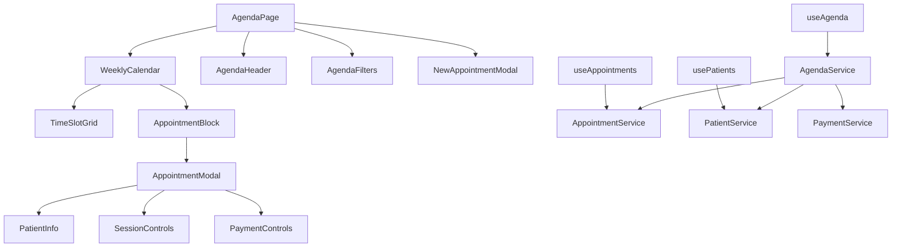

# Design - Sistema de Agenda para Fisioterapia

## Visão Geral

O sistema de agenda será o componente central do FisioFlow, implementado como uma interface rica estilo Outlook que permite gerenciamento completo de agendamentos, pacientes e sessões. O design prioriza usabilidade, performance e controle granular sobre o fluxo de trabalho da clínica.

## Arquitetura

### Arquitetura de Componentes



### Fluxo de Dados

1. **Carregamento Inicial**: AgendaPage carrega dados da semana atual via useAgenda hook
2. **Interação do Usuário**: Cliques em slots ou agendamentos disparam modals específicos
3. **Atualizações**: Mudanças são sincronizadas via TanStack Query com invalidação automática
4. **Tempo Real**: Supabase realtime subscriptions para sincronização multi-usuário

## Componentes e Interfaces

### 1. AgendaPage (Componente Principal)

**Responsabilidades:**
- Orquestrar todos os componentes da agenda
- Gerenciar estado global da visualização (semana atual, filtros)
- Controlar modals e overlays

**Props Interface:**
```typescript
interface AgendaPageProps {
  initialDate?: Date;
  userRole: 'admin' | 'therapist' | 'intern' | 'patient';
}
```

### 2. WeeklyCalendar

**Responsabilidades:**
- Renderizar grid semanal com slots de tempo
- Exibir agendamentos como blocos coloridos
- Gerenciar interações de clique e drag

**Props Interface:**
```typescript
interface WeeklyCalendarProps {
  currentWeek: Date;
  appointments: Appointment[];
  onSlotClick: (date: Date, time: string) => void;
  onAppointmentClick: (appointment: Appointment) => void;
  userRole: UserRole;
}
```

### 3. AppointmentModal

**Responsabilidades:**
- Exibir detalhes completos do agendamento
- Controlar ações de sessão (iniciar evolução, marcar status)
- Gerenciar pagamentos e observações

**Props Interface:**
```typescript
interface AppointmentModalProps {
  appointment: Appointment;
  isOpen: boolean;
  onClose: () => void;
  onUpdate: (updates: Partial<Appointment>) => void;
  userRole: UserRole;
}
```

### 4. SessionControls

**Responsabilidades:**
- Botões para ações da sessão (concluir, faltar, reagendar)
- Controle de status visual
- Validações de permissão por role

**Props Interface:**
```typescript
interface SessionControlsProps {
  appointment: Appointment;
  onStatusChange: (status: SessionStatus) => void;
  onStartEvolution: () => void;
  userRole: UserRole;
}
```

### 5. PaymentControls

**Responsabilidades:**
- Interface para marcar pagamentos
- Seleção de tipo de pagamento (avulso/pacote)
- Histórico de pagamentos da sessão

**Props Interface:**
```typescript
interface PaymentControlsProps {
  appointment: Appointment;
  onPaymentUpdate: (payment: PaymentData) => void;
  userRole: UserRole;
}
```

## Modelos de Dados

### Appointment
```typescript
interface Appointment {
  id: string;
  patient_id: string;
  therapist_id: string;
  date: string;
  start_time: string;
  end_time: string;
  status: 'scheduled' | 'completed' | 'missed' | 'cancelled' | 'rescheduled';
  payment_status: 'pending' | 'paid' | 'partial';
  session_type: 'individual' | 'group';
  notes: string;
  created_at: string;
  updated_at: string;
  
  // Relacionamentos
  patient: Patient;
  therapist: User;
  payments: Payment[];
}
```

### Patient (Estendido para Agenda)
```typescript
interface Patient {
  id: string;
  name: string;
  phone: string;
  email: string;
  session_price: number;
  package_sessions: number;
  remaining_sessions: number;
  important_notes: string;
  status: 'active' | 'inactive';
  created_at: string;
}
```

### Payment
```typescript
interface Payment {
  id: string;
  appointment_id: string;
  amount: number;
  payment_type: 'session' | 'package';
  sessions_count?: number;
  payment_method: 'cash' | 'card' | 'pix' | 'transfer';
  paid_at: string;
  notes: string;
}
```

### SessionStatus
```typescript
type SessionStatus = 'scheduled' | 'completed' | 'missed' | 'cancelled' | 'rescheduled';

interface StatusConfig {
  label: string;
  color: string;
  bgColor: string;
  borderColor: string;
  allowedActions: string[];
}
```

## Design Visual

### Esquema de Cores por Status
- **Agendado**: Azul (#3B82F6) - Sessão marcada, aguardando
- **Concluído**: Verde (#10B981) - Sessão realizada com sucesso
- **Faltou**: Vermelho (#EF4444) - Paciente não compareceu
- **Cancelado**: Cinza (#6B7280) - Sessão cancelada
- **Reagendado**: Laranja (#F59E0B) - Sessão movida para outra data

### Layout da Agenda
```
┌─────────────────────────────────────────────────────────────┐
│ [< Semana Anterior] [15-21 Jan 2024] [Próxima Semana >]    │
│ [Filtros: Todos os Fisioterapeutas ▼] [+ Novo Agendamento] │
├─────────────────────────────────────────────────────────────┤
│     │ SEG │ TER │ QUA │ QUI │ SEX │ SAB │ DOM │              │
├─────┼─────┼─────┼─────┼─────┼─────┼─────┼─────┤              │
│07:00│     │     │     │     │     │     │     │              │
│07:30│     │ Ana │     │     │     │     │     │              │
│08:00│João │ Silva│     │Pedro│     │     │     │              │
│08:30│     │     │     │     │     │     │     │              │
│ ... │     │     │     │     │     │     │     │              │
└─────────────────────────────────────────────────────────────┘
```

### Modal de Agendamento
```
┌─────────────────────────────────────────┐
│ Agendamento - João Silva                │
├─────────────────────────────────────────┤
│ 📞 (11) 99999-9999                     │
│ 💰 R$ 80,00 por sessão                 │
│ 📝 Observações: Dor no joelho direito  │
├─────────────────────────────────────────┤
│ Status: [Agendado ▼]                   │
│                                         │
│ [🏥 Iniciar Evolução]                  │
│ [💳 Marcar como Pago]                  │
│ [❌ Faltou] [📅 Reagendar]             │
├─────────────────────────────────────────┤
│ Pagamentos desta sessão:                │
│ • Pendente - R$ 80,00                  │
└─────────────────────────────────────────┘
```

## Tratamento de Erros

### Estratégias de Error Handling

1. **Conflitos de Agendamento**
   - Validação em tempo real antes de salvar
   - Sugestões de horários alternativos
   - Alertas visuais para sobreposições

2. **Falhas de Conectividade**
   - Cache local com sincronização posterior
   - Indicadores visuais de status offline
   - Retry automático com backoff exponencial

3. **Permissões Insuficientes**
   - Desabilitação de controles não permitidos
   - Mensagens contextuais de permissão
   - Redirecionamento para telas apropriadas

4. **Dados Inconsistentes**
   - Validação de integridade no frontend
   - Rollback automático em caso de erro
   - Logs detalhados para debugging

## Estratégia de Testes

### Testes Unitários
- Componentes individuais (WeeklyCalendar, AppointmentModal)
- Hooks customizados (useAgenda, useAppointments)
- Utilitários de data e formatação
- Validações de permissão por role

### Testes de Integração
- Fluxo completo de criação de agendamento
- Sincronização em tempo real entre usuários
- Navegação entre semanas com carregamento de dados
- Interações modal + agenda

### Testes E2E
- Cenário completo: login → agenda → criar agendamento → marcar como pago
- Teste de permissões por tipo de usuário
- Responsividade em diferentes dispositivos
- Performance com grande volume de agendamentos

## Considerações de Performance

### Otimizações Implementadas

1. **Virtualização de Dados**
   - Carregamento lazy de semanas não visíveis
   - Paginação inteligente de agendamentos históricos
   - Cache agressivo com invalidação seletiva

2. **Renderização Otimizada**
   - React.memo para componentes de agendamento
   - useMemo para cálculos de layout complexos
   - Debounce em filtros e buscas

3. **Gestão de Estado**
   - TanStack Query para cache inteligente
   - Normalização de dados para evitar re-renders
   - Subscriptions seletivas do Supabase

4. **Bundle Optimization**
   - Code splitting por rota
   - Lazy loading de modals pesados
   - Tree shaking de bibliotecas não utilizadas

## Segurança e Permissões

### Controle de Acesso por Role

**Administrador:**
- Acesso completo a todos os agendamentos
- Pode criar/editar/excluir qualquer agendamento
- Acesso a relatórios financeiros
- Gestão de usuários e permissões

**Fisioterapeuta:**
- Visualiza todos os agendamentos
- Pode criar/editar agendamentos
- Controle completo de sessões e pagamentos
- Acesso a evoluções de todos os pacientes

**Estagiário:**
- Visualiza todos os agendamentos (somente leitura)
- Pode marcar status de sessão (com supervisão)
- Não pode alterar valores ou criar agendamentos
- Acesso limitado a dados financeiros

**Paciente:**
- Visualiza apenas seus próprios agendamentos
- Interface simplificada (lista, não calendário)
- Não pode alterar dados
- Acesso apenas a informações básicas

### Implementação de Segurança

1. **Row Level Security (RLS)**
   - Políticas Supabase por tipo de usuário
   - Filtros automáticos baseados em role
   - Auditoria de todas as operações

2. **Validação Frontend**
   - Verificação de permissões em cada ação
   - Desabilitação de controles não permitidos
   - Redirecionamentos baseados em role

3. **API Security**
   - Validação de JWT em todas as requisições
   - Rate limiting por usuário
   - Logs de segurança detalhados