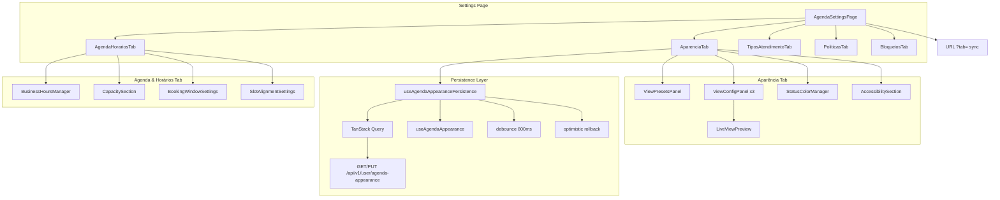
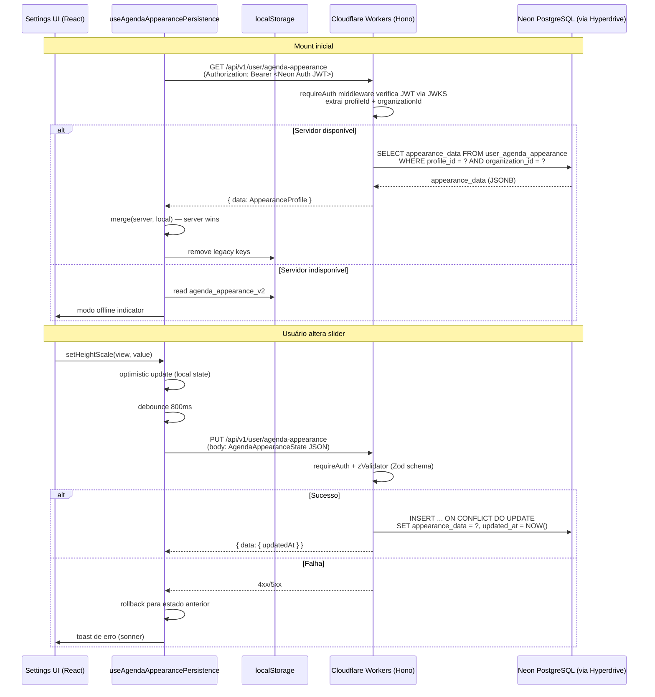

# Design Document — agenda-settings-ux-redesign

## Overview

Este documento descreve o design técnico do redesenho da UX/UI da página `/agenda/settings` do FisioFlow (`src/pages/ScheduleSettings.tsx`). O trabalho cobre três frentes:

1. **Aparência por view** — expor na UI os controles independentes por visualização (day/week/month) que o hook `useAgendaAppearance` já suporta, substituindo o `ScheduleVisualTab` atual que opera globalmente via `useCardSize`.
2. **Consolidação de abas** — reduzir de 6 para 5 abas, mesclando Capacidade + Horários e reorganizando o conteúdo.
3. **Persistência na nuvem** — migrar o `Appearance_Profile` de `localStorage` para **Neon PostgreSQL** via **Cloudflare Workers** (Hono), com optimistic update, debounce e rollback.

### Stack real do projeto

| Camada | Tecnologia |
|--------|-----------|
| Frontend | React 19 + React Router v7 + shadcn/ui + Tailwind CSS 4 |
| API | Cloudflare Workers + Hono (`apps/api/src/routes/`) |
| Banco | Neon PostgreSQL serverless via Hyperdrive |
| ORM | Drizzle ORM (`packages/db/src/schema/`) |
| Auth | Neon Auth — JWT verificado via JWKS pelo `requireAuth` middleware |
| Testes | Vitest + fast-check |

### Contexto do código existente

**Página atual**: `src/pages/ScheduleSettings.tsx` — já tem 6 abas com URL sync via `useSearchParams`, sidebar responsiva com Sheet mobile, lazy loading de tabs.

**Abas existentes** (valores de `?tab=`):
- `capacity` → `ScheduleCapacityTab`
- `hours` → `ScheduleCapacityHoursTab`
- `appointment-types` → `ScheduleAppointmentTypesTab`
- `policies` → `SchedulePoliciesTab`
- `blocked` → `ScheduleBlockedTab`
- `visual` → `ScheduleVisualTab` ← **aba a ser redesenhada**

**Componentes de settings existentes** em `src/components/schedule/settings/`:
- `AgendaVisualConfiguration.tsx` — controles globais (usa `useCardSize`)
- `StatusColorManager.tsx`, `BlockedTimesManager.tsx`, `BusinessHoursManager.tsx`
- `CapacityHeroCard.tsx`, `CapacityRulesList.tsx`, `BookingWindowSettings.tsx`, `SlotAlignmentSettings.tsx`
- `CancellationRulesManager.tsx`, `NoShowPolicyCard.tsx`
- `shared/SettingsSectionCard.tsx` — card de seção reutilizável

**Hook `useAgendaAppearance(view)`** em `src/hooks/useAgendaAppearance.ts` já implementa:
- Estado por view (`day`, `week`, `month`) com fallback para `global`
- `VIEW_DEFAULT_OVERRIDES` com defaults sensatos por view
- `applyToAllViews`, `resetView`, `resetAll`, `hasOverrideForView`
- Persistência em `localStorage` (chave `agenda_appearance_v2`)

**`useCardSize.ts`** — wrapper de compatibilidade que delega ao `useAgendaAppearance("day")`.

**Schema Drizzle** já criado em `packages/db/src/schema/userAgendaAppearance.ts` e exportado em `packages/db/src/schema/index.ts` (Task 1 concluída).

O que **não existe** ainda:
- UI com três painéis independentes por view na aba Aparência
- Pré-visualização ao vivo por view
- Endpoints Hono `GET/PUT /api/v1/user/agenda-appearance`
- Hook `useAgendaAppearancePersistence` para sincronizar com o servidor
- Consolidação das abas Capacidade + Horários

---

## Architecture

### Diagrama de componentes



### Fluxo de persistência do Appearance_Profile



---

## Components and Interfaces

### Novos componentes

#### `AgendaSettingsPage` (refatorado — `src/pages/ScheduleSettings.tsx`)

Refatoração da página existente. Mantém a estrutura atual (sidebar + conteúdo, Sheet mobile, URL sync via `useSearchParams`) e substitui as 6 abas por 5:

| Novo valor `?tab=` | Label | Conteúdo |
|---|---|---|
| `visual` | Aparência | `GlobalPresetsPanel` + 3× `ViewAppearancePanel` + `StatusColorManager` + acessibilidade |
| `agenda-horarios` | Agenda & Horários | `AgendaHorariosTab` (Capacidade + Horários mesclados) |
| `appointment-types` | Tipos de Atendimento | `ScheduleAppointmentTypesTab` (mantido) |
| `policies` | Políticas | `SchedulePoliciesTab` (mantido) |
| `blocked` | Bloqueios | `ScheduleBlockedTab` (mantido) |

> **Nota**: O valor `visual` é mantido para não quebrar deep-links existentes. Os valores `capacity` e `hours` são redirecionados para `agenda-horarios`.

#### `ViewAppearancePanel`

Painel de configuração de aparência para uma view específica. Substitui o `AgendaVisualConfiguration` atual (que opera globalmente via `useCardSize`).

```typescript
interface ViewAppearancePanelProps {
  view: AgendaView; // "day" | "week" | "month"
  label: string;    // "Dia" | "Semana" | "Mês"
  icon: LucideIcon;
}
```

Internamente usa `useAgendaAppearance(view)` para ler/escrever apenas o override daquela view. Exibe:
- Sliders: heightScale, fontScale, opacity
- Selector: cardSize (extra_small | small | medium | large)
- Botão "Aplicar a todas as views" → `applyToAllViews`
- Botão "Restaurar padrão" → `resetView`
- Indicador de override ativo (`hasOverrideForView`)
- `LiveViewPreview` embutido

#### `LiveViewPreview`

Pré-visualização ao vivo que reflete os valores configurados para a view. Recebe as CSS vars diretamente do hook e renderiza cards de exemplo com FullCalendar-like layout.

```typescript
interface LiveViewPreviewProps {
  appearance: AgendaViewAppearance;
  view: AgendaView;
}
```

Atualiza em tempo real (sem debounce visual) via `cssVariables` do hook.

#### `GlobalPresetsPanel`

Grid de presets globais (Alta Produtividade, Equilíbrio, Confortável, Camadas). Ao selecionar um preset, chama `applyToAllViews` e exibe confirmação visual por 2 segundos.

```typescript
interface GlobalPreset {
  id: string;
  name: string;
  description: string;
  icon: LucideIcon;
  config: Partial<AgendaViewAppearance>;
}
```

#### `useAgendaAppearancePersistence`

Hook que envolve `useAgendaAppearance` e adiciona a camada de persistência no servidor.

```typescript
interface UseAgendaAppearancePersistenceResult
  extends UseAgendaAppearanceResult {
  isSyncing: boolean;
  isOffline: boolean;
  lastSyncedAt: Date | null;
  syncError: Error | null;
}
```

Responsabilidades:
- `useQuery` para `GET /api/v1/user/agenda-appearance` no mount
- Merge server > local ao receber dados do servidor
- Remoção de chaves legadas do localStorage após primeiro sync
- `useMutation` para `PUT /api/v1/user/agenda-appearance` com debounce 800ms
- Optimistic update: atualiza estado local antes da resposta do servidor
- Rollback em caso de erro + toast de erro
- Fallback para localStorage se servidor indisponível

#### `AgendaHorariosTab` (novo — substitui `ScheduleCapacityTab` + `ScheduleCapacityHoursTab`)

Arquivo: `src/components/schedule/settings/tabs/AgendaHorariosTab.tsx`

Aba consolidada com sub-seções internas usando `SettingsSectionCard`:
1. **Horários de Funcionamento** — `BusinessHoursManager` (já existe)
2. **Capacidade** — `CapacityHeroCard` + `CapacityRulesList` (já existem)
3. **Janela de Agendamento** — `BookingWindowSettings` (já existe)
4. **Alinhamento de Slots** — `SlotAlignmentSettings` (já existe)

### Componentes existentes mantidos (sem alteração)

| Componente | Localização atual | Status |
|---|---|---|
| `BusinessHoursManager` | `settings/BusinessHoursManager.tsx` | Mantido |
| `BlockedTimesManager` | `settings/BlockedTimesManager.tsx` | Mantido |
| `CancellationRulesManager` | `settings/CancellationRulesManager.tsx` | Mantido |
| `NoShowPolicyCard` | `settings/NoShowPolicyCard.tsx` | Mantido |
| `StatusColorManager` | `settings/StatusColorManager.tsx` | Mantido |
| `ScheduleAppointmentTypesTab` | `settings/tabs/ScheduleAppointmentTypesTab.tsx` | Mantido |
| `SchedulePoliciesTab` | `settings/tabs/SchedulePoliciesTab.tsx` | Mantido |
| `ScheduleBlockedTab` | `settings/tabs/ScheduleBlockedTab.tsx` | Mantido |
| `CapacityHeroCard`, `CapacityRulesList` | `settings/` | Movidos para `AgendaHorariosTab` |
| `SettingsSectionCard` | `settings/shared/SettingsSectionCard.tsx` | Mantido |

---

## Data Models

### `AgendaAppearanceState` (existente, sem alteração)

```typescript
// src/hooks/useAgendaAppearance.ts — já definido
interface AgendaAppearanceState {
  day?: Partial<AgendaViewAppearance>;
  week?: Partial<AgendaViewAppearance>;
  month?: Partial<AgendaViewAppearance>;
  global: AgendaViewAppearance;
}

interface AgendaViewAppearance {
  cardSize: CardSize;       // "extra_small" | "small" | "medium" | "large"
  heightScale: number;      // 0..10
  fontScale: number;        // 0..10
  opacity: number;          // 0..100
}
```

### Tabela `user_agenda_appearance` (já criada — Task 1 concluída)

Schema Drizzle em `packages/db/src/schema/userAgendaAppearance.ts`, exportado em `packages/db/src/schema/index.ts`.

```sql
CREATE TABLE user_agenda_appearance (
  id              UUID PRIMARY KEY DEFAULT gen_random_uuid(),
  profile_id      TEXT NOT NULL,
  organization_id TEXT NOT NULL,
  appearance_data JSONB NOT NULL DEFAULT '{}',
  created_at      TIMESTAMPTZ NOT NULL DEFAULT NOW(),
  updated_at      TIMESTAMPTZ NOT NULL DEFAULT NOW(),
  UNIQUE (profile_id, organization_id)
);

CREATE INDEX idx_user_agenda_appearance_profile
  ON user_agenda_appearance (profile_id, organization_id);
```

O campo `appearance_data` armazena o `AgendaAppearanceState` serializado como JSON. O schema é validado com Zod no Worker antes de persistir.

### API Contracts (Hono + Cloudflare Workers)

Arquivo: `apps/api/src/routes/agendaAppearance.ts` — registrado em `apps/api/src/index.ts`.

Autenticação: todas as rotas usam `requireAuth` middleware que verifica o JWT do Neon Auth via JWKS e injeta `c.get("user")` com `{ uid, profileId, organizationId, role }`.

**GET `/api/v1/user/agenda-appearance`**

```typescript
// Handler Hono
app.get("/api/v1/user/agenda-appearance", requireAuth, async (c) => {
  const { profileId, organizationId } = c.get("user");
  // SELECT via Drizzle + Neon Hyperdrive
  // Retorna { data: null } se não encontrado (perfil novo)
});
```

Response `200` (encontrado):
```json
{
  "data": {
    "global": { "cardSize": "small", "heightScale": 6, "fontScale": 5, "opacity": 100 },
    "day": { "cardSize": "medium", "heightScale": 7, "fontScale": 6 },
    "week": { "cardSize": "small", "heightScale": 5, "fontScale": 5 },
    "month": { "cardSize": "extra_small", "heightScale": 3, "fontScale": 4 }
  }
}
```

Response `200` (não encontrado — perfil novo):
```json
{ "data": null }
```

**PUT `/api/v1/user/agenda-appearance`**

```typescript
// Handler Hono com zValidator
app.put("/api/v1/user/agenda-appearance",
  requireAuth,
  zValidator("json", AgendaAppearanceStateSchema),
  async (c) => {
    const { profileId, organizationId } = c.get("user");
    const body = c.req.valid("json");
    // UPSERT via Drizzle: INSERT ... ON CONFLICT DO UPDATE
    // Clampar valores fora do range antes de persistir
  }
);
```

Request body: `AgendaAppearanceState` (JSON validado com Zod)

Response `200`:
```json
{ "data": { "updatedAt": "2026-04-27T10:30:00Z" } }

### URL State

A aba ativa é sincronizada com o parâmetro `?tab=` via `useSearchParams` do React Router — **já implementado** em `ScheduleSettings.tsx`. A refatoração mantém esse mecanismo e atualiza os valores válidos:

```
/agenda/settings?tab=visual          ← Aparência (mantém valor existente)
/agenda/settings?tab=agenda-horarios ← Agenda & Horários (novo, substitui capacity + hours)
/agenda/settings?tab=appointment-types ← Tipos de Atendimento (mantido)
/agenda/settings?tab=policies        ← Políticas (mantido)
/agenda/settings?tab=blocked         ← Bloqueios (mantido)
```

Valores legados `capacity` e `hours` são redirecionados para `agenda-horarios` no `handleTabChange`.

---

## Correctness Properties

*Uma propriedade é uma característica ou comportamento que deve ser verdadeiro em todas as execuções válidas do sistema — essencialmente, uma declaração formal sobre o que o sistema deve fazer. Propriedades servem como ponte entre especificações legíveis por humanos e garantias de correção verificáveis por máquina.*

### Property 1: Isolamento de override por view

*Para qualquer* view V ∈ {day, week, month} e qualquer conjunto de valores de aparência (heightScale, fontScale, cardSize, opacity), atualizar V via `setHeightScale`/`setFontScale`/`setCardSize`/`setOpacity` deve deixar os overrides das outras duas views inalterados.

**Validates: Requirements 1.2, 1.3, 1.4, 1.5**

### Property 2: Propagação de applyToAllViews

*Para qualquer* conjunto de valores de aparência `patch`, chamar `applyToAllViews(patch)` deve resultar em todas as três views (day, week, month) tendo aqueles valores em seus overrides.

**Validates: Requirements 1.7, 1.10**

### Property 3: Reset de view reverte para defaults

*Para qualquer* view V e qualquer conjunto de overrides aplicados a V, chamar `resetView()` deve fazer com que `effectiveForView(state, V)` seja equivalente a `{ ...DEFAULT_GLOBAL, ...VIEW_DEFAULT_OVERRIDES[V] }`.

**Validates: Requirements 1.8**

### Property 4: hasOverrideForView reflete estado real

*Para qualquer* estado do hook, `hasOverrideForView` deve retornar `true` se e somente se `state[view]` existe e tem pelo menos uma chave.

**Validates: Requirements 1.9**

### Property 5: Pré-visualização reflete configuração

*Para qualquer* `AgendaViewAppearance`, as CSS vars geradas por `cssVariables` devem refletir matematicamente os valores configurados: `--agenda-card-font-scale` = `80 + (fontScale/10)*70`%, `--agenda-slot-height` = `round(24 * (0.5 + (heightScale/10)*1.5))`px, `--agenda-card-opacity` = `opacity/100`.

**Validates: Requirements 1.6, 4.8**

### Property 6: Serialização round-trip do Appearance_Profile

*Para qualquer* `AgendaAppearanceState` válido, `JSON.parse(JSON.stringify(state))` deve produzir um objeto profundamente igual ao original.

**Validates: Requirements 3.10**

### Property 7: Merge prioriza servidor

*Para qualquer* `serverProfile` e `localState`, a função de merge deve produzir um resultado onde todos os campos presentes em `serverProfile` têm os valores do servidor, independentemente dos valores locais.

**Validates: Requirements 3.3**

### Property 8: Rollback em falha de salvamento

*Para qualquer* estado anterior `S_prev` e qualquer mudança aplicada resultando em `S_next`, se a requisição PUT falhar, o estado do hook deve reverter para `S_prev`.

**Validates: Requirements 3.5**

### Property 9: Debounce agrupa escritas

*Para qualquer* sequência de N mudanças de aparência realizadas dentro de uma janela de 800ms, deve ser feita exatamente 1 chamada à API PUT (não N chamadas).

**Validates: Requirements 3.6**

### Property 10: Validação de horário de funcionamento

*Para qualquer* par de horários (open_time, close_time), a validação deve aceitar o par se e somente se `close_time > open_time` (comparação lexicográfica de strings HH:MM).

**Validates: Requirements 5.3**

### Property 11: Validação de BlockedTime

*Para qualquer* BlockedTime não-dia-inteiro, a validação deve rejeitar o registro se `end_time <= start_time` ou se título ou data de início estiverem ausentes.

**Validates: Requirements 6.2, 6.3**

### Property 12: Ordenação de BlockedTimes

*Para qualquer* lista de BlockedTimes com datas arbitrárias, a lista renderizada deve estar ordenada por `start_date` em ordem decrescente (mais recente primeiro).

**Validates: Requirements 6.5**

### Property 13: Validação de duração de AppointmentType

*Para qualquer* duração em minutos, a validação deve aceitar o valor se e somente se `15 <= duration <= 480`.

**Validates: Requirements 7.2**

### Property 14: Validação de antecedência de cancelamento

*Para qualquer* valor de antecedência mínima, a validação deve aceitar o valor se e somente se é um número inteiro no intervalo `[0, 72]`.

**Validates: Requirements 8.5**

### Property 15: Badge de contagem reflete tamanho da lista

*Para qualquer* lista de BlockedTimes ou AppointmentTypes de tamanho N, o badge exibido na aba correspondente deve mostrar exatamente N.

**Validates: Requirements 2.8**

### Property 16: URL sync é bidirecional

*Para qualquer* `SettingsTabId` válido, navegar para `?tab=X` deve ativar a aba X, e ativar a aba X programaticamente deve atualizar a URL para `?tab=X`.

**Validates: Requirements 2.6**

---

## Error Handling

### Falha no carregamento inicial (GET)

- Se o Worker retornar erro ou estiver indisponível, o hook usa o `localStorage` como fallback.
- Um indicador de "modo offline" é exibido na aba Aparência (banner amarelo discreto).
- O TanStack Query faz retry automático (3 tentativas com backoff exponencial).

### Falha no salvamento (PUT)

- O estado local é revertido para o valor anterior ao optimistic update.
- Um toast de erro é exibido via `sonner`: "Não foi possível salvar as configurações. Tente novamente."
- O erro é logado via Axiom (logger do Worker) e no console do cliente.
- A próxima alteração do usuário tentará salvar novamente (o debounce reinicia).

### Dados corrompidos no localStorage

- Se `JSON.parse` falhar ao ler `agenda_appearance_v2`, o hook usa `DEFAULT_GLOBAL`.
- Chaves legadas inválidas são ignoradas silenciosamente.

### Validação de schema no Worker (Zod + `@hono/zod-validator`)

- O endpoint PUT valida o body com Zod antes de persistir.
- Campos fora do schema são ignorados (Zod `strip` mode).
- Valores fora dos ranges válidos (ex.: `heightScale > 10`) são clampados no Worker antes do upsert.
- Erros de validação retornam `400` com detalhes do Zod.

### Conflito de concorrência (multi-device)

- Estratégia "last write wins" — o Worker sempre aceita o PUT mais recente.
- Não há merge de conflitos entre dispositivos; o carregamento inicial sempre traz o estado mais recente do Neon.

---

## Testing Strategy

### Abordagem dual

A estratégia combina testes de exemplo (casos concretos, edge cases, integrações) com testes baseados em propriedades (fast-check) para cobertura abrangente.

**Testes de exemplo** cobrem:
- Renderização de componentes específicos (3 painéis na aba Aparência, 7 dias na aba Horários)
- Interações de UI (toggle de dia, confirmação de exclusão)
- Estados de loading/error
- Comportamento responsivo (viewport < 768px)
- Remoção de chaves legadas do localStorage

**Testes de propriedade** (fast-check) cobrem:
- Isolamento de override por view (Properties 1–4)
- Cálculo de CSS vars (Property 5)
- Serialização round-trip (Property 6)
- Merge server > local (Property 7)
- Rollback em falha (Property 8)
- Debounce de escritas (Property 9)
- Validações de negócio (Properties 10–14)
- Badge de contagem (Property 15)
- URL sync (Property 16)

### Configuração de testes de propriedade

- **Biblioteca**: fast-check 4.5.3 (já instalado em `apps/web/package.json`)
- **Runner**: Vitest 4.x
- **Iterações mínimas**: 100 por propriedade
- **Tag format**: `// Feature: agenda-settings-ux-redesign, Property N: <texto>`

### Geradores fast-check relevantes

```typescript
// Gerador de AgendaViewAppearance
const fcViewAppearance = fc.record({
  cardSize: fc.constantFrom("extra_small", "small", "medium", "large"),
  heightScale: fc.integer({ min: 0, max: 10 }),
  fontScale: fc.integer({ min: 0, max: 10 }),
  opacity: fc.integer({ min: 0, max: 100 }),
});

// Gerador de AgendaAppearanceState
const fcAppearanceState = fc.record({
  global: fcViewAppearance,
  day: fc.option(fc.partialRecord(fcViewAppearance)),
  week: fc.option(fc.partialRecord(fcViewAppearance)),
  month: fc.option(fc.partialRecord(fcViewAppearance)),
});

// Gerador de AgendaView
const fcView = fc.constantFrom("day", "week", "month");

// Gerador de par de horários válido (close > open)
const fcValidTimePair = fc.tuple(
  fc.integer({ min: 0, max: 22 }),
  fc.integer({ min: 1, max: 23 }),
).filter(([open, close]) => close > open)
  .map(([open, close]) => ({
    open_time: `${String(open).padStart(2, "0")}:00`,
    close_time: `${String(close).padStart(2, "0")}:00`,
  }));

// Gerador de BlockedTime
const fcBlockedTime = fc.record({
  id: fc.uuid(),
  title: fc.string({ minLength: 1 }),
  start_date: fc.date().map(d => d.toISOString().slice(0, 10)),
  end_date: fc.date().map(d => d.toISOString().slice(0, 10)),
  is_all_day: fc.boolean(),
  is_recurring: fc.constant(false),
  recurring_days: fc.constant([]),
  created_by: fc.uuid(),
});
```

### Localização dos testes

```
src/hooks/__tests__/
  useAgendaAppearance.test.ts          # Properties 1–5, 15–16
  useAgendaAppearancePersistence.test.ts # Properties 6–9

src/components/schedule/settings/__tests__/
  ViewAppearancePanel.test.tsx         # Examples: 3 painéis, sliders
  AgendaHorariosTab.test.tsx           # Property 10, Examples: 7 dias
  BlockedTimesManager.test.tsx         # Properties 11–12, Example: confirmação
  ScheduleAppointmentTypesTab.test.tsx # Properties 13, 15, Examples: duplicidade
  SchedulePoliciesTab.test.tsx         # Property 14, Examples: campos
  AgendaSettingsPage.test.tsx          # Examples: estrutura de abas, URL sync
```

### Testes de integração

Os seguintes cenários requerem mocks da API (não são property-based):
- `GET /api/v1/user/agenda-appearance` retorna perfil → hook usa dados do servidor
- `PUT /api/v1/user/agenda-appearance` falha → rollback + toast
- Mount com servidor indisponível → fallback para localStorage
- Primeiro sync bem-sucedido → remoção de chaves legadas

### Cobertura mínima esperada

- Hook `useAgendaAppearance`: 95%+ (lógica pura, altamente testável)
- Hook `useAgendaAppearancePersistence`: 85%+ (com mocks de API)
- Componentes de settings: 70%+ (foco em lógica, não em estilos)
