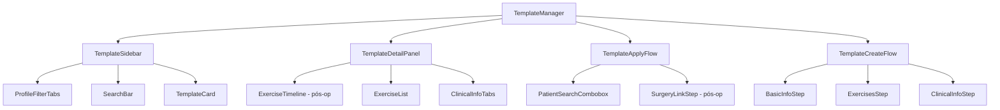

# Design Document: Exercise Templates Refactor

## Overview

Refatoração completa da aba "Templates" em `/exercises?tab=templates`. O objetivo é substituir o fluxo atual baseado em modais por um layout split-view (lista + painel de detalhes), introduzir a distinção entre `System_Template` e `Custom_Template`, e popular a base com 15+ templates clínicos pré-cadastrados organizados por perfil de paciente.

A refatoração é incremental: reutiliza a infraestrutura existente (`templatesApi`, `useExerciseTemplates`, `ExercisePlanRow`) e adiciona novos campos e endpoints onde necessário.

---

## Architecture

### Layout: Split-View

```
┌─────────────────────────────────────────────────────────────────┐
│  Template_Manager                                               │
│  ┌──────────────────────────┐  ┌──────────────────────────────┐ │
│  │  Sidebar (lista)         │  │  Template_Detail_Panel       │ │
│  │  ─────────────────────── │  │  ─────────────────────────── │ │
│  │  [Busca + filtro perfil] │  │  Nome + badges               │ │
│  │                          │  │  [Aplicar a Paciente] [btn]  │ │
│  │  ● Ortopédico (5)        │  │                              │ │
│  │  ● Esportivo (3)         │  │  Tabs: Exercícios | Clínico  │ │
│  │  ● Pós-operatório (4)    │  │       Contraindicações       │ │
│  │  ● Prevenção (3)         │  │       Progressão | Refs      │ │
│  │  ● Idosos (3)            │  │                              │ │
│  │                          │  │  (empty state se nenhum      │ │
│  │  [Template_Card]         │  │   template selecionado)      │ │
│  │  [Template_Card]         │  │                              │ │
│  │  ...                     │  │                              │ │
│  └──────────────────────────┘  └──────────────────────────────┘ │
└─────────────────────────────────────────────────────────────────┘
```

Em telas menores (< lg), o painel de detalhes substitui a lista (navegação back/forward).

### Fluxos Sobrepostos (Sheets/Dialogs)

- `Template_Apply_Flow` → Sheet lateral (não substitui o split-view)
- `Template_Create_Flow` → Dialog multi-step (3 etapas)
- Confirmação de exclusão → AlertDialog existente

### Diagrama de Componentes



---

## Components and Interfaces

### TemplateManager (refatorado)

Componente raiz da aba. Gerencia estado de seleção e orquestra os sub-componentes.

```typescript
interface TemplateManagerState {
  selectedTemplateId: string | null;
  activeProfile: PatientProfileCategory | "all";
  searchQuery: string;
  showApplyFlow: boolean;
  showCreateFlow: boolean;
  createFromTemplate: ExerciseTemplate | null; // para "Personalizar"
  deleteConfirmId: string | null;
}
```

### TemplateSidebar

Lista de templates com filtro por perfil e busca. Emite `onSelect(id)`.

Props:

```typescript
interface TemplateSidebarProps {
  templates: ExerciseTemplate[];
  selectedId: string | null;
  activeProfile: PatientProfileCategory | "all";
  searchQuery: string;
  loading: boolean;
  onSelect: (id: string) => void;
  onProfileChange: (profile: PatientProfileCategory | "all") => void;
  onSearchChange: (q: string) => void;
  onCreateClick: () => void;
}
```

### TemplateCard (refatorado)

Exibe nome, condição, contagem de exercícios, badge System/Custom e nível de evidência.

```typescript
interface TemplateCardProps {
  template: ExerciseTemplate;
  isSelected: boolean;
  onClick: () => void;
}
```

### TemplateDetailPanel (refatorado de TemplateDetailsModal)

Painel de detalhes inline (não modal). Exibe botões de ação primária no topo.

```typescript
interface TemplateDetailPanelProps {
  template: ExerciseTemplate | null;
  onApply: () => void;
  onCustomize: () => void;
  onEdit: () => void;
  onDelete: () => void;
}
```

### TemplateApplyFlow

Sheet lateral com 2–3 etapas:

1. Seleção de paciente (combobox com busca por nome/CPF)
2. Data de início
3. (Condicional) Vinculação a cirurgia — apenas para templates Pós-operatório

```typescript
interface TemplateApplyFlowProps {
  template: ExerciseTemplate;
  open: boolean;
  onOpenChange: (open: boolean) => void;
  onSuccess: (planId: string) => void;
}
```

### TemplateCreateFlow (refatorado de TemplateModal)

Dialog multi-step com 3 etapas. Suporta modo "personalizar" (pré-preenchido a partir de um System_Template).

```typescript
interface TemplateCreateFlowProps {
  open: boolean;
  onOpenChange: (open: boolean) => void;
  sourceTemplate?: ExerciseTemplate; // modo personalizar
  onSuccess: () => void;
}
```

---

## Data Models

### ExerciseTemplate (estendido)

O tipo existente em `src/types/workers.ts` recebe dois novos campos:

```typescript
export interface ExerciseTemplate {
  // campos existentes mantidos...
  id: string;
  name: string;
  description: string | null;
  category: string | null; // agora = PatientProfileCategory
  conditionName: string | null;
  templateVariant: string | null;
  clinicalNotes: string | null;
  contraindications: string | null;
  precautions: string | null;
  progressionNotes: string | null;
  evidenceLevel: "A" | "B" | "C" | "D" | null;
  bibliographicReferences: string[];
  isActive: boolean;
  isPublic: boolean;
  organizationId: string | null;
  createdBy: string | null;
  createdAt: string;
  updatedAt: string;

  // NOVOS campos
  templateType: "system" | "custom"; // distingue System vs Custom
  patientProfile: PatientProfileCategory; // perfil clínico principal
  sourceTemplateId: string | null; // referência ao System_Template original (para Custom)
  isDraft: boolean; // suporte a rascunho (Req 4.7)
  exerciseCount: number; // desnormalizado para performance na listagem
}

type PatientProfileCategory =
  | "ortopedico"
  | "esportivo"
  | "pos_operatorio"
  | "prevencao"
  | "idosos";
```

### ExercisePlan (novo — baseado em ExercisePlanRow existente)

O tipo `ExercisePlanRow` já existe em `src/types/workers.ts`. O fluxo de aplicação cria um registro nessa tabela via `exercisePlansApi.create()` (endpoint já existe em `src/api/v2/exercises.ts`).

```typescript
// Payload para criação via Template_Apply_Flow
interface CreateExercisePlanFromTemplatePayload {
  patient_id: string;
  template_id: string;
  name: string;
  start_date: string; // ISO date
  surgery_id?: string; // opcional, apenas pós-op
  notes?: string;
}
```

---

## Database Schema

### Tabela: `exercise_templates` (alterações)

Adicionar colunas à tabela existente:

```sql
ALTER TABLE exercise_templates
  ADD COLUMN template_type    TEXT NOT NULL DEFAULT 'custom'
                              CHECK (template_type IN ('system', 'custom')),
  ADD COLUMN patient_profile  TEXT
                              CHECK (patient_profile IN (
                                'ortopedico','esportivo','pos_operatorio',
                                'prevencao','idosos'
                              )),
  ADD COLUMN source_template_id UUID REFERENCES exercise_templates(id)
                              ON DELETE SET NULL,
  ADD COLUMN is_draft         BOOLEAN NOT NULL DEFAULT FALSE,
  ADD COLUMN exercise_count   INTEGER NOT NULL DEFAULT 0;

-- Índices para performance
CREATE INDEX idx_exercise_templates_type    ON exercise_templates(template_type);
CREATE INDEX idx_exercise_templates_profile ON exercise_templates(patient_profile);
CREATE INDEX idx_exercise_templates_org     ON exercise_templates(organization_id);
```

### Tabela: `exercise_template_items` (sem alterações estruturais)

A tabela já possui `week_start`, `week_end`, `clinical_notes`, `focus_muscles`, `purpose`. Nenhuma alteração necessária.

### Tabela: `exercise_template_categories` (nova — lookup)

```sql
CREATE TABLE exercise_template_categories (
  id          TEXT PRIMARY KEY,   -- 'ortopedico', 'esportivo', etc.
  label       TEXT NOT NULL,      -- 'Ortopédico', 'Esportivo', etc.
  icon        TEXT,               -- nome do ícone Lucide
  order_index INTEGER NOT NULL DEFAULT 0
);

INSERT INTO exercise_template_categories VALUES
  ('ortopedico',    'Ortopédico',    'bone',          1),
  ('esportivo',     'Esportivo',     'activity',      2),
  ('pos_operatorio','Pós-operatório','scissors',      3),
  ('prevencao',     'Prevenção',     'shield',        4),
  ('idosos',        'Idosos',        'heart-handshake',5);
```

### Trigger: manter `exercise_count` atualizado

```sql
CREATE OR REPLACE FUNCTION update_template_exercise_count()
RETURNS TRIGGER AS $$
BEGIN
  UPDATE exercise_templates
  SET exercise_count = (
    SELECT COUNT(*) FROM exercise_template_items
    WHERE template_id = COALESCE(NEW.template_id, OLD.template_id)
  )
  WHERE id = COALESCE(NEW.template_id, OLD.template_id);
  RETURN NEW;
END;
$$ LANGUAGE plpgsql;

CREATE TRIGGER trg_template_exercise_count
AFTER INSERT OR DELETE ON exercise_template_items
FOR EACH ROW EXECUTE FUNCTION update_template_exercise_count();
```

---

## Seed Data: System Templates

15 templates pré-cadastrados (`template_type = 'system'`, `organization_id = NULL`).

### Perfil Ortopédico (5 templates)

| Nome                           | Condição                     | Variante    | Evidência |
| ------------------------------ | ---------------------------- | ----------- | --------- |
| Protocolo Lombalgia Crônica    | Lombalgia                    | Conservador | A         |
| Protocolo Cervicalgia Postural | Cervicalgia                  | Inicial     | B         |
| Reabilitação Tendinite Patelar | Tendinite Patelar            | Progressivo | B         |
| Tratamento Fascite Plantar     | Fascite Plantar              | Conservador | A         |
| Reabilitação Manguito Rotador  | Síndrome do Manguito Rotador | Conservador | B         |

### Perfil Esportivo (3 templates)

| Nome                                      | Condição                     | Variante    | Evidência |
| ----------------------------------------- | ---------------------------- | ----------- | --------- |
| Retorno ao Esporte - Entorse de Tornozelo | Entorse de Tornozelo         | Progressivo | A         |
| Fortalecimento para Corredores            | Síndrome do Trato Iliotibial | Preventivo  | B         |
| Prevenção de Lesões em Atletas            | Prevenção Geral              | Funcional   | B         |

### Perfil Pós-operatório (4 templates)

| Nome                                   | Condição                     | Semanas Totais | Evidência |
| -------------------------------------- | ---------------------------- | -------------- | --------- |
| Reconstrução LCA - Protocolo Acelerado | Reconstrução de LCA          | 24             | A         |
| Prótese Total de Joelho                | Artroplastia de Joelho       | 12             | A         |
| Prótese Total de Quadril               | Artroplastia de Quadril      | 12             | A         |
| Reparo do Manguito Rotador             | Reparo Cirúrgico do Manguito | 16             | B         |

### Perfil Prevenção (3 templates)

| Nome                      | Condição                           | Variante    | Evidência |
| ------------------------- | ---------------------------------- | ----------- | --------- |
| Prevenção de Quedas       | Prevenção de Quedas                | Funcional   | A         |
| Fortalecimento Postural   | Desvios Posturais                  | Progressivo | B         |
| Ergonomia para Escritório | Síndrome do Trabalhador Sedentário | Educativo   | C         |

### Perfil Idosos (3 templates)

| Nome                                 | Condição               | Variante    | Evidência |
| ------------------------------------ | ---------------------- | ----------- | --------- |
| Equilíbrio e Marcha para Idosos      | Instabilidade Postural | Funcional   | A         |
| Fortalecimento Funcional para Idosos | Sarcopenia             | Progressivo | B         |
| Mobilidade Articular Geral           | Rigidez Articular      | Conservador | B         |

O seed será implementado como script Drizzle em `functions/src/seed/exercise-templates.ts`, executado uma única vez via Cloud Function admin.

---

## API / Cloud Functions

### Endpoints existentes (reutilizados sem alteração)

| Método | Endpoint                       | Uso                                  |
| ------ | ------------------------------ | ------------------------------------ |
| GET    | `/api/templates`               | Listagem com filtros `?category=&q=` |
| GET    | `/api/templates/:id`           | Detalhes + items                     |
| POST   | `/api/templates`               | Criar Custom_Template                |
| PUT    | `/api/templates/:id`           | Atualizar Custom_Template            |
| DELETE | `/api/templates/:id`           | Excluir Custom_Template              |
| POST   | `/api/clinical/exercise-plans` | Criar Exercise_Plan                  |

### Novos parâmetros de query (GET `/api/templates`)

```
?patientProfile=ortopedico|esportivo|pos_operatorio|prevencao|idosos
?templateType=system|custom
?isDraft=true|false
```

O Worker/Cloud Function filtra por `organization_id IS NULL` para `system` e por `organization_id = ctx.organizationId` para `custom`.

### Novo endpoint: POST `/api/templates/:id/apply`

Cria um `Exercise_Plan` a partir de um template, copiando todos os `exercise_template_items`.

Request body:

```typescript
{
  patientId: string;
  startDate: string;       // ISO date
  surgeryId?: string;      // opcional
  notes?: string;
}
```

Response:

```typescript
{
  data: {
    planId: string;
    patientId: string;
    exerciseCount: number;
  }
}
```

Lógica:

1. Busca o template e seus items
2. Valida que o template está ativo (`is_active = true`, `is_draft = false`)
3. Cria `exercise_plans` com `template_id` referenciando o template original
4. Copia cada `exercise_template_item` para `exercise_plan_items`
5. Retorna o `planId` para navegação direta

### Novo endpoint: POST `/api/templates/:id/customize`

Cria um `Custom_Template` como cópia de um `System_Template`.

Request body:

```typescript
{
  name?: string;  // opcional — usa nome original se omitido
}
```

Response: `{ data: ExerciseTemplate }` (o novo Custom_Template)

Lógica:

1. Valida que o template fonte é `template_type = 'system'`
2. Cria novo template com `template_type = 'custom'`, `organization_id = ctx.organizationId`, `source_template_id = id`
3. Copia todos os `exercise_template_items`

---

## State Management

### TanStack Query — Query Keys

```typescript
// Listagem (com filtros)
["templates", { patientProfile, templateType, q }][
  // Detalhe
  ("template", id)
][
  // Categorias
  "template-categories"
]; // staleTime: 30min (dados estáticos)
```

### Zustand Store: `useTemplateUIStore`

Estado de UI local (não persistido):

```typescript
interface TemplateUIStore {
  selectedTemplateId: string | null;
  activeProfile: PatientProfileCategory | "all";
  searchQuery: string;
  applyFlowOpen: boolean;
  createFlowOpen: boolean;
  createFlowSourceId: string | null;

  setSelectedTemplate: (id: string | null) => void;
  setActiveProfile: (p: PatientProfileCategory | "all") => void;
  setSearchQuery: (q: string) => void;
  openApplyFlow: () => void;
  closeApplyFlow: () => void;
  openCreateFlow: (sourceId?: string) => void;
  closeCreateFlow: () => void;
}
```

### Fluxo de dados: Template_Apply_Flow

```
1. Usuário clica "Aplicar a Paciente"
   → openApplyFlow() no store

2. Sheet abre, usuário busca paciente
   → useQuery(['patients', { q }]) com debounce 300ms

3. Usuário confirma
   → useMutation → POST /api/templates/:id/apply
   → onSuccess: invalidate(['exercise-plans', patientId])
   → toast.success + link para o plano

4. Erro
   → toast.error, formulário mantém dados (não fecha o Sheet)
```

---

## Correctness Properties

_A property is a characteristic or behavior that should hold true across all valid executions of a system — essentially, a formal statement about what the system should do. Properties serve as the bridge between human-readable specifications and machine-verifiable correctness guarantees._

### Property 1: Filtro por perfil retorna apenas templates do perfil selecionado

_Para qualquer_ lista de templates e qualquer perfil de paciente selecionado (`ortopedico`, `esportivo`, `pos_operatorio`, `prevencao` ou `idosos`), todos os templates retornados pela função de filtro devem ter `patientProfile` igual ao perfil selecionado. Quando nenhum perfil está selecionado (`'all'`), todos os templates da lista original devem ser retornados.

**Validates: Requirements 1.2, 1.4**

---

### Property 2: Busca retorna subconjunto relevante

_Para qualquer_ query de busca não-vazia e qualquer lista de templates, o conjunto de templates retornados deve ser um subconjunto da lista original, e cada resultado deve conter a query (case-insensitive) em pelo menos um dos campos: `name`, `conditionName` ou `templateVariant`.

**Validates: Requirements 1.6**

---

### Property 3: Renderização de card contém todas as informações obrigatórias

_Para qualquer_ template com campos preenchidos, o `TemplateCard` renderizado deve conter: o nome do template, a condição clínica, o número de exercícios (`exerciseCount`), e um badge indicando `template_type` ('Sistema' ou 'Personalizado'). Quando `evidenceLevel` não é nulo, o badge de evidência também deve estar presente.

**Validates: Requirements 1.5**

---

### Property 4: Renderização condicional por perfil pós-operatório

_Para qualquer_ template, os campos e componentes específicos de pós-operatório (timeline de semanas no `TemplateDetailPanel`, campos `week_start`/`week_end` no `TemplateCreateFlow`, etapa de vinculação a cirurgia no `TemplateApplyFlow`) devem aparecer se e somente se `patientProfile = 'pos_operatorio'`.

**Validates: Requirements 2.4, 3.4, 4.6**

---

### Property 5: Aplicação de template cria plano com exercícios corretos

_Para qualquer_ template com N exercícios (`exerciseCount = N`) e qualquer paciente válido, a operação de aplicação deve criar um `Exercise_Plan` com exatamente N itens, onde o `exercise_id` de cada item corresponde ao `exercise_id` de um item do template original.

**Validates: Requirements 3.5**

---

### Property 6: Personalizar System_Template não modifica o original

_Para qualquer_ `System_Template`, após executar a operação "Personalizar", o template original deve permanecer inalterado (mesmo `id`, mesmos valores de todos os campos, mesmos items). O novo `Custom_Template` criado deve ter `source_template_id` igual ao `id` do original e `template_type = 'custom'`.

**Validates: Requirements 5.3**

---

### Property 7: System_Templates não podem ser excluídos

_Para qualquer_ template com `template_type = 'system'`, uma tentativa de exclusão (via API ou UI) deve ser rejeitada, e o template deve continuar existindo na listagem após a tentativa.

**Validates: Requirements 8.1**

---

### Property 8: Contagem de exercícios é consistente com os items

_Para qualquer_ template, após qualquer operação de adição ou remoção de exercícios, o campo `exercise_count` deve ser igual ao número de registros em `exercise_template_items` com `template_id` correspondente.

**Validates: Requirements 1.5**

---

### Property 9: Badges distintos por tipo de template

_Para qualquer_ template, o componente `TemplateCard` deve renderizar badges visualmente distintos: templates com `template_type = 'system'` devem exibir badge "Sistema", e templates com `template_type = 'custom'` devem exibir badge "Personalizado". Nunca ambos ao mesmo tempo.

**Validates: Requirements 5.1, 5.4**

---

### Property 10: Preservação de estado do formulário em caso de erro

_Para qualquer_ conjunto de dados preenchidos no `TemplateApplyFlow` ou no diálogo de exclusão, quando a operação de backend falha com erro, todos os campos do formulário devem manter seus valores anteriores ao erro, permitindo nova tentativa sem repreenchimento.

**Validates: Requirements 3.7, 8.4**

---

### Property 11: System_Templates sempre visíveis independentemente de Custom_Templates

_Para qualquer_ organização (com ou sem Custom_Templates cadastrados), a listagem de templates deve sempre incluir todos os templates com `template_type = 'system'` e `is_active = true`.

**Validates: Requirements 7.2**

---

### Property 12: Validação de campos obrigatórios no formulário de criação

_Para qualquer_ submissão do `TemplateCreateFlow` onde `name`, `patientProfile` ou `conditionName` estão ausentes ou compostos apenas de espaços em branco, a submissão deve ser rejeitada com mensagem de erro, e nenhum template deve ser criado.

**Validates: Requirements 4.3**

---

## Error Handling

| Cenário                                   | Comportamento                                                  |
| ----------------------------------------- | -------------------------------------------------------------- |
| Falha ao carregar lista de templates      | Skeleton + botão "Tentar novamente"                            |
| Template selecionado não encontrado (404) | Painel de detalhes exibe estado de erro com opção de voltar    |
| Falha ao aplicar template                 | Toast de erro descritivo; Sheet permanece aberta com dados     |
| Falha ao criar Custom_Template            | Toast de erro; formulário mantém estado                        |
| Tentativa de excluir System_Template      | AlertDialog bloqueante com explicação                          |
| Tentativa de editar System_Template       | Toast informativo + oferta de "Personalizar"                   |
| Template sem exercícios ao aplicar        | Validação no cliente antes de chamar API; mensagem informativa |

---

## Testing Strategy

### Testes Unitários (Vitest + Testing Library)

Focados em casos específicos e condições de borda:

- `TemplateCard` renderiza badge "Sistema" para `template_type = 'system'`
- `TemplateCard` renderiza badge "Personalizado" para `template_type = 'custom'`
- `TemplateDetailPanel` exibe mensagem de template vazio quando `exerciseCount = 0`
- `TemplateDetailPanel` exibe timeline de semanas para templates `pos_operatorio`
- `TemplateDetailPanel` não exibe botão "Personalizar" para `Custom_Template`
- `TemplateCreateFlow` exibe campos de semana apenas quando perfil = `pos_operatorio`
- `TemplateApplyFlow` exibe etapa de cirurgia apenas para templates `pos_operatorio`
- Busca com debounce de 300ms não dispara query antes do tempo

### Testes de Propriedade (fast-check)

Cada propriedade do design deve ser coberta por um teste de propriedade com mínimo de 100 iterações.

```typescript
// Exemplo de estrutura — Feature: exercise-templates-refactor, Property 1
it("filtro por perfil retorna apenas templates do perfil selecionado", () => {
  fc.assert(
    fc.property(
      fc.array(arbitraryTemplate()),
      fc.constantFrom("ortopedico", "esportivo", "pos_operatorio", "prevencao", "idosos"),
      (templates, profile) => {
        const result = filterByProfile(templates, profile);
        return result.every((t) => t.patientProfile === profile);
      },
    ),
    { numRuns: 100 },
  );
});
```

Tag format para cada teste: `// Feature: exercise-templates-refactor, Property {N}: {título}`

### Testes E2E (Playwright)

- Fluxo completo: selecionar template → aplicar a paciente → verificar plano criado no perfil
- Fluxo de personalização: System_Template → Personalizar → verificar novo Custom_Template
- Estado vazio: organização sem Custom_Templates exibe System_Templates e CTAs corretos
