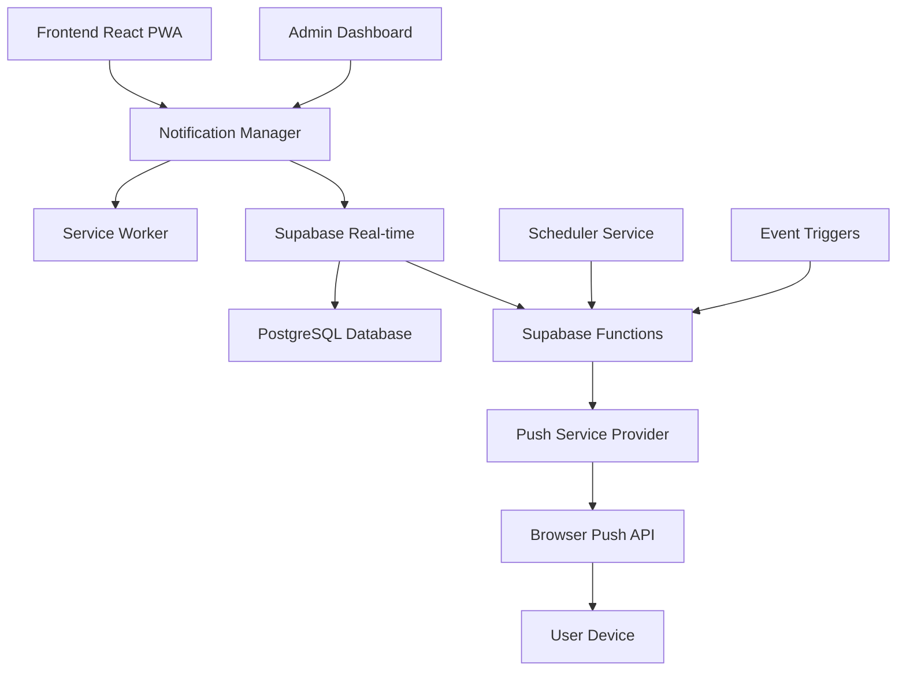

# Design Document - Sistema de Notificações Push

## Overview

O Sistema de Notificações Push do FisioFlow é uma solução completa que integra notificações web push, PWA e comunicação em tempo real para melhorar o engajamento de pacientes e a eficiência operacional da clínica. O sistema utiliza a infraestrutura existente do Supabase para gerenciamento de dados e autenticação, integrando-se perfeitamente com o Service Worker já configurado.

## Architecture

### High-Level Architecture



### Component Interaction Flow

1. **Registration Flow**: User grants permission → Service Worker registers → Subscription stored in Supabase
2. **Notification Trigger**: Event occurs → Supabase Function triggered → Push message sent → Service Worker receives → Notification displayed
3. **User Interaction**: User clicks notification → App opens/focuses → Action processed → Analytics recorded

## Components and Interfaces

### 1. NotificationManager (Frontend)

**Responsibilities:**
- Manage push subscription lifecycle
- Handle permission requests
- Coordinate with Service Worker
- Provide notification preferences UI

**Key Methods:**
```typescript
interface NotificationManager {
  requestPermission(): Promise<boolean>
  subscribe(): Promise<PushSubscription>
  unsubscribe(): Promise<void>
  updatePreferences(preferences: NotificationPreferences): Promise<void>
  getNotificationHistory(): Promise<Notification[]>
}
```

### 2. Service Worker Enhancement

**Responsibilities:**
- Handle push events
- Display notifications
- Manage offline notification queue
- Handle notification clicks and actions

**Key Events:**
```typescript
// Push event handler
self.addEventListener('push', handlePushEvent)
// Notification click handler  
self.addEventListener('notificationclick', handleNotificationClick)
// Background sync for offline notifications
self.addEventListener('sync', handleBackgroundSync)
```

### 3. Supabase Functions (Edge Functions)

**Functions:**
- `send-notification`: Send individual notifications
- `schedule-notifications`: Handle scheduled notifications
- `process-notification-events`: Process system events for notifications

**Example Function Structure:**
```typescript
export async function sendNotification(
  userId: string,
  type: NotificationType,
  payload: NotificationPayload
): Promise<void>
```

### 4. Database Schema Extensions

**New Tables:**
```sql
-- Push subscriptions
CREATE TABLE push_subscriptions (
  id UUID PRIMARY KEY DEFAULT gen_random_uuid(),
  user_id UUID REFERENCES auth.users(id),
  endpoint TEXT NOT NULL,
  p256dh TEXT NOT NULL,
  auth TEXT NOT NULL,
  created_at TIMESTAMP WITH TIME ZONE DEFAULT NOW(),
  updated_at TIMESTAMP WITH TIME ZONE DEFAULT NOW()
);

-- Notification preferences
CREATE TABLE notification_preferences (
  id UUID PRIMARY KEY DEFAULT gen_random_uuid(),
  user_id UUID REFERENCES auth.users(id),
  appointment_reminders BOOLEAN DEFAULT true,
  exercise_reminders BOOLEAN DEFAULT true,
  progress_updates BOOLEAN DEFAULT true,
  system_alerts BOOLEAN DEFAULT true,
  quiet_hours_start TIME DEFAULT '22:00',
  quiet_hours_end TIME DEFAULT '08:00',
  weekend_notifications BOOLEAN DEFAULT false,
  created_at TIMESTAMP WITH TIME ZONE DEFAULT NOW(),
  updated_at TIMESTAMP WITH TIME ZONE DEFAULT NOW()
);

-- Notification history
CREATE TABLE notification_history (
  id UUID PRIMARY KEY DEFAULT gen_random_uuid(),
  user_id UUID REFERENCES auth.users(id),
  type VARCHAR(50) NOT NULL,
  title TEXT NOT NULL,
  body TEXT NOT NULL,
  data JSONB,
  sent_at TIMESTAMP WITH TIME ZONE DEFAULT NOW(),
  delivered_at TIMESTAMP WITH TIME ZONE,
  clicked_at TIMESTAMP WITH TIME ZONE,
  status VARCHAR(20) DEFAULT 'sent'
);
```

### 5. Notification Types and Templates

**Notification Categories:**
```typescript
enum NotificationType {
  APPOINTMENT_REMINDER = 'appointment_reminder',
  APPOINTMENT_CHANGE = 'appointment_change',
  EXERCISE_REMINDER = 'exercise_reminder',
  EXERCISE_MILESTONE = 'exercise_milestone',
  PROGRESS_UPDATE = 'progress_update',
  SYSTEM_ALERT = 'system_alert',
  PAYMENT_REMINDER = 'payment_reminder',
  THERAPIST_MESSAGE = 'therapist_message'
}
```

**Template System:**
```typescript
interface NotificationTemplate {
  type: NotificationType
  title: string
  body: string
  icon?: string
  badge?: string
  actions?: NotificationAction[]
  data?: Record<string, any>
}
```

## Data Models

### Core Data Structures

```typescript
interface PushSubscription {
  id: string
  userId: string
  endpoint: string
  keys: {
    p256dh: string
    auth: string
  }
  createdAt: Date
  updatedAt: Date
}

interface NotificationPreferences {
  userId: string
  appointmentReminders: boolean
  exerciseReminders: boolean
  progressUpdates: boolean
  systemAlerts: boolean
  quietHours: {
    start: string // HH:MM format
    end: string   // HH:MM format
  }
  weekendNotifications: boolean
}

interface NotificationPayload {
  type: NotificationType
  title: string
  body: string
  icon?: string
  badge?: string
  image?: string
  data?: Record<string, any>
  actions?: NotificationAction[]
  requireInteraction?: boolean
  silent?: boolean
  tag?: string
  timestamp?: Date
}

interface NotificationAction {
  action: string
  title: string
  icon?: string
}
```

### Event Triggers

```typescript
interface NotificationTrigger {
  id: string
  name: string
  event: string
  conditions: Record<string, any>
  template: NotificationTemplate
  schedule?: {
    delay?: number // minutes
    recurring?: boolean
    cron?: string
  }
  active: boolean
}
```

## Error Handling

### Error Categories and Responses

1. **Permission Denied**
   - Fallback to in-app notifications
   - Show permission request UI
   - Log analytics event

2. **Subscription Failed**
   - Retry mechanism with exponential backoff
   - Fallback to polling for critical notifications
   - User notification about degraded experience

3. **Network Errors**
   - Queue notifications for retry
   - Background sync when online
   - Offline notification storage

4. **Service Worker Errors**
   - Graceful degradation to in-app notifications
   - Error reporting to monitoring service
   - Automatic service worker update

### Error Recovery Strategies

```typescript
class NotificationErrorHandler {
  async handlePermissionDenied(): Promise<void> {
    // Show in-app notification center
    // Display permission request banner
    // Track analytics
  }
  
  async handleSubscriptionError(error: Error): Promise<void> {
    // Implement retry logic
    // Fallback to alternative notification method
    // Log error for monitoring
  }
  
  async handleNetworkError(): Promise<void> {
    // Queue for background sync
    // Show offline indicator
    // Store notifications locally
  }
}
```

## Testing Strategy

### Unit Tests
- NotificationManager methods
- Service Worker event handlers
- Template rendering
- Permission handling
- Preference management

### Integration Tests
- End-to-end notification flow
- Supabase function integration
- Database operations
- Real-time subscription handling

### Browser Compatibility Tests
- Chrome, Firefox, Safari, Edge
- Mobile browsers (iOS Safari, Chrome Mobile)
- PWA installation scenarios
- Offline functionality

### Performance Tests
- Notification delivery latency
- Service Worker performance impact
- Database query optimization
- Memory usage monitoring

### User Experience Tests
- Permission request flow
- Notification interaction
- Preference management
- Offline behavior

### Test Scenarios

```typescript
describe('Push Notification System', () => {
  describe('Permission Management', () => {
    it('should request permission gracefully')
    it('should handle permission denial')
    it('should retry permission request')
  })
  
  describe('Subscription Lifecycle', () => {
    it('should create subscription')
    it('should update subscription')
    it('should handle subscription expiry')
  })
  
  describe('Notification Delivery', () => {
    it('should send appointment reminders')
    it('should respect user preferences')
    it('should handle offline scenarios')
  })
  
  describe('User Interactions', () => {
    it('should handle notification clicks')
    it('should process notification actions')
    it('should track analytics')
  })
})
```

## Security Considerations

### Data Protection
- Encrypt sensitive notification data
- Implement proper CORS policies
- Validate all notification payloads
- Use HTTPS for all communications

### Privacy Compliance
- LGPD compliance for Brazilian users
- Clear consent mechanisms
- Data retention policies
- User data deletion capabilities

### Authentication & Authorization
- Verify user permissions before sending notifications
- Implement rate limiting
- Secure API endpoints
- Validate push subscription ownership

## Performance Optimization

### Delivery Optimization
- Batch notifications when possible
- Implement smart scheduling
- Use notification deduplication
- Optimize payload size

### Client-Side Performance
- Lazy load notification components
- Efficient Service Worker caching
- Minimize main thread blocking
- Optimize notification rendering

### Database Performance
- Index notification queries
- Implement pagination for history
- Use database triggers for real-time events
- Optimize subscription lookups

## Monitoring and Analytics

### Key Metrics
- Notification delivery rate
- Click-through rate
- Permission grant rate
- User engagement metrics
- Error rates and types

### Monitoring Tools
- Real-time delivery tracking
- Performance monitoring
- Error logging and alerting
- User behavior analytics

### Dashboard Features
- Notification performance overview
- User engagement trends
- Error rate monitoring
- A/B testing results