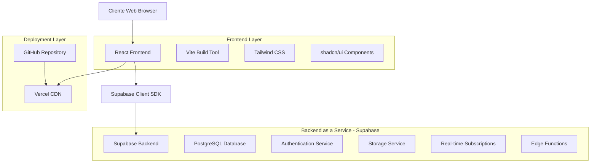
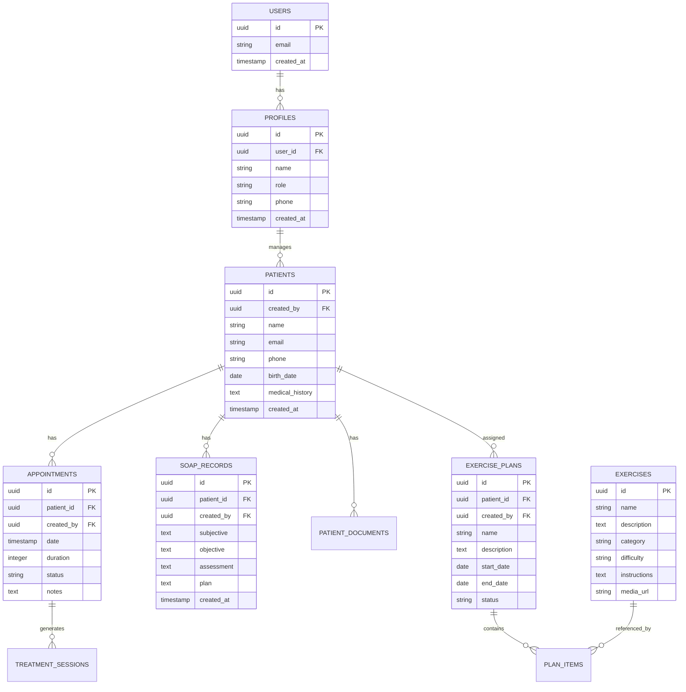

# FisioFlow - Documentação de Arquitetura Técnica

## 1. Arquitetura Geral do Sistema



## 2. Stack Tecnológico

### 2.1 Frontend
- **Framework**: React 18.3.1
- **Build Tool**: Vite 5.4.2
- **Linguagem**: TypeScript 5.6.2
- **Styling**: Tailwind CSS 3.4.10
- **UI Components**: shadcn/ui
- **Roteamento**: React Router DOM 6.26.1
- **Estado Global**: React Context + Hooks
- **Formulários**: React Hook Form + Zod
- **Notificações**: Sonner
- **Ícones**: Lucide React

### 2.2 Backend (Supabase)
- **Database**: PostgreSQL 15+
- **Authentication**: Supabase Auth (JWT)
- **Storage**: Supabase Storage
- **Real-time**: Supabase Realtime
- **API**: Auto-generated REST + GraphQL

### 2.3 Deployment
- **Hosting**: Vercel
- **CI/CD**: GitHub Actions
- **Domain**: Custom domain support
- **SSL**: Automatic HTTPS

## 3. Estrutura de Rotas

| Rota | Componente | Propósito | Autenticação |
|------|------------|-----------|-------------|
| `/` | Home | Página inicial e login | Não |
| `/dashboard` | Dashboard | Painel principal | Sim |
| `/patients` | PatientList | Lista de pacientes | Sim |
| `/patients/:id` | PatientProfile | Perfil do paciente | Sim |
| `/appointments` | AppointmentList | Agendamentos | Sim |
| `/exercises` | ExerciseLibrary | Biblioteca de exercícios | Sim |
| `/reports` | Reports | Relatórios e estatísticas | Sim |
| `/profile` | UserProfile | Perfil do usuário | Sim |
| `/settings` | Settings | Configurações | Sim |

## 4. Modelo de Dados

### 4.1 Diagrama ER



### 4.2 Principais Tabelas

#### Tabela: profiles
```sql
CREATE TABLE profiles (
    id UUID PRIMARY KEY DEFAULT gen_random_uuid(),
    user_id UUID REFERENCES auth.users(id) ON DELETE CASCADE,
    name TEXT NOT NULL,
    role TEXT DEFAULT 'physiotherapist',
    phone TEXT,
    avatar_url TEXT,
    created_at TIMESTAMP WITH TIME ZONE DEFAULT NOW(),
    updated_at TIMESTAMP WITH TIME ZONE DEFAULT NOW()
);
```

#### Tabela: patients
```sql
CREATE TABLE patients (
    id UUID PRIMARY KEY DEFAULT gen_random_uuid(),
    created_by UUID REFERENCES profiles(id) ON DELETE CASCADE,
    name TEXT NOT NULL,
    email TEXT,
    phone TEXT,
    birth_date DATE,
    gender TEXT,
    address TEXT,
    medical_history TEXT,
    emergency_contact TEXT,
    created_at TIMESTAMP WITH TIME ZONE DEFAULT NOW(),
    updated_at TIMESTAMP WITH TIME ZONE DEFAULT NOW()
);
```

#### Tabela: appointments
```sql
CREATE TABLE appointments (
    id UUID PRIMARY KEY DEFAULT gen_random_uuid(),
    patient_id UUID REFERENCES patients(id) ON DELETE CASCADE,
    created_by UUID REFERENCES profiles(id) ON DELETE CASCADE,
    date TIMESTAMP WITH TIME ZONE NOT NULL,
    duration INTEGER DEFAULT 60,
    status TEXT DEFAULT 'scheduled',
    type TEXT DEFAULT 'consultation',
    notes TEXT,
    created_at TIMESTAMP WITH TIME ZONE DEFAULT NOW()
);
```

## 5. Políticas de Segurança (RLS)

### 5.1 Políticas Implementadas

```sql
-- Profiles: usuários só veem seus próprios dados
CREATE POLICY "Users can view own profile" ON profiles
    FOR SELECT USING (auth.uid() = user_id);

CREATE POLICY "Users can update own profile" ON profiles
    FOR UPDATE USING (auth.uid() = user_id);

-- Patients: fisioterapeutas veem apenas seus pacientes
CREATE POLICY "Physiotherapists can view their patients" ON patients
    FOR SELECT USING (
        created_by IN (
            SELECT id FROM profiles WHERE user_id = auth.uid()
        )
    );

-- Appointments: acesso baseado no criador
CREATE POLICY "Users can view their appointments" ON appointments
    FOR SELECT USING (
        created_by IN (
            SELECT id FROM profiles WHERE user_id = auth.uid()
        )
    );
```

### 5.2 Funções de Segurança

```sql
-- Função para criar perfil automaticamente
CREATE OR REPLACE FUNCTION handle_new_user()
RETURNS TRIGGER AS $$
BEGIN
    INSERT INTO profiles (user_id, name, role)
    VALUES (
        NEW.id,
        COALESCE(NEW.raw_user_meta_data->>'name', NEW.email),
        'physiotherapist'
    );
    RETURN NEW;
END;
$$ LANGUAGE plpgsql SECURITY DEFINER;

-- Trigger para novos usuários
CREATE TRIGGER on_auth_user_created
    AFTER INSERT ON auth.users
    FOR EACH ROW EXECUTE FUNCTION handle_new_user();
```

## 6. APIs e Integrações

### 6.1 Supabase Client Configuration

```typescript
// src/lib/supabase.ts
import { createClient } from '@supabase/supabase-js'
import type { Database } from './database.types'

const supabaseUrl = import.meta.env.VITE_SUPABASE_URL
const supabaseAnonKey = import.meta.env.VITE_SUPABASE_ANON_KEY

export const supabase = createClient<Database>(
  supabaseUrl,
  supabaseAnonKey,
  {
    auth: {
      autoRefreshToken: true,
      persistSession: true,
      detectSessionInUrl: true
    }
  }
)
```

### 6.2 Principais Hooks Customizados

#### useAuth
```typescript
export function useAuth() {
  const [user, setUser] = useState<User | null>(null)
  const [loading, setLoading] = useState(true)
  
  // Implementação de autenticação
  const signIn = async (email: string, password: string) => { ... }
  const signUp = async (email: string, password: string) => { ... }
  const signOut = async () => { ... }
  
  return { user, loading, signIn, signUp, signOut }
}
```

#### usePatients
```typescript
export function usePatients() {
  const [patients, setPatients] = useState<Patient[]>([])
  const [loading, setLoading] = useState(false)
  
  const fetchPatients = useCallback(async () => { ... }, [])
  const addPatient = async (patient: Partial<Patient>) => { ... }
  const updatePatient = async (id: string, updates: Partial<Patient>) => { ... }
  
  return { patients, loading, fetchPatients, addPatient, updatePatient }
}
```

## 7. Configuração de Build e Deploy

### 7.1 Vite Configuration

```typescript
// vite.config.ts
import { defineConfig } from 'vite'
import react from '@vitejs/plugin-react'
import path from 'path'

export default defineConfig({
  plugins: [react()],
  resolve: {
    alias: {
      '@': path.resolve(__dirname, './src'),
    },
  },
  build: {
    outDir: 'dist',
    sourcemap: true,
    rollupOptions: {
      output: {
        manualChunks: {
          vendor: ['react', 'react-dom'],
          supabase: ['@supabase/supabase-js']
        }
      }
    }
  }
})
```

### 7.2 Vercel Configuration

```json
{
  "buildCommand": "npm run build",
  "outputDirectory": "dist",
  "installCommand": "npm install",
  "framework": "vite",
  "rewrites": [
    {
      "source": "/(.*)",
      "destination": "/index.html"
    }
  ],
  "headers": [
    {
      "source": "/api/(.*)",
      "headers": [
        {
          "key": "Access-Control-Allow-Origin",
          "value": "*"
        }
      ]
    }
  ]
}
```

## 8. Variáveis de Ambiente

### 8.1 Desenvolvimento (.env.local)
```bash
# Supabase
VITE_SUPABASE_URL=https://your-project.supabase.co
VITE_SUPABASE_ANON_KEY=your-anon-key

# Aplicação
VITE_APP_ENV=development
VITE_APP_NAME=FisioFlow
VITE_APP_VERSION=1.0.0
```

### 8.2 Produção (Vercel)
```bash
# Supabase Production
VITE_SUPABASE_URL=https://your-prod-project.supabase.co
VITE_SUPABASE_ANON_KEY=your-prod-anon-key

# Aplicação
VITE_APP_ENV=production
VITE_APP_NAME=FisioFlow
VITE_APP_VERSION=1.0.0
```

## 9. Performance e Otimizações

### 9.1 Code Splitting
- Lazy loading de rotas
- Componentes carregados sob demanda
- Chunks separados para vendor libraries

### 9.2 Database Optimization
- Índices em colunas frequentemente consultadas
- Paginação em listas grandes
- Cache de consultas frequentes

### 9.3 Asset Optimization
- Compressão de imagens
- Minificação de CSS/JS
- CDN para assets estáticos

## 10. Monitoramento e Logs

### 10.1 Métricas de Frontend
- Core Web Vitals
- Tempo de carregamento
- Taxa de erro JavaScript
- Performance de navegação

### 10.2 Métricas de Backend
- Tempo de resposta das queries
- Uso de recursos do Supabase
- Taxa de erro nas requisições
- Logs de autenticação

## 11. Testes

### 11.1 Estrutura de Testes
```
src/
├── __tests__/
│   ├── components/
│   ├── hooks/
│   ├── utils/
│   └── integration/
├── components/
└── hooks/
```

### 11.2 Tipos de Teste
- **Unit Tests**: Componentes e funções isoladas
- **Integration Tests**: Fluxos completos
- **E2E Tests**: Cenários de usuário

## 12. Backup e Recovery

### 12.1 Estratégia de Backup
- Backup automático diário do Supabase
- Versionamento de migrações
- Backup de configurações
- Documentação de recovery

### 12.2 Disaster Recovery
- Plano de contingência
- Rollback de deploys
- Restauração de dados
- Comunicação de incidentes

---

**Versão**: 1.0  
**Última Atualização**: Janeiro 2025  
**Responsável**: Equipe de Desenvolvimento FisioFlow  