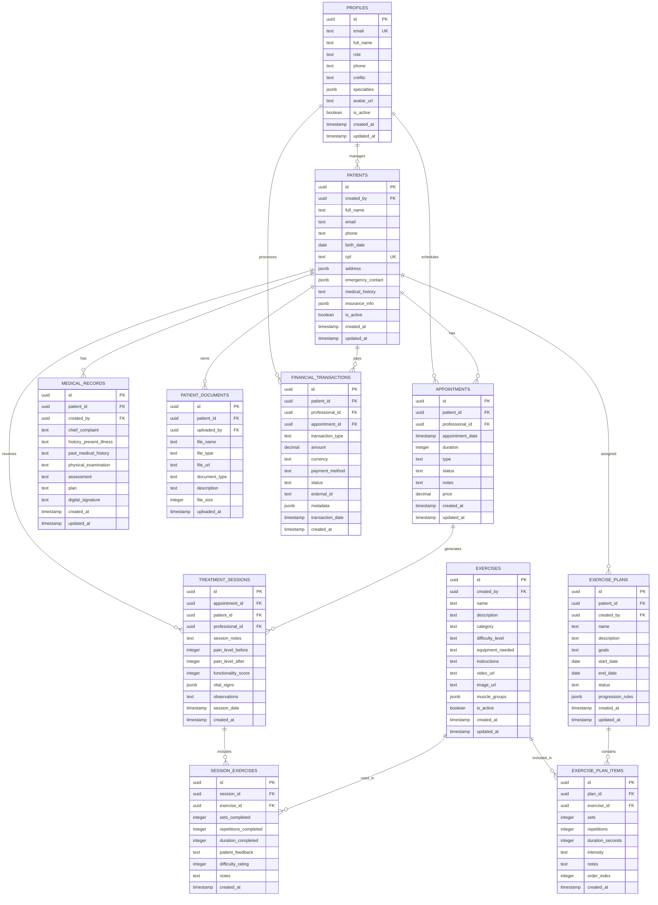

# FisioFlow - Arquitetura Técnica

## 1. Arquitetura Geral


## 2. Descrição das Tecnologias

### Frontend

* **React\@18**: Framework principal com hooks e context

* **TypeScript\@5**: Tipagem estática e IntelliSense

* **Vite\@5**: Build tool e dev server otimizado

* **TailwindCSS\@3**: Framework CSS utility-first

* **Shadcn/ui**: Biblioteca de componentes acessíveis

* **React Router\@6**: Roteamento client-side

* **TanStack Query\@5**: Gerenciamento de estado servidor

* **React Hook Form**: Formulários performáticos

* **Zod**: Validação de schemas TypeScript-first

* **Recharts**: Biblioteca de gráficos React

* **Lucide React**: Ícones SVG otimizados

### Backend/Serviços

* **Supabase**: Backend-as-a-Service completo

  * PostgreSQL com Row Level Security

  * Autenticação JWT integrada

  * Storage de arquivos

  * Edge Functions (Deno)

  * Realtime subscriptions

* **APIs Externas**: Integração com serviços terceiros

### Ferramentas de Desenvolvimento

* **ESLint + Prettier**: Linting e formatação

* **Husky**: Git hooks para qualidade

* **Jest + Testing Library**: Testes unitários

* **Playwright**: Testes end-to-end

* **Storybook**: Documentação de componentes

## 3. Definições de Rotas

| Rota                  | Propósito                  | Proteção             |
| --------------------- | -------------------------- | -------------------- |
| `/`                   | Página inicial/landing     | Pública              |
| `/login`              | Autenticação de usuários   | Pública              |
| `/register`           | Cadastro de novos usuários | Pública              |
| `/forgot-password`    | Recuperação de senha       | Pública              |
| `/reset-password`     | Redefinição de senha       | Pública              |
| `/dashboard`          | Dashboard principal        | Protegida            |
| `/patients`           | Gestão de pacientes        | Protegida            |
| `/patients/:id`       | Detalhes do paciente       | Protegida            |
| `/appointments`       | Gestão de agendamentos     | Protegida            |
| `/schedule`           | Calendário de consultas    | Protegida            |
| `/exercises`          | Biblioteca de exercícios   | Protegida            |
| `/exercise-plans`     | Planos de exercícios       | Protegida            |
| `/treatment-sessions` | Sessões de tratamento      | Protegida            |
| `/financial`          | Gestão financeira          | Protegida            |
| `/reports`            | Relatórios e analytics     | Protegida            |
| `/ai-assistant`       | Assistente de IA           | Protegida            |
| `/knowledge-base`     | Base de conhecimento       | Protegida            |
| `/partner-portal`     | Portal de parceiros        | Protegida (Parceiro) |
| `/settings`           | Configurações da conta     | Protegida            |
| `/profile`            | Perfil do usuário          | Protegida            |

## 4. Definições de API

### 4.1 APIs Core (Supabase)

#### Autenticação

```typescript
// Tipos de autenticação
interface AuthResponse {
  user: User | null;
  session: Session | null;
  error: AuthError | null;
}

interface LoginCredentials {
  email: string;
  password: string;
}

interface RegisterData {
  email: string;
  password: string;
  full_name: string;
  role: UserRole;
  phone?: string;
  crefito?: string;
}
```

#### Pacientes

```typescript
// GET /rest/v1/patients
interface PatientsResponse {
  data: Patient[];
  count: number;
  error: PostgrestError | null;
}

// POST /rest/v1/patients
interface CreatePatientRequest {
  full_name: string;
  email: string;
  phone: string;
  birth_date: string;
  cpf: string;
  address: Address;
  emergency_contact: EmergencyContact;
  medical_history?: string;
  insurance_info?: InsuranceInfo;
}
```

#### Agendamentos

```typescript
// GET /rest/v1/appointments
interface AppointmentsResponse {
  data: Appointment[];
  count: number;
  error: PostgrestError | null;
}

// POST /rest/v1/appointments
interface CreateAppointmentRequest {
  patient_id: string;
  professional_id: string;
  appointment_date: string;
  duration: number;
  type: AppointmentType;
  notes?: string;
  status: AppointmentStatus;
}
```

### 4.2 APIs Externas

#### OpenAI Integration

```typescript
// POST /api/ai/chat
interface AIQueryRequest {
  message: string;
  context?: string;
  patient_id?: string;
  session_id?: string;
}

interface AIQueryResponse {
  response: string;
  confidence: number;
  sources?: string[];
  usage: {
    prompt_tokens: number;
    completion_tokens: number;
    total_tokens: number;
  };
}
```

#### Stripe Integration

```typescript
// POST /api/payments/create-intent
interface PaymentIntentRequest {
  amount: number;
  currency: string;
  patient_id: string;
  appointment_id?: string;
  description: string;
}

interface PaymentIntentResponse {
  client_secret: string;
  payment_intent_id: string;
  status: string;
}
```

#### Email Service

```typescript
// POST /api/notifications/email
interface EmailRequest {
  to: string[];
  template: string;
  variables: Record<string, any>;
  scheduled_at?: string;
}

interface EmailResponse {
  message_id: string;
  status: 'sent' | 'scheduled' | 'failed';
  error?: string;
}
```

## 5. Arquitetura do Servidor (Edge Functions)


## 6. Modelo de Dados

### 6.1 Diagrama Entidade-Relacionamento



### 6.2 Definições DDL

#### Tabela de Perfis (Profiles)

```sql
CREATE TABLE profiles (
    id UUID PRIMARY KEY DEFAULT gen_random_uuid(),
    email TEXT UNIQUE NOT NULL,
    full_name TEXT NOT NULL,
    role TEXT NOT NULL CHECK (role IN ('admin', 'fisioterapeuta', 'recepcionista', 'estagiario', 'paciente', 'parceiro')),
    phone TEXT,
    crefito TEXT,
    specialties JSONB DEFAULT '[]',
    avatar_url TEXT,
    is_active BOOLEAN DEFAULT true,
    created_at TIMESTAMP WITH TIME ZONE DEFAULT NOW(),
    updated_at TIMESTAMP WITH TIME ZONE DEFAULT NOW()
);

-- Índices
CREATE INDEX idx_profiles_email ON profiles(email);
CREATE INDEX idx_profiles_role ON profiles(role);
CREATE INDEX idx_profiles_active ON profiles(is_active);

-- RLS Policies
ALTER TABLE profiles ENABLE ROW LEVEL SECURITY;

CREATE POLICY "Users can view own profile" ON profiles
FOR SELECT USING (auth.uid() = id);

CREATE POLICY "Users can update own profile" ON profiles
FOR UPDATE USING (auth.uid() = id);

CREATE POLICY "Admins can view all profiles" ON profiles
FOR SELECT USING (
    EXISTS (
        SELECT 1 FROM profiles
        WHERE id = auth.uid() AND role = 'admin'
    )
);
```

#### Tabela de Pacientes

```sql
CREATE TABLE patients (
    id UUID PRIMARY KEY DEFAULT gen_random_uuid(),
    created_by UUID REFERENCES profiles(id) ON DELETE SET NULL,
    full_name TEXT NOT NULL,
    email TEXT,
    phone TEXT NOT NULL,
    birth_date DATE NOT NULL,
    cpf TEXT UNIQUE,
    address JSONB DEFAULT '{}',
    emergency_contact JSONB DEFAULT '{}',
    medical_history TEXT,
    insurance_info JSONB DEFAULT '{}',
    is_active BOOLEAN DEFAULT true,
    created_at TIMESTAMP WITH TIME ZONE DEFAULT NOW(),
    updated_at TIMESTAMP WITH TIME ZONE DEFAULT NOW()
);

-- Índices
CREATE INDEX idx_patients_name ON patients(full_name);
CREATE INDEX idx_patients_cpf ON patients(cpf);
CREATE INDEX idx_patients_phone ON patients(phone);
CREATE INDEX idx_patients_created_by ON patients(created_by);
CREATE INDEX idx_patients_active ON patients(is_active);

-- RLS Policies
ALTER TABLE patients ENABLE ROW LEVEL SECURITY;

CREATE POLICY "Authenticated users can view patients" ON patients
FOR SELECT TO authenticated USING (true);

CREATE POLICY "Authenticated users can insert patients" ON patients
FOR INSERT TO authenticated WITH CHECK (true);

CREATE POLICY "Authenticated users can update patients" ON patients
FOR UPDATE TO authenticated USING (true);

CREATE POLICY "Only admins can delete patients" ON patients
FOR DELETE TO authenticated USING (
    EXISTS (
        SELECT 1 FROM profiles
        WHERE id = auth.uid() AND role = 'admin'
    )
);
```

#### Tabela de Agendamentos

```sql
CREATE TABLE appointments (
    id UUID PRIMARY KEY DEFAULT gen_random_uuid(),
    patient_id UUID REFERENCES patients(id) ON DELETE CASCADE,
    professional_id UUID REFERENCES profiles(id) ON DELETE SET NULL,
    appointment_date TIMESTAMP WITH TIME ZONE NOT NULL,
    duration INTEGER DEFAULT 60, -- em minutos
    type TEXT NOT NULL CHECK (type IN ('consulta', 'retorno', 'avaliacao', 'sessao')),
    status TEXT DEFAULT 'agendado' CHECK (status IN ('agendado', 'confirmado', 'em_andamento', 'concluido', 'cancelado', 'faltou')),
    notes TEXT,
    price DECIMAL(10,2),
    created_at TIMESTAMP WITH TIME ZONE DEFAULT NOW(),
    updated_at TIMESTAMP WITH TIME ZONE DEFAULT NOW()
);

-- Índices
CREATE INDEX idx_appointments_date ON appointments(appointment_date);
CREATE INDEX idx_appointments_patient ON appointments(patient_id);
CREATE INDEX idx_appointments_professional ON appointments(professional_id);
CREATE INDEX idx_appointments_status ON appointments(status);

-- RLS Policies
ALTER TABLE appointments ENABLE ROW LEVEL SECURITY;

CREATE POLICY "Authenticated users can view appointments" ON appointments
FOR SELECT TO authenticated USING (true);

CREATE POLICY "Authenticated users can manage appointments" ON appointments
FOR ALL TO authenticated USING (true);
```

#### Tabela de Exercícios

```sql
CREATE TABLE exercises (
    id UUID PRIMARY KEY DEFAULT gen_random_uuid(),
    created_by UUID REFERENCES profiles(id) ON DELETE SET NULL,
    name TEXT NOT NULL,
    description TEXT,
    category TEXT NOT NULL,
    difficulty_level TEXT CHECK (difficulty_level IN ('iniciante', 'intermediario', 'avancado')),
    equipment_needed TEXT,
    instructions TEXT,
    video_url TEXT,
    image_url TEXT,
    muscle_groups JSONB DEFAULT '[]',
    is_active BOOLEAN DEFAULT true,
    created_at TIMESTAMP WITH TIME ZONE DEFAULT NOW(),
    updated_at TIMESTAMP WITH TIME ZONE DEFAULT NOW()
);

-- Índices
CREATE INDEX idx_exercises_name ON exercises(name);
CREATE INDEX idx_exercises_category ON exercises(category);
CREATE INDEX idx_exercises_difficulty ON exercises(difficulty_level);
CREATE INDEX idx_exercises_active ON exercises(is_active);

-- RLS Policies
ALTER TABLE exercises ENABLE ROW LEVEL SECURITY;

CREATE POLICY "Authenticated users can view exercises" ON exercises
FOR SELECT TO authenticated USING (true);

CREATE POLICY "Professionals can manage exercises" ON exercises
FOR ALL TO authenticated USING (
    EXISTS (
        SELECT 1 FROM profiles
        WHERE id = auth.uid() AND role IN ('admin', 'fisioterapeuta')
    )
);
```

#### Tabela de Sessões de Tratamento

```sql
CREATE TABLE treatment_sessions (
    id UUID PRIMARY KEY DEFAULT gen_random_uuid(),
    appointment_id UUID REFERENCES appointments(id) ON DELETE CASCADE,
    patient_id UUID REFERENCES patients(id) ON DELETE CASCADE,
    professional_id UUID REFERENCES profiles(id) ON DELETE SET NULL,
    session_notes TEXT,
    pain_level_before INTEGER CHECK (pain_level_before >= 0 AND pain_level_before <= 10),
    pain_level_after INTEGER CHECK (pain_level_after >= 0 AND pain_level_after <= 10),
    functionality_score INTEGER CHECK (functionality_score >= 0 AND functionality_score <= 100),
    vital_signs JSONB DEFAULT '{}',
    observations TEXT,
    session_date TIMESTAMP WITH TIME ZONE DEFAULT NOW(),
    created_at TIMESTAMP WITH TIME ZONE DEFAULT NOW()
);

-- Índices
CREATE INDEX idx_treatment_sessions_patient ON treatment_sessions(patient_id);
CREATE INDEX idx_treatment_sessions_professional ON treatment_sessions(professional_id);
CREATE INDEX idx_treatment_sessions_date ON treatment_sessions(session_date);

-- RLS Policies
ALTER TABLE treatment_sessions ENABLE ROW LEVEL SECURITY;

CREATE POLICY "Authenticated users can view treatment sessions" ON treatment_sessions
FOR SELECT TO authenticated USING (true);

CREATE POLICY "Professionals can manage treatment sessions" ON treatment_sessions
FOR ALL TO authenticated USING (
    EXISTS (
        SELECT 1 FROM profiles
        WHERE id = auth.uid() AND role IN ('admin', 'fisioterapeuta', 'estagiario')
    )
);
```

#### Configuração de Storage

```sql
-- Criar buckets para arquivos
INSERT INTO storage.buckets (id, name, public, file_size_limit, allowed_mime_types)
VALUES 
('patient-documents', 'patient-documents', false, 52428800, ARRAY['application/pdf', 'image/jpeg', 'image/png', 'image/webp']),
('exercise-media', 'exercise-media', true, 104857600, ARRAY['image/jpeg', 'image/png', 'image/webp', 'video/mp4', 'video/webm']),
('profile-avatars', 'profile-avatars', true, 5242880, ARRAY['image/jpeg', 'image/png', 'image/webp']);

-- Políticas de acesso para patient-documents
CREATE POLICY "Users can upload patient documents" ON storage.objects
FOR INSERT WITH CHECK (
    bucket_id = 'patient-documents' AND
    auth.role() = 'authenticated'
);

CREATE POLICY "Users can view patient documents" ON storage.objects
FOR SELECT USING (
    bucket_id = 'patient-documents' AND
    auth.role() = 'authenticated'
);

-- Políticas de acesso para exercise-media
CREATE POLICY "Public access to exercise media" ON storage.objects
FOR SELECT USING (bucket_id = 'exercise-media');

CREATE POLICY "Professionals can upload exercise media" ON storage.objects
FOR INSERT WITH CHECK (
    bucket_id = 'exercise-media' AND
    EXISTS (
        SELECT 1 FROM profiles
        WHERE id = auth.uid() AND role IN ('admin', 'fisioterapeuta')
    )
);

-- Políticas de acesso para profile-avatars
CREATE POLICY "Users can upload own avatar" ON storage.objects
FOR INSERT WITH CHECK (
    bucket_id = 'profile-avatars' AND
    auth.uid()::text = (storage.foldername(name))[1]
);

CREATE POLICY "Public access to avatars" ON storage.objects
FOR SELECT USING (bucket_id = 'profile-avatars');
```

#### Dados Iniciais

```sql
-- Inserir perfil de administrador
INSERT INTO profiles (id, email, full_name, role, phone, is_active)
VALUES 
('00000000-0000-0000-0000-000000000001', 'admin@fisioflow.com', 'Administrador Sistema', 'admin', '+55 11 99999-9999', true),
('00000000-0000-0000-0000-000000000002', 'fisio@fisioflow.com', 'Dr. João Silva', 'fisioterapeuta', '+55 11 98888-8888', true);

-- Inserir exercícios básicos
INSERT INTO exercises (name, description, category, difficulty_level, equipment_needed, instructions, muscle_groups)
VALUES 
('Alongamento Cervical', 'Exercício para alívio de tensão no pescoço', 'Alongamento', 'iniciante', 'Nenhum', 'Incline a cabeça lateralmente e mantenha por 30 segundos', '["cervical", "trapezio"]'),
('Fortalecimento Quadríceps', 'Exercício para fortalecimento do quadríceps', 'Fortalecimento', 'intermediario', 'Caneleira', 'Extensão de joelho sentado, 3 séries de 15 repetições', '["quadriceps", "joelho"]'),
('Caminhada', 'Exercício cardiovascular básico', 'Cardio', 'iniciante', 'Nenhum', 'Caminhada em ritmo moderado por 30 minutos', '["membros_inferiores", "cardiovascular"]');
```

## 7. Configurações de Segurança

### 7.1 Row Level Security (RLS)

Todas as tabelas principais implementam RLS para garantir que:

* Usuários só acessem dados permitidos para seu role

* Pacientes só vejam seus próprios dados

* Profissionais tenham acesso adequado aos dados dos pacientes

* Administradores tenham acesso completo quando necessário

### 7.2 Validação de Dados

```typescript
// Schemas Zod para validação
export const patientSchema = z.object({
  full_name: z.string().min(2, 'Nome deve ter pelo menos 2 caracteres'),
  email: z.string().email('Email inválido').optional(),
  phone: z.string().min(10, 'Telefone deve ter pelo menos 10 dígitos'),
  birth_date: z.string().refine(date => {
    const birthDate = new Date(date);
    const today = new Date();
    return birthDate < today;
  }, 'Data de nascimento deve ser anterior a hoje'),
  cpf: z.string().refine(cpf => {
    // Validação de CPF
    return validateCPF(cpf);
  }, 'CPF inválido'),
});

export const appointmentSchema = z.object({
  patient_id: z.string().uuid('ID do paciente inválido'),
  professional_id: z.string().uuid('ID do profissional inválido'),
  appointment_date: z.string().refine(date => {
    const appointmentDate = new Date(date);
    const now = new Date();
    return appointmentDate > now;
  }, 'Data do agendamento deve ser futura'),
  duration: z.number().min(15).max(240, 'Duração deve ser entre 15 e 240 minutos'),
  type: z.enum(['consulta', 'retorno', 'avaliacao', 'sessao']),
});
```

### 7.3 Middleware de Autenticação

```typescript
// middleware/auth.ts
export async function authMiddleware(req: Request): Promise<User | null> {
  const token = req.headers.get('Authorization')?.replace('Bearer ', '');
  
  if (!token) {
    throw new Error('Token de autenticação necessário');
  }
  
  const { data: { user }, error } = await supabase.auth.getUser(token);
  
  if (error || !user) {
    throw new Error('Token inválido');
  }
  
  return user;
}

// Verificação de roles
export async function requireRole(userId: string, allowedRoles: UserRole[]): Promise<boolean> {
  const { data: profile } = await supabase
    .from('profiles')
    .select('role')
    .eq('id', userId)
    .single();
  
  if (!profile || !allowedRoles.includes(profile.role)) {
    throw new Error('Acesso negado');
  }
  
  return true;
}
```

## 8. Performance e Otimização

### 8.1 Estratégias de Cache

```typescript
// Configuração do TanStack Query
export const queryClient = new QueryClient({
  defaultOptions: {
    queries: {
      staleTime: 5 * 60 * 1000, // 5 minutos
      cacheTime: 10 * 60 * 1000, // 10 minutos
      retry: 3,
      retryDelay: attemptIndex => Math.min(1000 * 2 ** attemptIndex, 30000),
    },
  },
});

// Cache específico por tipo de dados
export const cacheConfig = {
  patients: { staleTime: 2 * 60 * 1000 }, // 2 minutos
  appointments: { staleTime: 1 * 60 * 1000 }, // 1 minuto
  exercises: { staleTime: 30 * 60 * 1000 }, // 30 minutos
  profiles: { staleTime: 15 * 60 * 1000 }, // 15 minutos
};
```

### 8.2 Lazy Loading e Code Splitting

```typescript
// Lazy loading de páginas
const PatientsPage = lazy(() => import('@/pages/PatientsPage'));
const AppointmentsPage = lazy(() => import('@/pages/AppointmentsPage'));
const ExercisesPage = lazy(() => import('@/pages/ExercisesPage'));
const FinancialPage = lazy(() => import('@/pages/FinancialPage'));
const AIAssistantPage = lazy(() => import('@/pages/AIAssistantPage'));

// Preload de componentes críticos
const preloadComponents = () => {
  import('@/components/patients/PatientForm');
  import('@/components/appointments/AppointmentModal');
};
```

### 8.3 Otimização de Bundle

```typescript
// vite.config.ts
export default defineConfig({
  build: {
    rollupOptions: {
      output: {
        manualChunks: {
          vendor: ['react', 'react-dom'],
          ui: ['@radix-ui/react-dialog', '@radix-ui/react-dropdown-menu'],
          charts: ['recharts'],
          forms: ['react-hook-form', '@hookform/resolvers'],
        },
      },
    },
    chunkSizeWarningLimit: 1000,
  },
  optimizeDeps: {
    include: ['react', 'react-dom', '@supabase/supabase-js'],
  },
});
```

## 9. Monitoramento e Observabilidade

### 9.1 Métricas de Performance

```typescript
// Performance monitoring
export const performanceMonitor = {
  trackPageLoad: (pageName: string) => {
    const startTime = performance.now();
    return () => {
      const loadTime = performance.now() - startTime;
      // Enviar métrica para serviço de monitoramento
      analytics.track('page_load', {
        page: pageName,
        load_time: loadTime,
      });
    };
  },
  
  trackAPICall: (endpoint: string, method: string) => {
    const startTime = performance.now();
    return (success: boolean, error?: string) => {
      const duration = performance.now() - startTime;
      analytics.track('api_call', {
        endpoint,
        method,
        duration,
        success,
        error,
      });
    };
  },
};
```

### 9.2 Error Tracking

```typescript
// Error boundary com Sentry
import * as Sentry from '@sentry/react';

export const ErrorBoundary = Sentry.withErrorBoundary(
  ({ children }: { children: React.ReactNode }) => children,
  {
    fallback: ({ error, resetError }) => (
      <div className="error-fallback">
        <h2>Algo deu errado</h2>
        <p>{error.message}</p>
        <button onClick={resetError}>Tentar novamente</button>
      </div>
    ),
    beforeCapture: (scope, error) => {
      scope.setTag('component', 'ErrorBoundary');
      scope.setLevel('error');
    },
  }
);
```

***

**Documento criado em**: Janeiro 2025\
**Versão**: 1.0\
**Próxima revisão**: Após implementação da Fase 1
