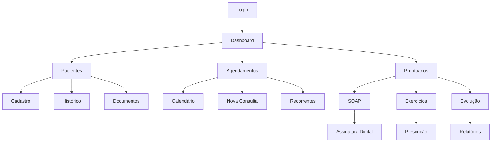

# FisioFlow - Documentação Completa do Sistema

## 1. Visão Geral do Produto

O FisioFlow é um sistema completo de gestão para clínicas de fisioterapia, desenvolvido com tecnologias modernas (React + TypeScript + Supabase). O sistema oferece uma solução integrada para gerenciamento de pacientes, agendamentos, prontuários eletrônicos, exercícios terapêuticos e análises de desempenho.

### Principais Objetivos
- Digitalizar e otimizar processos clínicos de fisioterapia
- Garantir conformidade com regulamentações de saúde (LGPD, CFM)
- Melhorar a experiência de pacientes e profissionais
- Fornecer insights baseados em dados para tomada de decisões

## 2. Funcionalidades Principais

### 2.1 Perfis de Usuário

| Perfil | Método de Registro | Principais Permissões |
|--------|-------------------|----------------------|
| Administrador | Convite do sistema | Acesso completo, gestão de usuários, relatórios financeiros |
| Fisioterapeuta | Registro com CREFITO | Gestão de pacientes, prescrição de exercícios, registros SOAP |
| Estagiário | Convite de supervisor | Acompanhamento supervisionado, visualização de protocolos |
| Paciente | Registro público | Acesso aos próprios dados, exercícios prescritos, histórico |
| Parceiro | Registro com validação | Portal específico, comissões, relatórios de performance |

### 2.2 Módulos do Sistema

O sistema FisioFlow é composto pelos seguintes módulos principais:

1. **Dashboard Principal**: visão geral, métricas em tempo real, notificações
2. **Gestão de Pacientes**: cadastro completo, histórico médico, documentos
3. **Agendamento**: calendário avançado, consultas recorrentes, notificações
4. **Prontuários SOAP**: registros estruturados, assinaturas digitais, auditoria
5. **Biblioteca de Exercícios**: catálogo completo, prescrições personalizadas
6. **Sessões de Tratamento**: acompanhamento de evolução, métricas de progresso
7. **Relatórios e Analytics**: dashboards inteligentes, insights de performance
8. **Sistema Financeiro**: cobrança, comissões, relatórios financeiros
9. **Assistente de IA**: sugestões inteligentes, análise de padrões
10. **Configurações**: perfil, preferências, configurações da clínica

### 2.3 Detalhes dos Módulos

| Módulo | Componente Principal | Funcionalidades |
|--------|---------------------|----------------|
| Dashboard | Dashboard.tsx | Métricas em tempo real, gráficos de performance, notificações urgentes, agenda do dia |
| Pacientes | PatientsPage.tsx | CRUD completo, upload de documentos, histórico médico, controle de acesso LGPD |
| Agendamentos | Schedule.tsx | Calendário multi-visualização, detecção de conflitos, consultas recorrentes, lembretes automáticos |
| Prontuários SOAP | SOAPRecordEditor.tsx | Editor estruturado S.O.A.P, assinatura digital, trilha de auditoria, integração com planos |
| Exercícios | ExercisesEnhanced.tsx | Biblioteca filtrada, prescrições personalizadas, acompanhamento de progresso, protocolos baseados em evidência |
| Sessões | TreatmentSessionManager.tsx | Registro de sessões, escalas de dor, evolução funcional, metas de tratamento |
| Relatórios | Reports.tsx | Dashboards interativos, métricas de adesão, análises de tendências, exportação PDF |
| Financeiro | Financial.tsx | Cobrança automática, controle de inadimplência, comissões de parceiros, relatórios fiscais |
| IA | SmartAI.tsx | Sugestões de exercícios, análise de padrões, insights preditivos, base de conhecimento |
| Configurações | Settings.tsx | Perfil profissional, preferências do sistema, configurações da clínica, segurança |

## 3. Fluxos Principais do Sistema

### Fluxo do Fisioterapeuta
1. Login no sistema → Dashboard com agenda do dia
2. Visualizar pacientes agendados → Acessar prontuário
3. Realizar consulta → Registrar SOAP
4. Prescrever exercícios → Acompanhar evolução
5. Gerar relatórios → Planejar próximas sessões

### Fluxo do Paciente
1. Acesso via link/app → Visualizar dados pessoais
2. Consultar exercícios prescritos → Registrar execução
3. Acompanhar evolução → Comunicar com terapeuta
4. Agendar consultas → Receber lembretes

### Fluxo Administrativo
1. Gestão de usuários → Controle de permissões
2. Monitoramento de métricas → Análise de performance
3. Gestão financeira → Relatórios gerenciais
4. Configurações do sistema → Backup e segurança

## 4. Design e Interface do Usuário

### 4.1 Estilo de Design

- **Cores Primárias**: 
  - Azul principal: `#3B82F6` (blue-500)
  - Azul escuro: `#1E40AF` (blue-700)
  - Verde sucesso: `#10B981` (emerald-500)
  - Vermelho erro: `#EF4444` (red-500)
  - Amarelo aviso: `#F59E0B` (amber-500)

- **Tipografia**: 
  - Fonte principal: Inter (sistema)
  - Tamanhos: 12px (small), 14px (base), 16px (lg), 20px (xl)
  - Pesos: 400 (normal), 500 (medium), 600 (semibold), 700 (bold)

- **Componentes**:
  - Botões com bordas arredondadas (6px)
  - Cards com sombra sutil e bordas suaves
  - Inputs com foco em acessibilidade
  - Ícones do Lucide React

- **Layout**:
  - Sidebar responsiva com navegação principal
  - Header com breadcrumbs e ações contextuais
  - Grid system baseado em CSS Grid e Flexbox
  - Breakpoints: mobile (640px), tablet (768px), desktop (1024px)

### 4.2 Componentes de Interface

| Página | Módulo | Elementos de UI |
|--------|--------|----------------|
| Dashboard | Métricas | Cards com gráficos, indicadores KPI, lista de tarefas, calendário compacto |
| Pacientes | Lista | Tabela responsiva, filtros avançados, ações em lote, modal de detalhes |
| Agendamentos | Calendário | Visualização mensal/semanal/diária, drag-and-drop, cores por tipo, tooltips |
| SOAP | Editor | Formulário estruturado, editor rich text, upload de anexos, assinatura digital |
| Exercícios | Biblioteca | Grid de cards, filtros por categoria, modal de detalhes, player de vídeo |
| Relatórios | Analytics | Gráficos interativos (Recharts), filtros de período, exportação PDF/Excel |

### 4.3 Responsividade

- **Desktop-first**: Otimizado para uso profissional em desktops
- **Mobile-adaptive**: Interface adaptada para tablets e smartphones
- **Touch-friendly**: Botões e controles otimizados para toque
- **Progressive Web App**: Funcionalidades offline e instalação

## 5. Segurança e Conformidade

### 5.1 Autenticação e Autorização

- **Supabase Auth**: Sistema robusto com JWT tokens
- **Row Level Security (RLS)**: Controle de acesso a nível de banco
- **Roles e Permissões**: Sistema hierárquico de permissões
- **Session Management**: Controle de sessões com timeout automático
- **Multi-factor Authentication**: Suporte a 2FA (planejado)

### 5.2 Proteção de Dados

- **LGPD Compliance**: Conformidade com Lei Geral de Proteção de Dados
- **Criptografia**: Dados sensíveis criptografados em repouso e trânsito
- **Audit Trail**: Trilha completa de auditoria para ações críticas
- **Backup Automático**: Backup diário com retenção de 30 dias
- **Anonimização**: Ferramentas para anonimização de dados

### 5.3 Segurança Técnica

- **HTTPS Obrigatório**: Todas as comunicações criptografadas
- **Headers de Segurança**: CSP, HSTS, X-Frame-Options configurados
- **Rate Limiting**: Proteção contra ataques de força bruta
- **Input Validation**: Validação rigorosa com Zod schemas
- **SQL Injection Protection**: Queries parametrizadas e ORM seguro

## 6. Integrações e APIs

### 6.1 APIs Internas (Supabase)

- **REST API**: Endpoints automáticos para todas as tabelas
- **GraphQL**: Queries otimizadas para dados relacionais
- **Realtime**: Subscriptions para atualizações em tempo real
- **Storage**: Upload e gerenciamento de arquivos
- **Edge Functions**: Lógica customizada no servidor

### 6.2 APIs Externas

- **OpenAI/Anthropic**: Assistente de IA e análise de texto
- **Stripe/MercadoPago**: Processamento de pagamentos
- **Resend/SendGrid**: Envio de emails transacionais
- **Twilio**: SMS e notificações por WhatsApp
- **Google Calendar**: Sincronização de agendamentos

### 6.3 Webhooks e Automações

- **Payment Webhooks**: Confirmação automática de pagamentos
- **Email Triggers**: Envio automático de lembretes
- **Backup Triggers**: Backup automático de dados críticos
- **Audit Triggers**: Registro automático de ações importantes

## 7. Performance e Escalabilidade

### 7.1 Otimizações Frontend

- **Code Splitting**: Carregamento sob demanda de módulos
- **Lazy Loading**: Componentes carregados quando necessário
- **Image Optimization**: Compressão e formatos modernos (WebP)
- **Bundle Analysis**: Monitoramento do tamanho dos bundles
- **Service Workers**: Cache inteligente e funcionalidades offline

### 7.2 Otimizações Backend

- **Database Indexing**: Índices otimizados para queries frequentes
- **Connection Pooling**: Pool de conexões para melhor performance
- **Query Optimization**: Queries otimizadas com EXPLAIN ANALYZE
- **Caching Strategy**: Cache em múltiplas camadas (Redis, CDN)
- **Auto-scaling**: Escalabilidade automática baseada em demanda

### 7.3 Monitoramento

- **Application Monitoring**: Métricas de performance em tempo real
- **Error Tracking**: Captura e análise de erros
- **User Analytics**: Análise de comportamento dos usuários
- **Database Monitoring**: Monitoramento de performance do banco
- **Uptime Monitoring**: Monitoramento de disponibilidade 24/7

## 8. Deployment e DevOps

### 8.1 Ambientes

- **Development**: Ambiente local com hot reload
- **Staging**: Ambiente de testes com dados simulados
- **Production**: Ambiente de produção com alta disponibilidade

### 8.2 CI/CD Pipeline

- **GitHub Actions**: Automação de build, teste e deploy
- **Quality Gates**: Verificação de qualidade antes do deploy
- **Automated Testing**: Testes unitários e de integração
- **Security Scanning**: Verificação de vulnerabilidades
- **Performance Testing**: Testes de carga e performance

### 8.3 Infraestrutura

- **Vercel/Netlify**: Hosting otimizado para aplicações React
- **Supabase Cloud**: Backend gerenciado com alta disponibilidade
- **CDN Global**: Distribuição de conteúdo otimizada
- **SSL/TLS**: Certificados automáticos e renovação
- **Domain Management**: Gestão de domínios e DNS

## 9. Roadmap e Futuras Implementações

### 9.1 Próximas Funcionalidades (Q1 2024)

- [ ] App Mobile (React Native)
- [ ] Sistema de Notificações Push
- [ ] Integração com WhatsApp Business
- [ ] Relatórios PDF automáticos
- [ ] Dashboard Financeiro avançado
- [ ] Sistema de Backup em tempo real

### 9.2 Melhorias Planejadas (Q2-Q3 2024)

- [ ] Inteligência Artificial para diagnósticos
- [ ] Integração com equipamentos IoT
- [ ] Telemedicina integrada
- [ ] API pública para terceiros
- [ ] Marketplace de exercícios
- [ ] Sistema de gamificação para pacientes

### 9.3 Visão de Longo Prazo (2024-2025)

- [ ] Plataforma multi-tenant
- [ ] Integração com sistemas hospitalares
- [ ] Análise preditiva de resultados
- [ ] Realidade virtual para reabilitação
- [ ] Blockchain para registros médicos
- [ ] Expansão internacional

## 10. Suporte e Manutenção

### 10.1 Documentação

- **Guia do Usuário**: Manual completo para cada perfil
- **API Documentation**: Documentação técnica das APIs
- **Video Tutorials**: Tutoriais em vídeo para funcionalidades
- **FAQ**: Perguntas frequentes e soluções
- **Release Notes**: Notas de versão e changelog

### 10.2 Suporte Técnico

- **Help Desk**: Sistema de tickets para suporte
- **Live Chat**: Chat em tempo real durante horário comercial
- **Knowledge Base**: Base de conhecimento searchável
- **Community Forum**: Fórum da comunidade de usuários
- **Training Programs**: Programas de treinamento personalizados

### 10.3 Manutenção

- **Updates Regulares**: Atualizações mensais com melhorias
- **Security Patches**: Correções de segurança prioritárias
- **Performance Optimization**: Otimizações contínuas
- **Bug Fixes**: Correção rápida de bugs reportados
- **Feature Requests**: Implementação baseada em feedback

---

**FisioFlow** - Transformando o cuidado em saúde através da tecnologia.

*Última atualização: Janeiro 2024*
*Versão do documento: 2.0*