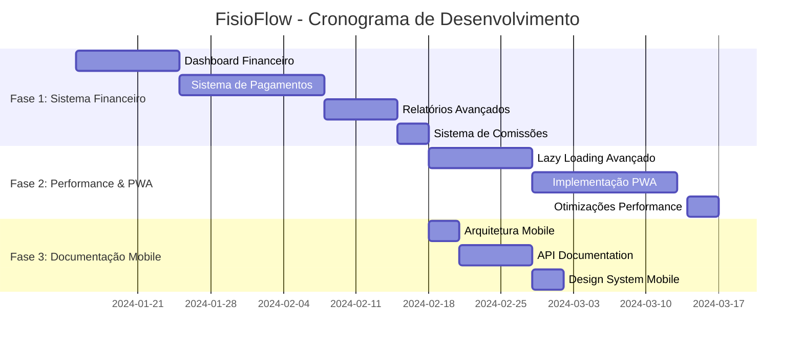

# FisioFlow - Plano Estratégico dos Próximos Passos

## 1. Visão Geral do Estado Atual

O FisioFlow está em um estágio avançado de desenvolvimento com uma base sólida implementada:

### ✅ **Funcionalidades Implementadas**
- Arquitetura React + TypeScript + Supabase
- Sistema de autenticação com Supabase Auth
- CRUD completo de pacientes e agendamentos
- Interface responsiva com shadcn/ui e Tailwind CSS
- 32 migrações de banco de dados
- Sistema de exercícios com biblioteca completa
- Prontuários eletrônicos (SOAP)
- Configuração MCP para shadcn/ui
- Repositório Git configurado e hospedado no GitHub

### 🎯 **Próximas Prioridades Estratégicas**
1. **Sistema Financeiro Completo** - Dashboard e métricas financeiras
2. **Otimização de Performance** - Lazy loading avançado e PWA
3. **Documentação Mobile** - Preparação para desenvolvimento futuro

---

## 2. FASE 1: Sistema Financeiro Completo (4-5 semanas)

### **Objetivo**: Implementar sistema financeiro robusto com dashboard e métricas avançadas
**Prioridade**: CRÍTICA
**Início**: Imediato
**Conclusão Estimada**: 5 semanas

### 2.1 Dashboard Financeiro Principal
**Duração**: 1,5 semanas
**Responsável**: Desenvolvedor Frontend + Backend

#### **Critérios de Aceitação**:
- Dashboard em tempo real com métricas financeiras
- Gráficos interativos (receita, despesas, lucro)
- Filtros por período (dia, semana, mês, ano)
- Comparativos com períodos anteriores
- Indicadores KPI (ticket médio, taxa de conversão)

#### **Dependências Técnicas**:
- Biblioteca Recharts (já instalada)
- Tabelas financeiras no Supabase
- Sistema de autenticação funcionando

#### **Arquivos a Criar/Modificar**:
```
src/pages/Financial.tsx (expandir)
src/components/dashboard/FinancialDashboard.tsx
src/components/dashboard/RevenueChart.tsx
src/components/dashboard/ExpenseChart.tsx
src/hooks/useFinancialMetrics.ts
src/types/financial.ts
```

#### **Estimativa de Esforço**:
- Setup inicial: 2 dias
- Componentes de gráficos: 3 dias
- Integração com dados: 2 dias
- Testes e refinamentos: 3 dias

### 2.2 Sistema de Cobrança e Pagamentos
**Duração**: 2 semanas
**Responsável**: Desenvolvedor Fullstack

#### **Critérios de Aceitação**:
- Integração com Stripe ou Mercado Pago
- Geração automática de cobranças
- Controle de inadimplência
- Notificações de pagamento
- Relatórios de recebimento

#### **Dependências Técnicas**:
- Conta no provedor de pagamento
- Webhooks configurados
- Sistema de notificações por email

#### **Arquivos a Criar**:
```
src/services/paymentService.ts
src/hooks/usePayments.ts
src/components/payments/PaymentForm.tsx
src/components/payments/InvoiceGenerator.tsx
supabase/functions/payment-webhook/
```

#### **Estimativa de Esforço**:
- Integração com API: 4 dias
- Interface de cobrança: 3 dias
- Webhooks e notificações: 3 dias
- Testes de pagamento: 4 dias

### 2.3 Relatórios Financeiros Avançados
**Duração**: 1 semana
**Responsável**: Desenvolvedor Frontend

#### **Critérios de Aceitação**:
- Relatórios mensais/anuais automáticos
- Exportação em PDF e Excel
- Análise de lucratividade por serviço
- Projeções financeiras
- Relatórios de comissões

#### **Dependências Técnicas**:
- Biblioteca jsPDF (já instalada)
- Biblioteca xlsx (já instalada)
- Dados financeiros consolidados

#### **Arquivos a Criar**:
```
src/components/reports/FinancialReports.tsx
src/services/reportGenerator.ts
src/hooks/useFinancialReports.ts
src/utils/pdfGenerator.ts
```

#### **Estimativa de Esforço**:
- Geração de relatórios: 3 dias
- Exportação PDF/Excel: 2 dias
- Interface de relatórios: 2 dias

### 2.4 Sistema de Comissões
**Duração**: 0,5 semana
**Responsável**: Desenvolvedor Backend

#### **Critérios de Aceitação**:
- Configuração de percentuais por profissional
- Cálculo automático mensal
- Relatórios individuais de comissão
- Integração com folha de pagamento

#### **Arquivos a Criar**:
```
src/components/commissions/CommissionCalculator.tsx
src/hooks/useCommissions.ts
supabase/functions/calculate-commissions/
```

---

## 3. FASE 2: Otimização de Performance e PWA (3-4 semanas)

### **Objetivo**: Transformar o FisioFlow em uma aplicação de alta performance com recursos PWA
**Prioridade**: ALTA
**Início**: Após conclusão da Fase 1
**Conclusão Estimada**: 4 semanas

### 3.1 Implementação de Lazy Loading Avançado
**Duração**: 1,5 semanas
**Responsável**: Desenvolvedor Frontend Senior

#### **Critérios de Aceitação**:
- Lazy loading de rotas com React.lazy()
- Lazy loading de componentes pesados
- Preloading inteligente baseado em navegação
- Skeleton screens para melhor UX
- Code splitting otimizado

#### **Dependências Técnicas**:
- React 18 (já instalado)
- Vite com configuração otimizada
- Análise de bundle size

#### **Arquivos a Modificar/Criar**:
```
src/App.tsx (implementar lazy routes)
src/components/ui/SkeletonLoader.tsx
src/hooks/useIntelligentPreload.ts (já existe, expandir)
vite.config.ts (otimizações)
src/utils/lazyImports.ts
```

#### **Implementação Técnica**:
```typescript
// Exemplo de lazy loading de rotas
const Patients = lazy(() => import('./pages/Patients'));
const Schedule = lazy(() => import('./pages/Schedule'));
const Financial = lazy(() => import('./pages/Financial'));

// Preloading inteligente
const useIntelligentPreload = () => {
  useEffect(() => {
    // Preload próximas rotas baseado no comportamento
    const timer = setTimeout(() => {
      import('./pages/Schedule');
    }, 2000);
    return () => clearTimeout(timer);
  }, []);
};
```

#### **Estimativa de Esforço**:
- Configuração de lazy loading: 3 dias
- Skeleton screens: 2 dias
- Preloading inteligente: 3 dias
- Otimização de bundle: 2 dias

### 3.2 Implementação PWA Completa
**Duração**: 2 semanas
**Responsável**: Desenvolvedor Frontend + DevOps

#### **Critérios de Aceitação**:
- Service Worker para cache offline
- Manifest.json configurado
- Instalação como app nativo
- Notificações push
- Sincronização em background
- Cache estratégico de dados críticos

#### **Dependências Técnicas**:
- Workbox para service workers
- Push notifications API
- Cache API do navegador

#### **Arquivos a Criar**:
```
public/manifest.json
public/sw.js
src/services/serviceWorker.ts
src/hooks/usePWA.ts
src/services/pushNotifications.ts
vite-plugin-pwa configuration
```

#### **Configuração PWA**:
```json
{
  "name": "FisioFlow",
  "short_name": "FisioFlow",
  "description": "Sistema de Gestão para Fisioterapia",
  "theme_color": "#3b82f6",
  "background_color": "#ffffff",
  "display": "standalone",
  "start_url": "/",
  "icons": [
    {
      "src": "icon-192.png",
      "sizes": "192x192",
      "type": "image/png"
    }
  ]
}
```

#### **Estimativa de Esforço**:
- Service Worker setup: 4 dias
- Manifest e ícones: 2 dias
- Push notifications: 4 dias
- Cache strategies: 3 dias
- Testes PWA: 1 dia

### 3.3 Otimizações de Performance Avançadas
**Duração**: 0,5 semana
**Responsável**: Desenvolvedor Frontend

#### **Critérios de Aceitação**:
- Lighthouse score > 90 em todas as métricas
- Tempo de carregamento inicial < 2s
- First Contentful Paint < 1.5s
- Cumulative Layout Shift < 0.1
- Otimização de imagens automática

#### **Técnicas a Implementar**:
- Image optimization com next/image equivalente
- Virtual scrolling para listas grandes
- Memoização de componentes pesados
- Debounce em buscas e filtros
- Compressão de assets

#### **Arquivos a Modificar**:
```
vite.config.ts (compressão e otimizações)
src/components/ui/VirtualizedList.tsx
src/hooks/useDebounce.ts
src/utils/imageOptimization.ts
```

---

## 4. FASE 3: Documentação para Desenvolvimento Mobile (2 semanas)

### **Objetivo**: Criar documentação completa para futuro desenvolvimento de app mobile
**Prioridade**: MÉDIA
**Início**: Paralelo à Fase 2
**Conclusão Estimada**: 2 semanas

### 4.1 Arquitetura Mobile Strategy
**Duração**: 0,5 semana
**Responsável**: Arquiteto de Software

#### **Deliverables**:
- Documento de arquitetura mobile
- Comparativo React Native vs Flutter
- Estratégia de compartilhamento de código
- Roadmap de desenvolvimento mobile

#### **Conteúdo do Documento**:
```markdown
# FisioFlow Mobile - Estratégia de Desenvolvimento

## Tecnologias Recomendadas
- React Native com Expo (recomendado)
- Compartilhamento de lógica de negócio
- Supabase como backend unificado

## Funcionalidades Prioritárias Mobile
1. Agendamento de consultas
2. Visualização de exercícios
3. Chat com fisioterapeuta
4. Notificações push
5. Modo offline básico
```

### 4.2 API Documentation
**Duração**: 1 semana
**Responsável**: Desenvolvedor Backend

#### **Critérios de Aceitação**:
- Documentação completa da API Supabase
- Endpoints customizados documentados
- Schemas de dados exportados
- Exemplos de integração mobile
- Guia de autenticação mobile

#### **Arquivos a Criar**:
```
docs/api/
├── authentication.md
├── patients-api.md
├── appointments-api.md
├── exercises-api.md
├── schemas/
│   ├── patient.json
│   ├── appointment.json
│   └── exercise.json
└── mobile-integration-guide.md
```

### 4.3 Design System Mobile
**Duração**: 0,5 semana
**Responsável**: UI/UX Designer

#### **Deliverables**:
- Guia de componentes mobile
- Especificações de design responsivo
- Protótipos de telas principais
- Guidelines de UX mobile

---

## 5. Cronograma Consolidado

### **Timeline Geral: 9-11 semanas**



---

## 6. Recursos Necessários

### **Equipe Recomendada**:
- 1 Desenvolvedor Frontend Senior (React/TypeScript)
- 1 Desenvolvedor Backend (Supabase/PostgreSQL)
- 1 Desenvolvedor Fullstack (Pagamentos/Integrações)
- 1 UI/UX Designer (part-time)
- 1 DevOps/QA (part-time)

### **Ferramentas e Serviços**:
- Stripe ou Mercado Pago (pagamentos)
- Workbox (PWA)
- Lighthouse CI (performance)
- Figma (design)
- GitHub Actions (CI/CD)

### **Orçamento Estimado**:
- Desenvolvimento: R$ 45.000 - R$ 60.000
- Ferramentas e serviços: R$ 2.000 - R$ 3.000
- **Total**: R$ 47.000 - R$ 63.000

---

## 7. Riscos e Mitigações

### **Riscos Técnicos**:
1. **Integração de Pagamentos Complexa**
   - *Mitigação*: Começar com Stripe (mais simples)
   - *Contingência*: Implementar pagamento manual inicialmente

2. **Performance em Dispositivos Antigos**
   - *Mitigação*: Testes em dispositivos variados
   - *Contingência*: Versão lite para dispositivos antigos

3. **Complexidade do PWA**
   - *Mitigação*: Implementação incremental
   - *Contingência*: Focar em cache básico primeiro

### **Riscos de Negócio**:
1. **Mudanças de Requisitos**
   - *Mitigação*: Sprints curtas com validação constante

2. **Recursos Limitados**
   - *Mitigação*: Priorização rigorosa de funcionalidades

---

## 8. Critérios de Sucesso

### **Métricas Técnicas**:
- Lighthouse Score > 90
- Tempo de carregamento < 2s
- PWA instalável em 100% dos navegadores modernos
- Cobertura de testes > 80%

### **Métricas de Negócio**:
- Sistema financeiro processando pagamentos reais
- Redução de 50% no tempo de carregamento
- Documentação mobile completa e validada
- Feedback positivo de usuários beta

### **Marcos de Entrega**:
- **Semana 5**: Sistema financeiro em produção
- **Semana 9**: PWA funcional e otimizada
- **Semana 11**: Documentação mobile completa

---

## 9. Próximos Passos Imediatos

### **Esta Semana**:
1. ✅ Configurar ambiente de desenvolvimento financeiro
2. ✅ Criar estrutura de tabelas financeiras no Supabase
3. ✅ Iniciar desenvolvimento do dashboard financeiro
4. ✅ Configurar integração com provedor de pagamentos

### **Próxima Semana**:
1. Implementar gráficos de receita e despesas
2. Criar sistema de geração de cobranças
3. Configurar webhooks de pagamento
4. Iniciar testes de integração financeira

### **Mês 1**:
- Sistema financeiro básico funcionando
- Dashboard com métricas principais
- Primeiros pagamentos processados
- Relatórios básicos implementados

---

**Documento criado em**: Janeiro 2024  
**Última atualização**: Janeiro 2024  
**Versão**: 1.0  
**Status**: Aprovado para execução