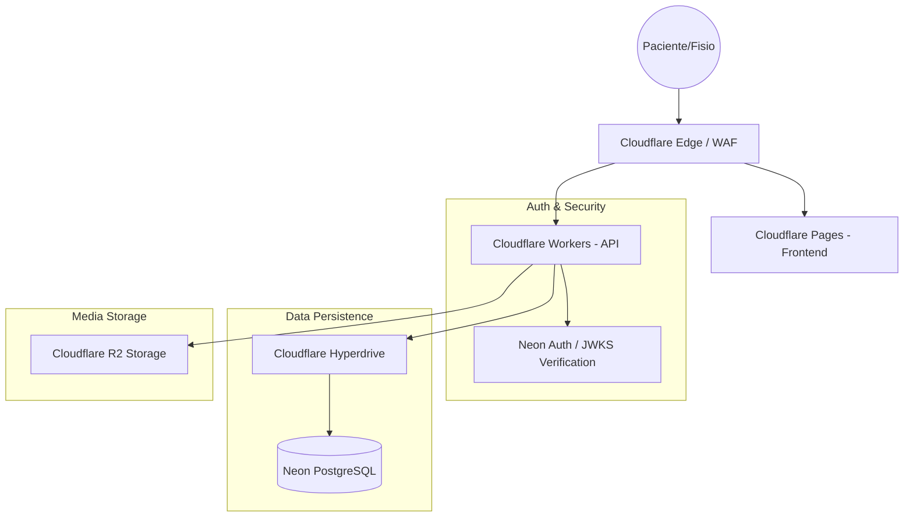

# 🏗️ FisioFlow - System Architecture (v4.0.0 - 2026)

A arquitetura do **FisioFlow** foi projetada para ser nativa da borda (Edge-Native), utilizando a infraestrutura global da Cloudflare e o escalonamento serverless do Neon PostgreSQL.

## 🚀 Tecnologias Principais

| Camada         | Tecnologia               | Implementação                                                     |
| :------------- | :----------------------- | :---------------------------------------------------------------- |
| **Runtime**    | Node.js v20.12.0+        | Ambiente de desenvolvimento e build consistente.                  |
| **Frontend**   | React 19 + Vite 8        | Hospedado no **Cloudflare Pages**.                                |
| **Backend**    | Cloudflare Workers       | Serverless API (Hono.js/TypeScript) em `apps/api`.                |
| **Database**   | **Neon DB (PostgreSQL)** | Banco relacional serverless com **Drizzle ORM**.                  |
| **Auth**       | **Neon Auth (JWKS)**     | Gestão de identidade integrada com validação por chaves públicas. |
| **Storage**    | **Cloudflare R2**        | Armazenamento de mídia (Vídeos/Imagens) via S3 API.               |
| **Aceleração** | Cloudflare Hyperdrive    | Pooling de conexões PostgreSQL distribuído na borda.              |

## 📐 Diagrama de Arquitetura

## 🔐 Modelo de Segurança e Isolamento

1.  **Isolamento de Tenant**: O sistema utiliza um padrão de **Multi-tenancy** no nível da aplicação. Todas as tabelas possuem `organizationId`, e o acesso é filtrado em tempo de execução pelo Drizzle ORM baseado no contexto do usuário autenticado.
2.  **Autenticação JWT**: Os tokens emitidos pelo provedor de identidade (Neon Auth) são validados pelos Workers via chaves JWKS distribuídas, eliminando dependência de chamadas externas para verificação de sessão.
3.  **Audit Log**: Operações críticas são registradas para conformidade com a LGPD, garantindo rastreabilidade de acesso aos dados de saúde.
4.  **Presigned URLs**: Todo acesso ao Cloudflare R2 é autenticado; o backend gera URLs temporárias para visualização/upload de mídia privada.

## 💾 Fluxo de Dados Operacional

- **Leitura**: Client -> Worker -> Hyperdrive (Connection Pooling) -> Neon DB.
- **Escrita**: Client -> Worker -> Neon DB (Transações via Drizzle ORM).
- **Consistência**: O banco Neon opera em modo serverless, escalando de zero à demanda máxima instantaneamente.

---

**Última Atualização:** Abril de 2026  
**Status:** Produção Estável (Legacy Firebase/Supabase Decommissioned)
