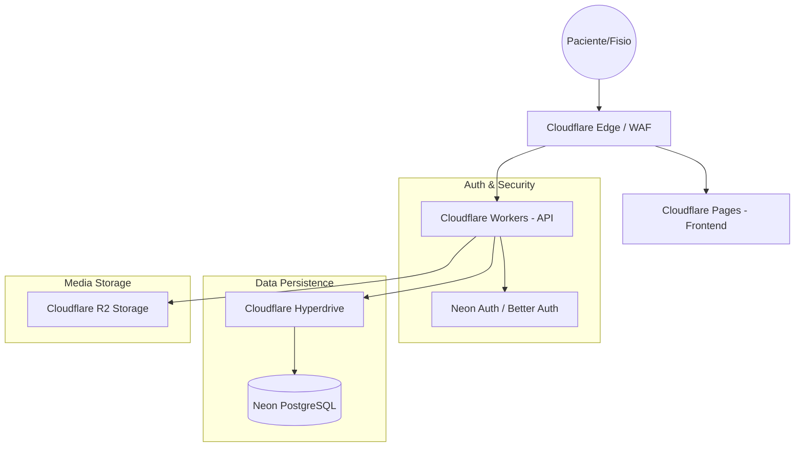

# 🏗️ FisioFlow - System Architecture (v4.0.0 - 2026)

## ⚠️ Alerta de Segurança e Migração

O projeto está em transição final para a arquitetura v4.0.0.

*   **API Legada (DEPRECATED)**: `cloudflare-worker/fisioflow-api.ts`. Esta API **não** deve ser utilizada em produção, pois possui vulnerabilidades na verificação de tokens JWT e não utiliza o Drizzle ORM.
*   **API Atual (CANÔNICA)**: `workers/src/index.ts`. Esta é a API oficial baseada em Hono, com verificação robusta via JWKS (`jose`) e integração total com Drizzle ORM.

Todas as aplicações (Patient e Professional) devem apontar para os domínios `api-paciente.moocafisio.com.br` e `api-pro.moocafisio.com.br` respectivamente, que são servidos pela nova API.

## 🚀 Tecnologias Principais

| Camada | Tecnologia | Implementação |
| :--- | :--- | :--- |
| **Frontend** | React 19 + Vite | Hospedado no **Cloudflare Pages**. |
| **Backend** | Cloudflare Workers | Serverless API (Hono.js/TypeScript). |
| **Database** | **Neon DB (PostgreSQL)** | Banco relacional com **Drizzle ORM**. |
| **Auth** | **Neon Auth (Better Auth)** | Gestão de identidade integrada ao banco. |
| **Storage** | **Cloudflare R2** | Armazenamento de mídia (Vídeos/Imagens). |
| **Aceleração** | Cloudflare Hyperdrive | Pooling de conexões PostgreSQL na borda. |

## 📐 Arquitetura do Sistema

## 🔐 Modelo de Segurança

1.  **Isolamento de Tenant**: Utilização de Row Level Security (RLS) no PostgreSQL via Neon para garantir que uma clínica nunca acesse dados de outra.
2.  **Autenticação JWT**: Os Workers validam os tokens emitidos pelo Neon Auth usando chaves públicas (JWKS).
3.  **Acesso Interno**: O sistema está configurado com `X-Robots-Tag: noindex` e headers de segurança para evitar indexação em motores de busca.
4.  **Presigned URLs**: Todo acesso ao Cloudflare R2 é feito via URLs temporárias geradas pelo backend, garantindo que arquivos de pacientes não sejam públicos.

## 💾 Fluxo de Dados

- **Leitura**: Client -> Worker -> Hyperdrive -> Neon DB (Cacheado na borda se aplicável).
- **Escrita**: Client -> Worker -> Neon DB (Commit imediato).
- **Mídia**: Client -> Worker (Gera URL de Upload) -> R2 (Upload direto do Client).

---
**Última Atualização:** Março de 2026  
**Status:** Produção em Transição (Firebase Deprecated)
