# FisioFlow - Planejamento Sequencial de Próximos Passos

## 📊 Status Atual do Projeto: ~80% Completo

| Componente | Status | Completude |
|------------|--------|-----------|
| Web App (Profissionais) | ✅ Produção | 90% |
| Professional iOS App | ✅ Funcional | 85% |
| Backend API | ✅ Produção | 95% |
| Patient iOS App | ✅ MVP Avançado | 80% |
| Integrações | ⚠️ Parcial | 60% |
| Testes | ⚠️ Insuficiente | 30% |

### ✅ Recém Concluído (31/01/2026)
- **Patient iOS App MVP Avançado**: Dashboard completo
  - ✅ Login com Firebase Auth
  - ✅ Dashboard com exercícios, consultas e quick actions
  - ✅ Tela de Exercícios (Firestore real-time + Video Modal)
  - ✅ Tela de Consultas (Firestore real-time)
  - ✅ Tela de Progresso/Evoluções com gráfico
  - ✅ Tela de Perfil com configurações
  - ✅ Tela de Registro para novos pacientes
  - ✅ Tela de Vincular Profissional (código de convite)
  - ✅ Video Modal para exercícios com expo-av
  - ✅ Componentes UI base (Button, Card, Input)
  - ✅ Temas claro/escuro dinâmico
  - ✅ Integração completa com Firebase

**Status do Patient App: 80% completo - MVP funcional pronto para testes**

---

## 🎯 Visão Geral do Roadmap

```
FASE 1 (Semanas 1-2)    📱 App iOS Pacientes - MVP
FASE 2 (Semanas 3-4)    🔗 Integrações & Sincronização
FASE 3 (Semanas 5-6)    🧪 Testes & Qualidade
FASE 4 (Semanas 7-8)    🚀 Deploy & Produção
FASE 5 (Semanas 9-10)   ✨ Polimento & Features Extras
```

---

## FASE 1: App iOS Pacientes - MVP (Semanas 1-2)

### Prioridade: 🔴 ALTA - Usuário final não tem app!

#### 1.1 Estrutura Base (Dia 1-2)
- [ ] Criar estrutura do app com Expo Router
- [ ] Configurar Firebase (Auth, Firestore, Storage)
- [ ] Setup navegação (tabs, drawer)
- [ ] Sistema de tema (dark/light mode)
- [ ] Componentes UI base

#### 1.2 Autenticação (Dia 3-4)
- [ ] Tela de Login/Registro
- [ ] Recuperação de senha
- [ ] Vincular código do profissional
- [ ] Biometria (Face ID/Touch ID)

#### 1.3 Dashboard do Paciente (Dia 5-7)
- [ ] Próximas consultas
- [ ] Exercícios do dia
- [ ] Progresso visual
- [ ] Notificações
- [ ] Acesso rápido

#### 1.4 Exercícios (Dia 8-10)
- [ ] Visualizar exercícios prescritos
- [ ] Vídeos demonstrativos
- [ ] Marcar como concluído
- [ ] Feedback de dificuldade/dor
- [ ] Timer e contadores

#### 1.5 Protocolos de Tratamento (Dia 11-12)
- [ ] Ver progresso do tratamento
- [ ] Histórico de evoluções
- [ ] Metas e objetivos
- [ ] Linha do tempo

#### 1.6 Perfil e Configurações (Dia 13-14)
- [ ] Dados pessoais
- [ ] Histórico médico
- [ ] Configurações de notificação
- [ ] Privacidade e LGPD

---

## FASE 2: Integrações & Sincronização (Semanas 3-4)

### Prioridade: 🟡 MÉDIA - Melhora experiência significativamente

#### 2.1 Sincronização Offline-Online (Dia 15-17)
- [ ] Implementar sync manager no patient app
- [ ] Cache local com AsyncStorage
- [ ] Fila de operações offline
- [ ] Conflito resolution
- [ ] Indicador visual de sync

#### 2.2 Telemedicina (Dia 18-20)
- [ ] Integração com vídeo chamada
- [ ] Waiting room virtual
- [ ] Chat durante consulta
- [ ] Gravação de consulta (com consentimento)
- [ ] Prescrição digital

#### 2.3 Pagamentos (Dia 21-23)
- [ ] Integração Stripe no iOS
- [ ] Pagamento de consultas
- [ ] Pacote de sessões
- [ ] Histórico de transações
- [ ] Reembolsos

#### 2.4 Comunicações (Dia 24-25)
- [ ] WhatsApp Business API
- [ ] Lembretes automáticos
- [ ] Confirmações de consulta
- [ ] Follow-up pós-consulta
- [ ] Campanhas de reengajamento

#### 2.5 Calendar Sync (Dia 26-28)
- [ ] Google Calendar sync
- [ ] Notificações de lembrete
- [ ] Cancelamento/reagendamento
- [ ] Disponibilidade do profissional
- [ ] Fuso horário automático

---

## FASE 3: Testes & Qualidade (Semanas 5-6)

### Prioridade: 🟡 MÉDIA - Garante estabilidade

#### 3.1 Testes Unitários (Dia 29-31)
- [ ] Hooks e utilitários
- [ ] Componentes UI
- [ ] Lógica de negócio
- [ ] Funções de sincronização
- [ ] Cobertura > 70%

#### 3.2 Testes de Integração (Dia 32-34)
- [ ] Fluxo de autenticação
- [ ] CRUD completo
- [ ] Sincronização de dados
- [ ] APIs do backend
- [ ] Integrações externas

#### 3.3 Testes E2E (Dia 35-37)
- [ ] Fluxos críticos do usuário
- [ ] Agendamento de consulta
- [ ] Prescrição de exercícios
- [ ] Pagamentos
- [ ] Playwright para web

#### 3.4 Testes de Usabilidade (Dia 38-40)
- [ ] Testes com usuários reais
- [ ] Acessibilidade (WCAG 2.1 AA)
- [ ] Performance (time-to-interactive)
- [ ] Testes de carga
- [ ] Testes de segurança

#### 3.5 Correções de Bugs (Dia 41-42)
- [ ] Bug backlog
- [ ] Crash reports
- [ ] Performance issues
- [ ] Memory leaks
- [ ] Memory profiling

---

## FASE 4: Deploy & Produção (Semanas 7-8)

### Prioridade: 🔴 ALTA - Necessário para launch

#### 4.1 Preparação iOS (Dia 43-45)
- [ ] Configurar EAS Build
- [ ] Certificados e Provisioning Profiles
- [ ] App Store Connect
- [ ] Screenshots e metadata
- [ ] Política de privacidade

#### 4.2 CI/CD Pipeline (Dia 46-47)
- [ ] GitHub Actions
- [ ] Automated tests
- [ ] Automated builds
- [ ] Deploy automático
- [ ] Rollback automation

#### 4.3 Monitoramento (Dia 48-49)
- [ ] Sentry (error tracking)
- [ ] Analytics (mixpanel/amplitude)
- [ ] Performance monitoring
- [ ] Crash reports
- [ ] User feedback

#### 4.4 Documentação (Dia 50-51)
- [ ] API documentation
- [ ] User manuals
- [ ] Admin guides
- [ ] Onboarding docs
- [ ] Vídeos tutoriais

#### 4.5 Launch (Dia 52-56)
- [ ] Beta testing com grupo seleto
- [ ] Feedback loop
- [ ] Correções críticas
- [ ] Soft launch
- [ ] Full launch

---

## FASE 5: Polimento & Features Extras (Semanas 9-10)

### Prioridade: 🟢 BAIXA - Nice-to-have

#### 5.1 AI Enhancements
- [ ] Análise de movimento em tempo real
- [ ] Recomendações inteligentes
- [ ] Previsão de adesão
- [ ] Chatbot de suporte
- [ ] Análise de progresso preditiva

#### 5.2 Gamification
- [ ] Pontos e conquistas
- [ ] Streaks de exercícios
- [ ] Badges e medals
- [ ] Leaderboards (opcional)
- [ ] Desafios semanais

#### 5.3 Relatórios Avançados
- [ ] Export PDF personalizado
- [ ] Gráficos de progresso
- [ ] Comparativo antes/depois
- [ ] Relatórios de pagamento
- [ ] Relatórios de produtividade

#### 5.4 Integrações Extras
- [ ] Apple Health / Google Fit
- [ ] Smartwatches (Apple Watch, WearOS)
- [ ] Zoom / Google Meet
- [ ] ICS (sistemas de saúde)
- [ ] Tasy, MV, Doctoralia

#### 5.5 Multitenancy Avançada
- [ ] Clínicas com múltiplos profissionais
- [ ] Compartilhamento de pacientes
- [ ] Calendário da clínica
- [ ] Relatórios consolidados
- [ ] Gestão de equipe

---

## 🚀 Sugestão de Execução Imediata

### Esta Semana (Foco: App do Paciente - MVP)

```mermaid
gantt
    title Cronograma App iOS Paciente - 2 Semanas
    dateFormat  D
    section Base
    Estrutura Expo           :a1, 1, 2
    Temas e Navegação        :a2, 2, 2
    section Auth
    Login/Registro           :b1, 3, 2
    Vincular Profissional    :b2, 4, 2
    section Core
    Dashboard                :c1, 5, 3
    Exercícios               :c2, 6, 3
    Protocolos               :c3, 7, 3
    section Final
    Perfil                   :d1, 8, 2
    Polimento                :d2, 9, 2
    Testes                   :d3, 10, 3
```



### Tarefas para Hoje (Dia 1)

1. **Manhã (3h)**
   - [ ] Criar estrutura base do patient-ios app
   - [ ] Configurar Expo Router
   - [ ] Setup Firebase

2. **Tarde (4h)**
   - [ ] Implementar telas de Login/Registro
   - [ ] Criar componentes UI base
   - [ ] Setup navegação

3. **Noite (2h)**
   - [ ] Testar autenticação
   - [ ] Dashboard inicial do paciente

---

## 📋 Checklist Rápido de Prioridades

### 🔴 URGENTE (Esta semana)
- [ ] App iOS Pacientes - Estrutura Base
- [ ] App iOS Pacientes - Autenticação
- [ ] App iOS Pacientes - Dashboard MVP

### 🟡 IMPORTANTE (Próximas 2 semanas)
- [ ] App iOS Pacientes - Exercícios
- [ ] App iOS Pacientes - Protocolos
- [ ] Sync offline para ambos apps
- [ ] Testes E2E básicos

### 🟢 DESEJÁVEL (Próximo mês)
- [ ] Telemedicina
- [ ] Pagamentos Stripe
- [ ] Testes completos
- [ ] Deploy iOS App Store

### ⚪ FUTURO (Quarto trimestre)
- [ ] AI enhancements
- [ ] Gamification
- [ ] Integrações extras
- [ ] Multitenancy avançada

---

## 📈 Métricas de Sucesso

### Para App do Paciente
- **Downloads**: > 1000 no primeiro mês
- **Retenção D7**: > 40%
- **Engajamento**: > 3 sessões/semana
- **Satisfação**: NPS > 50

### Para App Profissional
- **Adoção**: > 70% profissionais usando
- **Frequência**: > 4x/semana
- **Feature Usage**: Exercícios prescritos > 80%
- **Suporte**: Tickets < 5/semana

### Para o Negócio
- **MAU**: Melhorar em 20%
- **LTV**: Aumentar em 30%
- **CAC**: Reduzir em 15%
- **Churn**: < 5% ao mês

---

## 🔗 Links Úteis

- **Web App**: `/src/`
- **Professional iOS**: `/apps/professional-ios/`
- **Patient iOS**: `/apps/patient-ios/`
- **Backend API**: `/functions/`
- **Types**: `/packages/shared-types/`

---

**Última atualização**: 31/01/2026
**Próxima revisão**: Semanal
