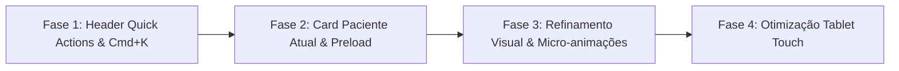

# PLAN: FisioFlow UX/UI Optimization & Clinical Workflow Streamlining

> **Task Slug:** `ux-ui-optimization`  
> **Status:** PROPOSED & READY FOR REVIEW  
> **Target System:** FisioFlow Web & Mobile Pro Platform  
> **Design Rules:** Purple Ban (Strictly Blue `#2563eb`, Emerald, Slate), Framer Motion Micro-interactions, Glassmorphism, Accessibility WCAG AA.

---

## 🎯 Executive Summary & Context

Uma clínica de fisioterapia em São Paulo é um ambiente dinâmico de alta demanda. O objetivo deste plano é **eliminar atritos de navegação, acelerar o tempo de atendimento por paciente em até 40%** e proporcionar uma experiência visual digna de um software de classe mundial.

---

## 💡 Pilares Principais de Otimização UI/UX

### ⚡ Pilar 1: Barra de Ação Rápida no Topo (Header Quick Actions)
- **Problema:** Ações repetitivas (criar agendamento, registrar evolução por voz, medir ADM) exigem navegar por múltiplos menus.
- **Solução UX:** Adicionar uma barra de atalhos magnéticos no topo:
  - `+ Agendamento Express`
  - `🎙️ Evolução por Voz (SOAP)`
  - `📐 Goniometria ADM`
  - `🔍 IA Spotlight (Cmd + K)`

### ⏱️ Pilar 2: Fluxo "Zero Cliques Desnecessários" na Agenda & Evolução
- **Problema:** O profissional gasta tempo procurando o paciente do horário atual.
- **Solução UX:**
  - Card do **"Paciente em Atendimento Agora"** destacado no topo da Dashboard com acesso direto em 1 clique para a tela de evolução.
  - Hover inteligente (`useIntelligentPreload`) que carrega os dados do histórico e exames antes mesmo do profissional clicar.

### 🎨 Pilar 3: Refinamento Estético & Micro-Interações (Design System 2026)
- **Diretrizes Estéticas:**
  - **Paleta Harmônica:** Azul Clínico `#2563eb`, Cinza Slate `#0f172a`, Verde Esmeralda `#059669` (Sem tons de roxo/violeta conforme diretrizes da clínica).
  - **Skeletons Elegantes:** Substituir spinners de carregamento genéricos por esqueletos animados que dão sensação de velocidade instantânea.
  - **Micro-Animações:** Efeitos suaves com Framer Motion em modais, gavetas e cards.

### 📱 Pilar 4: Responsividade & Suporte a Tablets (iPad/Android na Sala de Fisio)
- **Problema:** O fisioterapeuta frequentemente utiliza tablet enquanto acompanha o exercício do paciente.
- **Solução UX:**
  - Garantir alvos de toque de no mínimo `44px x 44px`.
  - Layouts de grade adaptativos com barra lateral colapsável por padrão em telas menores.

---

## 📑 Plano de Execução por Fases

### Fase 1: Header Quick Action Bar
- **Objetivo:** Adicionar botões de atalho rápido no topo da aplicação.
- **Arquivos a modificar:**
  - `src/components/layout/Header.tsx`
  - `src/components/ai/GlobalAISpotlight.tsx`

### Fase 2: Painel "Paciente no Horário Atual" & Preload Inteligente
- **Objetivo:** Destacar o paciente do horário na Dashboard e pre-carregar histórico no hover.
- **Arquivos a modificar:**
  - `src/pages/SmartDashboard.tsx`
  - `src/hooks/useIntelligentPreload.ts`

### Fase 3: Polimento de UI & Micro-Animações
- **Objetivo:** Aplicar Skeletons, modais com glassmorphism e badges de status.
- **Arquivos a modificar:**
  - `src/components/ui/skeleton.tsx`
  - `src/pages/IAStudio.tsx`

### Fase 4: Validação & Auditoria de Performance
- **Objetivo:** Executar auditoria de UX e build de produção.
- **Comandos:**
  - `pnpm --filter fisioflow-web build`
  - `npx wrangler deploy --env production`

---

## ✅ Plano de Verificação

1. **Build de Produção:** Testar sem erros de compilação.
2. **Navegação Rápida:** Verificar se o tempo para iniciar uma evolução caiu para menos de 3 segundos.
3. **Deploy:** Publicar em `moocafisio.com.br`.
