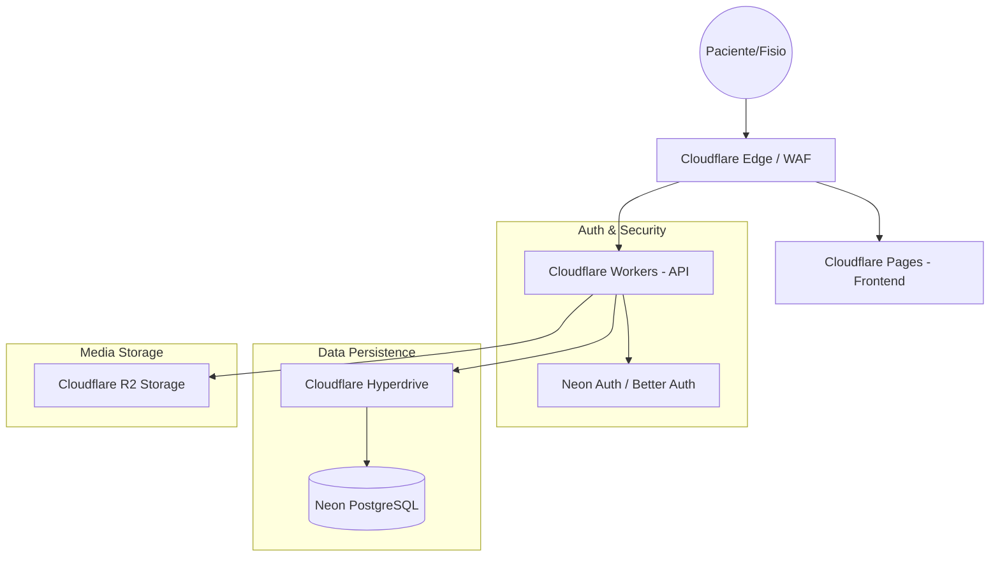

# 🏗️ FisioFlow - Technical Architecture (v4.0.0 - 2026)

## 📐 System Overview

FisioFlow version 4.0.0 represents a complete transition to a modern, serverless, and edge-native architecture. The system is designed for high performance, low latency, and clinical-grade security.

### High-Level Architecture

---

## 🛠️ Technology Stack

| Layer | Technology | Implementation |
| :--- | :--- | :--- |
| **Frontend** | React 19 + Vite 8 | Hosted on **Cloudflare Pages**. Uses **Rolldown** for bundling. |
| **Backend** | Cloudflare Workers | Serverless API built with **Hono.js**. |
| **Database** | **Neon DB (PostgreSQL)** | Serverless Postgres with branching and autoscaling. |
| **ORM** | **Drizzle ORM** | Type-safe SQL builder and migration management. |
| **Auth** | **Neon Auth** | Managed authentication powered by **Better Auth**. |
| **Storage** | **Cloudflare R2** | S3-compatible object storage for patient media. |
| **Networking** | **Cloudflare Hyperdrive** | Connection pooling for global database access. |

---

## 📁 Frontend Architecture

### Component Pattern
- **Core:** React 19 with Concurrent Rendering.
- **Styling:** Vanilla CSS + shadcn/ui (Tailwind v4 ready).
- **State Management:**
    - **Server State:** TanStack Query v5.
    - **Global State:** Zustand (for UI and session state).
    - **Forms:** React Hook Form + Zod.

### Build System
- **Tooling:** Vite 8.
- **Bundler:** Rolldown (optimized for speed and code splitting).
- **Code Splitting:** Configured via `rolldownOptions.output.codeSplitting.groups`.

---

## ⚡ Backend Architecture (Hono Workers)

The API is located in `apps/api/src/index.ts` and runs as a Cloudflare Worker.

### Key Features:
1. **Edge-native:** Low latency responses from the nearest Cloudflare data center.
2. **Middleware:** 
    - CORS handling for multiple origins (`api-paciente`, `api-pro`).
    - JWT Validation via JWKS (`jose`).
    - Drizzle Context injection.
3. **Hyperdrive:** Uses Cloudflare Hyperdrive to maintain high-speed connections to Neon DB without the overhead of standard TCP handshakes on every request.

---

## 💾 Database Design

### Neon PostgreSQL + Drizzle
- **Relational Integrity:** Strong foreign keys and constraints.
- **Performance:** Optimized indices on `organization_id` and search terms.
- **Migrations:** Managed via `drizzle-kit`, with SQL files versioned in `/drizzle`.

### Key Tables
- `organizations`: Multi-tenant root.
- `profiles`: User identities linked to Neon Auth.
- `patients`: Clinical records with HIPAA/LGPD compliance in mind.
- `appointments`: Scheduling and attendance tracking.
- `medical_evolutions`: Clinical SOAP notes and history.

---

## 🔐 Security & Compliance

1. **Multi-tenancy:** Isolation enforced via `organization_id` on all clinical tables.
2. **Authentication:** JWT tokens validated on the edge using public keys from Neon Auth.
3. **Data Protection:**
    - **At Rest:** Neon DB native encryption.
    - **In Transit:** TLS 1.3 enforced by Cloudflare.
    - **Media:** Cloudflare R2 access via Presigned URLs.
4. **Privacy:** `X-Robots-Tag: noindex` on all apps to prevent search engine indexing of clinical data.

---

## 🚀 Deployment & CI/CD

- **Environment Management:** wrangler.toml and Cloudflare Dash.
- **CI/CD:** GitHub Actions for automated testing and deployment to Cloudflare Pages/Workers.
- **Database Branching:** Neon branches used for preview environments.

---

**Last Updated:** April 2026
**Status:** Stable / Production
