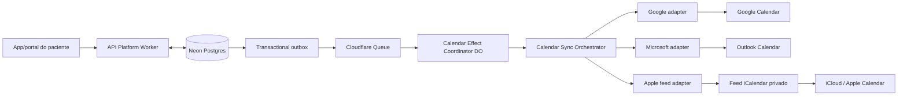

# FisioFlow — Sincronização do calendário do paciente

**Data:** 2026-07-14  
**Status:** design aprovado pelo proprietário e revisão técnica adversarial concluída; aguardando aprovação humana do documento final  
**Tipo:** especificação de produto, UX, arquitetura, segurança e testes  
**Escopo:** portal/app do paciente, Google Calendar, Microsoft Outlook e Calendário Apple/iCloud

## 1. Decisão

O FisioFlow oferecerá sincronização contínua e unidirecional dos agendamentos do paciente por uma **integração híbrida gerenciada**:

- Google Calendar: OAuth e calendário secundário criado pelo FisioFlow;
- Microsoft Outlook: OAuth delegado e calendário separado criado pelo FisioFlow;
- Calendário do iPhone/iCloud: feed iCalendar privado, assinado e revogável;
- arquivo `.ics` individual: somente fallback, nunca solução principal.

Depois de um aceite explícito, todos os agendamentos futuros elegíveis serão incluídos. Novos agendamentos entram automaticamente, remarcações atualizam o mesmo evento e cancelamentos o removem. No Apple/iCloud, a remoção será validada como comportamento observado do snapshot completo depois do próximo polling, sem prometer uma semântica de tombstone que o padrão não garante.

O FisioFlow continua sendo a fonte da verdade. A primeira versão não lê eventos pessoais, não detecta conflitos e não aceita alterações clínicas vindas do calendário externo.

## 2. Decisões aprovadas

1. A solicitação aparece somente em contexto, depois da confirmação de um agendamento.
2. O paciente autoriza uma vez e pode recusar, reconectar ou revogar quando quiser.
3. Inicialmente existe uma conexão principal por paciente e organização.
4. O modo de privacidade padrão é discreto.
5. O calendário externo se chama `Meus agendamentos`.
6. O título padrão do evento é `Compromisso`.
7. O evento pode conter horário, endereço e um link autenticado para o FisioFlow.
8. Diagnóstico, procedimento, prontuário, evolução, observação clínica e documento são proibidos no evento.
9. O paciente pode optar por exibir clínica e profissional no título.
10. Google e Outlook usam integração direta; Apple/iCloud usa assinatura privada.
11. Sincronização é somente FisioFlow → calendário.
12. Eventos externos nunca alteram o agendamento canônico.
13. O projeto OAuth Google do calendário do paciente é isolado de integrações de staff e de outros produtos FisioFlow.

## 3. Contexto e evidências

### 3.1 Referência de produto

O padrão comprovável da Doctoralia/Docplanner inclui confirmação imediata, lista de próximas consultas, lembretes e ações para confirmar, remarcar ou cancelar. Não foi encontrada documentação oficial suficiente de sincronização contínua de todos os compromissos futuros com o calendário pessoal do paciente.

O FisioFlow reutiliza o padrão de jornada — confirmação clara, próximos agendamentos, lembretes e ações — e trata a sincronização contínua como diferencial próprio.

### 3.2 Estado do legado

O repositório atual possui quatro peças desconectadas:

- um hook `expo-calendar` que pede permissão automaticamente e somente cria eventos;
- um feed `.ics` público e enumerável por `patientId`;
- uma integração Google orientada ao staff, sem ciclo completo de update/delete;
- telas simuladas para Outlook, iCloud e CalDAV.

Nenhuma dessas peças cumpre consentimento explícito, vínculo persistente consulta↔evento, remarcação idempotente, cancelamento, reconciliação ou revogação segura. Elas são evidência histórica, não base executável do sistema novo.

## 4. Objetivos

- reduzir esquecimento e confusão depois de novos agendamentos ou remarcações;
- colocar todos os próximos agendamentos no calendário escolhido após um único aceite;
- refletir criação, remarcação e cancelamento sem duplicar eventos;
- oferecer experiência consistente no app do paciente e no portal web;
- minimizar acesso ao calendário e dados expostos;
- tornar falhas, reconexão e revogação compreensíveis para o paciente;
- operar sobre Cloudflare e Neon usando contratos isolados por provedor;
- suportar implementação e testes a partir de Linux, com build iOS remoto.

## 5. Não objetivos da primeira versão

- ler compromissos pessoais;
- detectar disponibilidade ou conflitos;
- sincronização bidirecional;
- permitir remarcar ao editar o evento externo;
- múltiplos provedores ativos simultaneamente;
- CalDAV genérico;
- integração direta com credenciais iCloud ou senha específica de app;
- full access do EventKit;
- sincronização Android;
- incluir dados clínicos no calendário;
- substituir confirmações, push, e-mail ou WhatsApp;
- migrar tokens, feeds ou eventos do legado.

## 6. Jornada do paciente

### 6.1 Descoberta contextual

Depois que a consulta é confirmada, a tela de sucesso mostra:

> **Sincronizar meus agendamentos**  
> Autorize uma vez. Novas consultas, remarcações e cancelamentos serão atualizados automaticamente.

A ação secundária é `Agora não`. Recusar não bloqueia nenhuma jornada e não abre uma permissão nativa.

Se o paciente recusar:

- o convite não reaparece na mesma sessão;
- uma opção discreta permanece em `Próximos agendamentos` e em `Configurações > Calendário`;
- o produto não usa dark patterns nem ativa o recurso implicitamente.

### 6.2 Seleção do provedor

O paciente escolhe exatamente uma opção:

- `Google Agenda`;
- `Outlook`;
- `Calendário do iPhone`;
- `Agora não`.

Antes de sair para OAuth ou para o Calendário Apple, a tela informa:

- quais eventos serão criados;
- que novos agendamentos e alterações serão sincronizados;
- que os demais compromissos não serão lidos;
- no Google, que a integração pode ler nomes/metadados da lista de calendários somente para recuperar `Meus agendamentos`, nunca o conteúdo dos eventos pessoais;
- no Outlook, que a permissão delegada do provedor é mais ampla, embora o FisioFlow opere somente no calendário separado que criou;
- como desconectar e apagar o calendário;
- que a atualização do iCloud depende da frequência de consulta do app Calendário.

### 6.3 Google e Outlook

1. O app abre autorização segura no navegador do sistema.
2. O callback valida a transação e provisiona `Meus agendamentos`.
3. O backend enfileira o backfill de agendamentos futuros elegíveis.
4. O app mostra progresso e quantidade sincronizada.
5. O estado final exibe conta mascarada, provedor, última sincronização e ações de gerenciamento.

Se a autorização for cancelada, nenhum estado parcial fica ativo. O paciente retorna com uma explicação simples e pode tentar novamente.

### 6.4 Apple/iCloud

1. O backend cria uma credencial de feed privada e revogável.
2. O app abre a assinatura `webcal`/Calendário usando a URL secreta.
3. O paciente conclui a assinatura no fluxo do sistema.
4. Como a Apple não fornece callback confiável de conclusão, o FisioFlow mostra `Aguardando confirmação` e oferece `Já adicionei ao Calendário`.
5. A tela deixa explícito que o feed já está atualizado, mas a exibição depende do polling do Calendário/iCloud.

Se o deep link não funcionar, o app oferece instrução guiada e cópia segura do endereço como fallback.

Se a resposta que entregaria a URL se perder, uma nova tentativa autenticada revoga a credencial ainda não confirmada e emite outra versão. O endereço anterior não pode ser recuperado nem reenviado, pois não é armazenado em texto puro.

A tela informa que essa URL é uma credencial: ela é entregue uma vez pelo backend ao app autenticado e, ao assinar, passa a ser armazenada/processada pela Apple e sincronizada nos dispositivos da mesma conta iCloud. O FisioFlow não controla a persistência feita pela Apple; pode apenas revogar a URL no servidor e orientar nova assinatura.

### 6.5 Estado conectado

`Configurações > Calendário` mostra:

- provedor;
- conta mascarada quando aplicável;
- estado da conexão;
- última sincronização confirmada pelo backend;
- quantidade de eventos futuros vinculados;
- modo de privacidade;
- `Sincronizar novamente` quando seguro;
- `Reconectar` quando necessário;
- `Desconectar`.

### 6.6 Desconexão

O paciente escolhe entre:

- parar futuras sincronizações e manter eventos já copiados;
- parar a sincronização e apagar o calendário `Meus agendamentos`.

A segunda opção é recomendada. Para Apple, o backend invalida imediatamente o feed e instrui o paciente a remover a assinatura no sistema, pois cópias em cache podem permanecer até a remoção local.

Rotacionar a URL Apple invalida a anterior, move a conexão para `awaiting_user_confirmation` e exige que o paciente remova a assinatura antiga e adicione a nova. O FisioFlow não consegue substituir remotamente uma URL já salva no iCloud.

### 6.7 Fallback de uma única consulta

Quando uma conexão contínua não puder ser concluída, a tela oferece `Adicionar somente esta consulta`. Essa ação baixa um arquivo `.ics` estático e autenticado para o agendamento escolhido.

O produto explica antes do download:

- somente essa consulta será adicionada;
- novos agendamentos não entrarão automaticamente;
- remarcações e cancelamentos podem não atualizar a cópia importada;
- a conexão contínua continua sendo a opção recomendada.

O fallback não usa EventKit nem o hook nativo do legado. O endpoint valida a identidade do paciente, resolve o agendamento no servidor, retorna o mesmo conteúdo discreto permitido para os adapters, usa `Cache-Control: no-store` e não cria conexão ou credencial persistente.

## 7. Conteúdo e privacidade do evento

### 7.1 Modo discreto, padrão

| Campo | Valor |
|---|---|
| Calendário | `Meus agendamentos` |
| Título | `Compromisso` |
| Início/fim | data e horário canônicos do agendamento |
| Fuso | fuso IANA da unidade do agendamento |
| Local | endereço operacional necessário para comparecimento |
| Descrição | texto neutro e link autenticado para `Próximos agendamentos` |
| Disponibilidade | ocupado |
| Visibilidade | privada quando o provedor permitir |
| Lembretes | padrão do calendário do usuário; não forçar alarmes duplicados |

O link não contém `patientId`, `appointmentId`, token de login ou informação clínica. Ele abre uma rota genérica autenticada; o app resolve o próximo compromisso depois do login.

### 7.2 Modo detalhado, opt-in

O paciente pode habilitar um modo que inclui nome da clínica e profissional. A interface avisa que esses dados podem aparecer em notificações, widgets, telas bloqueadas e calendários compartilhados.

Mesmo no modo detalhado, continuam proibidos:

- motivo da consulta;
- procedimento;
- diagnóstico/CID;
- evolução ou conduta;
- observações;
- anexos;
- dados financeiros;
- telefone, CPF ou e-mail do paciente.

## 8. Arquitetura



### 8.1 Responsabilidades

#### Patient Calendar API

- expõe status, preferências, conexão, reconexão e desconexão;
- exige identidade de paciente e escopo do próprio registro;
- inicia OAuth com `state` e PKCE;
- recebe callbacks e provisiona conexões;
- nunca retorna refresh tokens;
- gera a credencial do feed Apple e redige logs.

#### Calendar Connection Service

- controla a máquina de estados da conexão;
- registra consentimento versionado;
- cifra/decifra credenciais somente no backend;
- garante uma conexão principal ativa por paciente+organização;
- agenda backfill, revogação e reconciliação.

#### Calendar Sync Orchestrator

- consome mensagens pelo menos uma vez;
- busca o estado canônico por caso de uso autorizado;
- combina `connectionGeneration`, `appointmentSequence` e `privacyVersion` em um estado desejado monotônico;
- rejeita revisões antigas sem confiar na ordem de entrega da Queue;
- constrói o payload mínimo;
- chama o adapter do provedor;
- grava efeito e receipt de forma idempotente;
- classifica falhas como transitórias, de autenticação ou permanentes.

#### Calendar Effect Coordinator

Um Durable Object é endereçado pelo `coordinatorId` opaco persistido ao criar o vínculo, inicialmente derivado por `HMAC(connectionId, appointmentId)`. O ID e a versão da chave de derivação nunca são recalculados após rotação; isso evita que o mesmo vínculo ganhe dois coordenadores. Ele não é a fonte da verdade e não guarda conteúdo clínico: persiste somente geração da conexão, vetor de revisão, estado da operação e hashes técnicos.

O coordenador:

- recebe notificações idempotentes e usa o vetor `(connectionGeneration, appointmentSequence, privacyVersion)`: geração tem precedência total, e o máximo componente a componente vale somente dentro da mesma geração;
- garante no máximo uma mutação externa em voo para o mesmo vínculo;
- antes de confirmar o RPC da Queue, persiste atomicamente vetor desejado, `attemptId`, vetor alvo, disposição/operação, `payloadHash`, `baseExternalRevision`, fase `planned|inflight` e alarm de recuperação;
- persiste a intenção antes do `fetch` externo e nunca mantém `blockConcurrencyWhile()` durante I/O;
- enquanto uma chamada está em voo, apenas agrega novas revisões; ao terminar, relê o estado canônico e aplica diretamente a combinação mais recente;
- quando a resposta chega, relê o journal e só avança o vetor aplicado até o vetor alvo daquele `attemptId`, nunca diretamente até um desejo mais novo;
- depois de eviction/crash com resultado ambíguo, entra em `uncertain`; um GET isolado não libera outro write cego;
- usa alarm/retry idempotente para retomar trabalho persistido;
- considera concluído somente o estado remoto cujo marker HMAC versionado confirma `attemptId`, geração, ambas as revisões e `payloadHash` desejados.

Neon continua sendo a fonte da verdade. O SQLite do Durable Object é um journal de coordenação recuperável; uma reconciliação Neon → coordenador reconstitui qualquer instância perdida ou divergente.

#### Provider adapters

Cada adapter implementa um contrato interno equivalente a:

```text
provisionCalendar(connection)
upsertAppointment(connection, appointmentSnapshot)
cancelAppointment(connection, appointmentSnapshot)
reconcileConnection(connection)
deleteManagedCalendar(connection)
revokeConnection(connection)
```

Os adapters não conhecem telas, RBAC de staff ou regras clínicas. Recebem um snapshot mínimo já autorizado.

#### Apple Feed Service

- autentica pela credencial opaca da URL;
- autentica e decifra o envelope da capability antes de obter o contexto de organização;
- resolve a conexão ativa usando o hash do token já dentro do contexto RLS;
- consulta agendamentos elegíveis e histórico publicado recente; cancelados são omitidos do snapshot autoritativo;
- gera iCalendar válido com `UID`, `DTSTAMP`, `LAST-MODIFIED` e `SEQUENCE`; `STATUS:CANCELLED` não faz parte do perfil básico;
- suporta `ETag` e `Last-Modified` sem cache compartilhado;
- nunca usa `patientId` ou `organizationId` na URL.

## 9. Modelo de dados

### 9.1 `calendar_connections`

| Campo | Finalidade |
|---|---|
| `id` | identificador interno aleatório |
| `organizationId` | isolamento multi-tenant e RLS |
| `patientPortalUserId` | identidade autenticada do paciente |
| `patientId` | registro de paciente da organização |
| `provider` | `google`, `microsoft` ou `apple_feed` |
| `role` | `primary`, `candidate`, `retiring` ou `historical` |
| `status` | estado canônico da conexão |
| `externalAccountSubject` | identificador externo cifrado ou tokenizado |
| `externalAccountDisplay` | conta mascarada para UI |
| `externalCalendarId` | calendário gerenciado pelo adapter |
| `calendarProvisionKey` | marcador HMAC persistido antes da tentativa de criação do calendário |
| `calendarProvisionState` | `not_started`, `inflight`, `uncertain`, `recovered` ou `complete` |
| `privacyMode` | `discreet` ou `detailed` |
| `privacyVersion` | revisão monotônica do conteúdo externo permitido |
| `generation` | fence monotônica que invalida jobs de uma geração anterior |
| `shadowSinceOutboxId` | início do fan-out sombra durante troca de provider |
| `promotionWatermark` | maior posição da outbox confirmada antes da promoção |
| `consentVersion` | versão do texto aceito |
| `consentedAt` | instante do aceite |
| `revokedAt` | instante da revogação |
| `grantedScopes` | escopos efetivamente concedidos |
| `encryptedRefreshToken` | refresh token cifrado; nulo para Apple |
| `tokenKeyVersion` | versão da chave de envelope encryption |
| `tokenExpiresAt` | expiração quando aplicável |
| `lastSyncedAt` | último efeito externo confirmado |
| `lastReconciledAt` | última reconciliação completa |
| `lastErrorCode` | código redigido, nunca payload bruto |
| `createdAt`, `updatedAt` | auditoria operacional |

Restrições:

- RLS `default deny` por `organizationId`;
- FK para paciente e usuário de portal;
- no máximo uma conexão `primary` e uma `candidate` não terminal por `(organizationId, patientId)`;
- credenciais nunca são selecionadas por endpoints de leitura da UI.

`calendarProvisionKey` é gravada antes de qualquer `provisionCalendar`. Resultado ambíguo nunca autoriza um segundo POST cego: a conexão fica `provisioning/uncertain`, o adapter procura o marcador por todas as páginas permitidas e somente segue quando recupera exatamente um calendário ou comprova que a primeira chamada não foi enviada. Zero resultados depois de uma chamada possivelmente enviada mantém o estado incerto e exige reconciliação/control plane; dois ou mais resultados acionam limpeza auditada, sem criar outro.

### 9.2 `calendar_event_links`

| Campo | Finalidade |
|---|---|
| `organizationId` | isolamento multi-tenant e RLS |
| `connectionId` | conexão proprietária |
| `appointmentId` | agendamento canônico |
| `externalEventId` | ID retornado por Google/Outlook |
| `providerCreateKey` | ID/transaction key determinístico persistido antes do efeito externo |
| `desiredAppointmentSequence` | maior revisão canônica solicitada |
| `desiredPrivacyVersion` | maior revisão de privacidade solicitada |
| `desiredConnectionGeneration` | geração total da conexão solicitada |
| `appliedAppointmentSequence` | revisão canônica confirmada externamente |
| `appliedPrivacyVersion` | revisão de privacidade confirmada externamente |
| `appliedConnectionGeneration` | geração da conexão confirmada externamente |
| `desiredDisposition` | `publish`, `publish_current`, `cancel`, `keep_history` ou `ignore` |
| `coordinatorId` | nome opaco e estável do Durable Object do vínculo |
| `coordinatorKeyVersion` | versão usada apenas na criação; rotação não muda o ID existente |
| `externalRevision` | ETag/change key quando disponível |
| `payloadHash` | evita update sem alteração |
| `effectState` | `idle`, `pending`, `inflight`, `uncertain`, `reconciling` ou `failed` |
| `operationGeneration` | fence local persistida antes de cada efeito |
| `lastSyncedAt` | observabilidade |
| `lastErrorCode` | erro redigido |

Chave única: `(organizationId, connectionId, appointmentId)`. A linha `pending` e a `providerCreateKey` são gravadas antes da primeira chamada externa.

As revisões formam um vetor parcial, não uma ordenação lexicográfica. `connectionGeneration` tem precedência total; dentro da mesma geração, cada entrada atualiza sequência e privacidade por `max`. Antes de qualquer efeito o coordenador relê disposição, agendamento e preferência atuais — `operation` da Queue é apenas uma notificação — e gera um payload único para a combinação vigente. O vínculo está convergido somente quando os três componentes aplicados alcançam os desejados e o marcador remoto confirma o `payloadHash`. Se somente um componente aumentar, o payload inteiro é reconstruído, impedindo que `upsert` antigo ressuscite cancelamento, remarcação restaure privacidade antiga ou mudança de privacidade restaure horário antigo.

### 9.3 `calendar_feed_credentials`

| Campo | Finalidade |
|---|---|
| `organizationId` | isolamento multi-tenant e RLS |
| `connectionId` | conexão Apple proprietária |
| `tokenHash` | `HMAC-SHA-256` do bearer token com pepper de lookup separado |
| `tokenPrefix` | prefixo não secreto para suporte |
| `tokenKeyVersion` | versão da chave de AEAD usada no envelope opaco |
| `lookupKeyVersion` | versão do pepper HMAC usado no lookup |
| `tokenNonce` | nonce AEAD não secreto; único por `tokenKeyVersion` |
| `version` | rotação e revogação |
| `rotatedAt`, `revokedAt` | ciclo de vida |

O token bruto é criado no backend como envelope AEAD versionado, e sua credencial/hash é commitada antes de ele ser entregue uma única vez ao frontend autenticado. Depois, ele é armazenado/processado pela Apple/iCloud. O FisioFlow não o persiste em texto puro e não o envia a analytics, suporte ou logs controlados pela aplicação.

As duas tabelas filhas aplicam RLS por `organizationId` e FKs compostas que exigem que conexão e organização coincidam. Nenhuma policy autoriza acesso apenas por conhecer `connectionId`. `calendar_feed_credentials` possui unique constraint em `(tokenKeyVersion, tokenNonce)` para tornar reutilização acidental de nonce uma falha explícita.

### 9.4 `calendar_consent_events`

Registra aceite, recusa opcional, mudança de privacidade, troca de provedor e revogação com versão do texto, ator, organização, finalidade, timestamp e contexto técnico mínimo. O log não contém token OAuth nem URL do feed.

### 9.5 Bootstrap RLS do feed Apple

O feed público conhece inicialmente apenas a capability opaca. Para preservar `NOBYPASSRLS` sem varrer tenants nem criar uma role geral privilegiada, o formato normativo é:

```text
v1.<kid>.<base64url(nonce || ciphertext || tag)>
```

O contrato criptográfico é:

1. AES-256-GCM com nonce CSPRNG de 96 bits, único por chave;
2. AAD canônico inclui finalidade `fisioflow.patient-calendar-feed`, hostname, template da rota, versão e `kid`;
3. plaintext mínimo contém `organizationId`, `credentialId`, `connectionId`, `credentialVersion`, `connectionGeneration`, `lookupKeyVersion`, segredo aleatório de 256 bits e `issuedAt`; nenhum `patientId` ou dado clínico;
4. chave AEAD e pepper HMAC de lookup são materiais separados e versionados em Worker Secrets;
5. o Worker limita tamanho, valida formato e só usa os campos depois de validar integralmente a tag AEAD;
6. na mesma conexão Neon, inicia transação e executa `set_config('app.org_id', organizationId, true)` a partir do envelope autenticado;
7. consulta `calendar_feed_credentials` por organização + `credentialId` + `HMAC-SHA-256(lookupPepper, token completo)` sob RLS;
8. verifica organização, conexão, geração, versão, consentimento, TTL e revogação;
9. autoriza apenas `candidate/awaiting_user_confirmation` ou `candidate/catching_up` dentro do TTL, e `primary/active` ou `primary/degraded`;
10. nega `revoking`, `cleanup_pending`, `expired`, `historical` e qualquer geração/versão anterior.

Falha de versão, autenticação AEAD, hash, RLS, revogação ou vínculo retorna a mesma resposta opaca `404`; indisponibilidade operacional do Neon retorna `503` genérico com `Cache-Control: no-store`, nunca um snapshot em cache. Não se revela se tenant, paciente ou credencial existem. A URL continua sem IDs legíveis, e o contexto de organização nunca é aceito de header, query string ou campo não autenticado.

Keyring antigo permanece `decrypt-only` enquanto existir feed emitido com aquele `kid`, porque o token bruto não pode ser migrado silenciosamente. Retirada emergencial de chave rotaciona as URLs e exige nova assinatura. Se a resposta de emissão se perder depois do commit, retry autenticado revoga a credencial não confirmada e cria versão superior; o token antigo nunca é armazenado nem reenviado. Após commit de revogação, novas requisições recebem `404`; uma resposta que já concluiu autenticação/autorização pode terminar, e essa fronteira é aceita/auditada. `SET LOCAL` é sempre transacional para impedir vazamento de tenant em conexão reutilizada.

## 10. Máquina de estados

`role` representa a posição da conexão na troca; `status` representa sua saúde/etapa operacional. Eles não são intercambiáveis.

| Role | Status permitidos |
|---|---|
| `candidate` | `authorizing`, `provisioning`, `awaiting_user_confirmation`, `backfilling`, `catching_up`, `degraded` |
| `primary` | `active`, `degraded`, `reconnect_required`, `revoking`, `cleanup_pending` |
| `retiring` | `revoking`, `cleanup_pending`, `degraded` |
| `historical` | `disconnected`, `failed`, `expired` |

Fluxo nominal de uma conexão nova:

```text
candidate/authorizing
  -> candidate/provisioning
     -> candidate/awaiting_user_confirmation # ramo Apple
     -> candidate/backfilling                # ramo Google/Outlook
  -> candidate/catching_up
  -> primary/active                         # promoção atômica
  -> primary/degraded <-> primary/active
  -> primary/reconnect_required
  -> primary/revoking
  -> primary|retiring/cleanup_pending
  -> historical/disconnected
```

Regras:

- somente `primary/active` recebe fan-out normal como destino único;
- `candidate/backfilling` e `candidate/catching_up` recebem fan-out sombra versionado, além do backfill;
- `degraded` continua tentando falhas transitórias;
- `reconnect_required` bloqueia chamadas ao provedor até novo OAuth;
- `revoking` bloqueia jobs normais e permite somente a limpeza solicitada;
- `cleanup_pending` conserva credencial apenas pelo prazo e finalidade estritos da limpeza;
- nenhuma transição depende apenas de estado mantido no frontend.

### 10.1 Exclusividade e troca de provedor

Os estados `authorizing`, `provisioning`, `awaiting_user_confirmation`, `backfilling`, `catching_up`, `active`, `degraded`, `reconnect_required`, `revoking` e `cleanup_pending` são não terminais. `disconnected`, `failed` e `expired` são terminais e exigem `role=historical`.

Uma transação com lock na linha do paciente e índices parciais impede duas conexões `primary` ou duas `candidate` simultâneas.

Troca de provedor:

1. a conexão atual permanece `primary` e ativa;
2. a nova nasce como `candidate`;
3. antes do backfill, grava-se `shadowSinceOutboxId`; desde essa posição, cada mudança relevante é enviada à primary e também à candidate como fan-out sombra;
4. o backfill aplica o snapshot canônico atual enquanto o coordenador da candidate agrega mudanças concorrentes pelo vetor de revisão;
5. ao terminar, captura-se um watermark, aguarda-se todos os jobs sombra até ele e executa-se reconciliação autoritativa de `publish`/`cancel`;
6. se surgir novo trabalho durante a reconciliação, o ciclo catch-up → watermark repete; após três ciclos sem estabilizar, a troca permanece `degraded` e não promove;
7. uma transação com lock do paciente verifica candidate convergida, registra `promotionWatermark`, promove-a a `primary` e move a anterior para `retiring`;
8. eventos já roteados para a candidate são deduplicados; eventos posteriores passam somente para a nova primary;
9. a antiga é limpa ou preservada conforme a escolha do paciente e então se torna `historical/disconnected`.

Uma candidate cancelada, Apple não confirmada dentro do TTL ou OAuth abandonado é movida atomicamente para `historical/expired` sem afetar a primary. A confirmação Apple é idempotente e só pode promover a candidate ligada à transação autenticada.

TTL normativo: transações OAuth expiram em 10 minutos; candidate Apple não confirmada expira em 24 horas e sua URL é revogada. A candidate nunca é promovida com gap de outbox, vínculo `uncertain`, erro permanente ou diferença na reconciliação. Se a troca for abandonada, o calendário/feed da candidate é limpo ou explicitamente orientado para remoção antes de `historical/expired`.

## 11. API proposta

Rotas autenticadas com identidade de paciente:

```text
GET    /api/v1/patient/calendar-connection
POST   /api/v1/patient/calendar-connection/oauth/start
POST   /api/v1/patient/calendar-connection/apple-feed
POST   /api/v1/patient/calendar-connection/apple-feed/confirm
PATCH  /api/v1/patient/calendar-connection/preferences
POST   /api/v1/patient/calendar-connection/reconnect
POST   /api/v1/patient/calendar-connection/sync
DELETE /api/v1/patient/calendar-connection
GET    /api/v1/patient/appointments/{appointmentId}/calendar-file.ics
```

Callbacks públicos autenticados por transação OAuth assinada:

```text
GET /api/v1/integrations/calendar/google/callback
GET /api/v1/integrations/calendar/microsoft/callback
```

Feed por bearer token opaco:

```text
GET /calendar/subscriptions/{opaqueToken}.ics
```

Proibições:

- nenhuma rota aceita `patientId` escolhido pelo cliente para autorizar acesso;
- o feed não possui ID enumerável;
- o endpoint de status nunca serializa a linha completa da conexão;
- callbacks não confiam em `returnUrl` arbitrária;
- URLs e headers com token são redigidos antes de logs/traces.
- o arquivo `.ics` individual exige sessão do paciente, verifica propriedade do agendamento, usa conteúdo discreto e não representa uma assinatura.

## 12. Eventos e entrega assíncrona

O domínio Scheduling publica, pela outbox transacional:

- `appointment.created`;
- `appointment.rescheduled`;
- `appointment.status-changed`.

O consumidor de calendário reage somente quando o estado canônico indica que o compromisso é futuro e elegível. A regra de elegibilidade pertence ao domínio Scheduling; o adapter não compara strings localizadas do legado.

Cancelamento é uma transição terminal em `appointment.status-changed`. Um pedido de remarcação não remove o horário antigo até que a remarcação seja efetivada.

### 12.1 Disposição normativa do calendário

Scheduling expõe uma disposição canônica, calculada com o relógio UTC do servidor:

| Disposição | Regra | Efeito |
|---|---|---|
| `publish` | início no futuro e lifecycle `scheduled` ou `confirmed` | criar/atualizar evento |
| `publish_current` | pedido de remarcação ainda não efetivado | manter data/hora canônicas atuais |
| `cancel` | vínculo existente e lifecycle `cancelled`, `superseded` ou exclusão antes do início | remover no provider direto; omitir do snapshot Apple |
| `keep_history` | vínculo existente e consulta já iniciada, concluída ou marcada como no-show | não alterar/remover a cópia passada |
| `ignore` | draft, solicitação ainda não aceita, waitlist, passado nunca publicado ou estado não operacional | nenhum efeito |

`Todos os próximos` significa todos os registros materializados com disposição `publish`, sem janela máxima artificial. Séries recorrentes geram ocorrências individuais no domínio Scheduling; o calendário não inventa ocorrências.

Backfill e reconciliação usam essa tabela. Para o feed Apple, eventos publicados permanecem por 30 dias depois do término para preservar histórico recente; cancelados são excluídos do snapshot completo seguinte. Google e Outlook preservam eventos passados, salvo quando o paciente pede a exclusão do calendário inteiro.

Mensagem interna mínima:

```json
{
  "eventId": "uuid-sintetico",
  "organizationId": "uuid-sintetico",
  "connectionId": "uuid-sintetico",
  "connectionGeneration": 3,
  "appointmentId": "uuid-sintetico",
  "appointmentSequence": 7,
  "outboxId": 184902,
  "operation": "upsert",
  "correlationId": "uuid-sintetico"
}
```

A mensagem não leva nome, e-mail, telefone, endereço, diagnóstico, horário ou texto clínico. Depois do evento de domínio, o consumidor faz fan-out para a conexão primary e, durante troca, para a candidate a partir de `shadowSinceOutboxId`. Cada work item fixa `connectionId` + `connectionGeneration`; o coordenador obtém `privacyVersion` e snapshot mínimo atuais com autorização própria. Geração divergente, role/status incompatível ou item anterior ao watermark aplicável é ack sem efeito.

## 13. Fluxos assíncronos

### 13.1 Backfill inicial

Para Google e Outlook:

1. conexão candidate torna-se válida e grava `shadowSinceOutboxId` antes da consulta;
2. serviço ativa fan-out sombra e cria `calendar.backfill.requested` ou workflow equivalente;
3. consulta paginada encontra agendamentos com disposição `publish`;
4. um job idempotente é criado por conexão+agendamento+vetor de revisão;
5. o coordenador combina backfill e mudanças sombra concorrentes, sempre relendo o estado atual;
6. progresso é agregado sem manter uma requisição HTTP aberta;
7. serviço captura watermark, espera todos os itens até ele e faz reconciliação autoritativa;
8. somente candidate sem gaps, efeitos `uncertain` ou drift pode ser promovida a `primary/active`; item isolado em retry mantém `candidate/degraded` e bloqueia promoção.

Para Apple não existe create remoto por evento: o feed já deriva um snapshot completo da fonte canônica. Mesmo assim, a confirmação captura watermark, valida credencial/ETag e executa a mesma checagem de elegibilidade antes da promoção.

### 13.2 Novo agendamento

1. scheduling grava agendamento e outbox na mesma transação;
2. dispatcher publica na Queue;
3. consumidor encontra a primary ativa e eventual candidate elegível para fan-out sombra;
4. consumidor cria/obtém a linha `calendar_event_links` como `pending`, com `providerCreateKey` determinística, e confirma essa gravação antes do efeito remoto;
5. work item notifica o Durable Object determinístico e retorna; o DO serializa o efeito;
6. adapter tenta recuperar um evento já aceito pelo provedor usando essa chave;
7. somente se o create anterior comprovadamente não foi enviado, cria o evento com o mesmo ID/transaction key;
8. vínculo, vetor aplicado e receipt são persistidos;
9. timeout ou crash entre os passos 7 e 8 move o vínculo para `uncertain` e nunca autoriza um segundo create cego.

### 13.3 Remarcação

1. scheduling incrementa a sequência do aggregate;
2. job eleva `desiredAppointmentSequence`, sem copiar payload antigo da Queue;
3. coordenador relê horário, disposição e `privacyVersion` atuais;
4. adapter atualiza o mesmo `externalEventId` e grava marcador HMAC da combinação aplicada;
5. Google usa ETag/`If-Match`; conflito força GET e reconstrução do payload atual;
6. Outlook permanece estritamente single-flight por vínculo; o uso de `If-Match` com revisão externa precisa ser validado em conta real como release gate, pois `changeKey` + read-after-write sozinho detecta, mas não cerca uma escrita atrasada;
7. revisão e hash só avançam depois da confirmação; mensagens antigas são absorvidas pelo vetor desejado.

O sistema garante convergência monotônica, não uma ordem da Queue. Se uma chamada remota tiver resultado ambíguo, nenhuma mutação posterior daquele vínculo começa antes do protocolo de recuperação. Reconciliador periódico volta a comparar marker/payload para cobrir efeitos remotos atrasados.

### 13.4 Cancelamento

- Google/Outlook: remove o evento gerenciado pelo FisioFlow;
- Apple: omite o evento do próximo snapshot completo autoritativo.

O histórico do cancelamento permanece no FisioFlow conforme a política do domínio. O calendário externo não é arquivo clínico.

O spike em iPhone, macOS e iCloud precisa demonstrar que a omissão remove o evento depois do polling. `STATUS:CANCELLED` só poderá ser adotado como perfil de compatibilidade se testes mostrarem necessidade; nesse caso, o componente continuará válido com `UID`, `DTSTART`, `DTEND`, timestamps UTC e `SEQUENCE` maior, sem usar `METHOD:CANCEL` nem alegar garantia de exclusão pelo RFC.

### 13.5 Reconciliação

Um job periódico:

- confirma a existência do calendário gerenciado;
- compara vínculos com agendamentos futuros canônicos e com o histórico gerenciado sujeito a reprojeção de privacidade;
- recria eventos ausentes quando a conexão continua ativa;
- corrige horário/conteúdo divergente;
- remove órfãos criados pelo FisioFlow;
- não examina calendários pessoais fora do calendário dedicado.

No Apple feed, a resposta é derivada da fonte canônica; reconciliação externa não é possível nem necessária.

### 13.6 Mudança de privacidade

1. `PATCH preferences` incrementa `privacyVersion` de forma atômica;
2. novos jobs usam imediatamente o modo novo;
3. um workflow reprojeta todos os eventos ainda mapeados da conexão;
4. mudança de `detailed` para `discreet` cria uma barreira de segurança: bloqueia novos payloads detalhados, eleva o vetor desejado e remove clínica/profissional também das cópias passadas ainda acessíveis pelo adapter;
5. se existir efeito detalhado com resultado remoto ambíguo, o vínculo não é considerado seguro; o adapter apaga o evento antigo e o recria discreto com nova `providerCreateKey` antes de concluir a barreira;
6. se a exclusão não puder ser confirmada, a conexão fica `degraded`, a UI deixa de mostrar o evento como sincronizado e suporte/paciente recebem ação de remoção; nunca se marca a redução como concluída;
7. a UI mostra `Atualizando privacidade` até todos os vínculos alcançarem a nova versão;
8. o ETag do feed Apple muda imediatamente e a próxima consulta já usa o conteúdo novo.

SLO: eventos futuros são reprojetados em até 5 minutos e o histórico gerenciado em até 60 minutos, exceto indisponibilidade externa. Falhas mantêm o estado visível e continuam em retry.

Uma requisição detalhada já aceita pelo provider pode ficar visível durante uma janela transitória antes de a redução chegar. A interface não promete apagamento instantâneo; a barreira só conclui depois da confirmação discreta ou substituição segura.

### 13.7 Resultado remoto incerto e crash recovery

Um GET isolado após timeout não prova que uma requisição antiga não chegará depois. Por isso, `uncertain` só termina por uma destas evidências:

1. o adapter encontra exatamente o marker HMAC contendo `attemptId`, geração, `appointmentSequence`, `privacyVersion` e `payloadHash`; ou
2. o adapter confirma a exclusão do evento antigo e recria o estado canônico sob novo ID/`providerCreateKey`, de modo que a requisição atrasada continue apontando apenas para o ID eliminado.

Google usa `If-Match`/ETag em update e delete. Outlook deve usar `If-Match` somente se o comportamento for comprovado nos testes reais; sem essa garantia, todo update/delete incerto segue substituição segura. Se nem a exclusão puder ser confirmada, o vínculo continua `degraded/uncertain`, não recebe write sucessor e nunca é marcado como convergido.

Matriz obrigatória de recuperação:

| Ponto da falha | Recuperação permitida |
|---|---|
| antes de persistir intenção | nenhuma chamada externa pode ter sido feita; criar intenção nova |
| intenção `planned` persistida, antes de marcar `inflight` | retry do mesmo `attemptId` é permitido |
| `inflight`, durante/depois do fetch, antes do receipt | marcar `uncertain`; procurar marker ou executar substituição segura; nenhum write sucessor cego |
| receipt remoto persistido no DO, antes do Neon | repetir somente a persistência local do mesmo receipt |
| Neon aplicado, antes de limpar journal | recovery reconhece o vetor já aplicado e conclui o journal sem novo efeito |
| geração revogada durante I/O | não iniciar sucessor; resolver/limpar o efeito já enviado antes de declarar desconexão concluída |

## 14. Providers

### 14.1 Google Calendar

- usar um Google Cloud project exclusivo para calendário do paciente, separado de integrações Google de staff, Drive, Docs ou outros produtos;
- solicitar `https://www.googleapis.com/auth/calendar.app.created` e `https://www.googleapis.com/auth/calendar.calendarlist.readonly`;
- explicar que o segundo escopo permite ler somente a lista/metadados de calendários para recuperar o calendário gerenciado depois de resposta ambígua; nenhum evento pessoal é lido;
- solicitar acesso server-side com `access_type=offline`; usar novo consentimento somente quando necessário para recuperar um refresh token ausente;
- nunca substituir um refresh token existente por `null` quando a resposta OAuth não trouxer outro;
- criar calendário secundário `Meus agendamentos`;
- não solicitar `calendar`, `calendar.events` global, Drive ou Docs;
- gravar no calendário um marker HMAC opaco e versionado, sem IDs internos;
- persistir o marker antes do POST e, se `calendars.insert` tiver resultado ambíguo, usar `calendarList.list` paginado exclusivamente para encontrá-lo;
- depois de tentativa possivelmente enviada, nunca repetir `calendars.insert` enquanto a recuperação não for conclusiva; zero resultados mantém `provisioning/uncertain`, e múltiplos resultados acionam cleanup auditado;
- correlacionar evento com propriedade privada e vínculo local;
- derivar um `eventId` aceito pelo Google por HMAC de conexão+agendamento e reutilizá-lo em todo retry;
- em resposta ambígua, executar `GET` pelo ID determinístico antes de repetir `insert`;
- usar `PATCH` quando apenas campos mudarem;
- quando o paciente pedir limpeza, excluir o calendário primeiro e somente depois revogar/apagar o token;
- tratar refresh token expirado ou revogado como `reconnect_required`.

`calendar.app.created` permite criar calendários secundários e gerenciar somente eventos neles. `calendar.calendarlist.readonly` é acrescentado porque `calendars.insert` não possui ID escolhido pelo cliente nem idempotency key; sem a leitura limitada de metadados, uma resposta perdida poderia deixar um calendário órfão irrecuperável.

### 14.2 Microsoft Outlook

- solicitar OAuth delegado e `Calendars.ReadWrite` com `offline_access` quando necessário;
- criar calendário separado `Meus agendamentos`;
- persistir antes da chamada um marker HMAC de provisionamento e criar o calendário com esse marker em `singleValueLegacyExtendedProperty`;
- depois de resultado ambíguo, filtrar a coleção paginada de calendários pela propriedade; nunca repetir o POST até recuperação conclusiva;
- para eventos, persistir antes da chamada um `transactionId` determinístico e extensão própria de correlação;
- depois de timeout ambíguo de evento, procurar a extensão dentro do calendário dedicado antes de repetir o create com o mesmo `transactionId`;
- enviar `Prefer: IdType="ImmutableId"` em todas as operações e persistir somente IDs imutáveis;
- limitar o código ao ID do calendário criado, embora a permissão Microsoft seja mais ampla;
- nunca listar ou ler o calendário pessoal para detectar conflitos;
- usar `PATCH` para remarcação e `DELETE` para cancelamento;
- apagar o calendário antes de descartar a credencial local quando solicitado;
- ao desconectar, apagar todas as versões locais do refresh token e parar de usá-las; não prometer revogação remota seletiva;
- oferecer instrução/link para o paciente remover o consentimento do aplicativo na conta Microsoft.

A Microsoft não oferece escopo equivalente ao `calendar.app.created`; essa diferença deve aparecer no aviso de privacidade e nos testes de política de acesso.

### 14.3 Apple/iCloud

- usar feed de assinatura, não full access EventKit;
- endpoint HTTPS e versão `webcal` somente para abertura do sistema;
- token aleatório de pelo menos 256 bits de entropia;
- UID derivado por HMAC para não expor IDs do banco;
- datas com fuso explícito e cobertura de DST;
- escaping, folding de linhas e CRLF conforme iCalendar;
- `Cache-Control: private, max-age=0, must-revalidate` e sem cache compartilhado no edge;
- `ETag` e `Last-Modified` para polling eficiente;
- rotação cria URL nova e invalida a anterior.

O feed usa hostname/rota dedicados. Logs de aplicação registram somente o template da rota; Workers Observability, Logpush, WAF/event export e qualquer APM precisam ser configurados e testados para não persistir path/query nessa rota. A resposta usa `Referrer-Policy: no-referrer`, e o token nunca é colocado em query string. Esse gate é obrigatório antes de dados reais, porque redaction dentro do handler não alcança logs produzidos antes dele.

O acesso somente de escrita do EventKit pode criar eventos, mas não permite ler ou apagar nem os eventos criados pelo próprio app. Por isso ele não cumpre remarcação e cancelamento contínuos e não será usado no v1, nem mesmo no fallback. O fallback aprovado é exclusivamente o arquivo `.ics` autenticado de uma consulta.

## 15. Segurança e LGPD técnica

Esta seção é orientação técnica e não substitui validação jurídica/DPO.

### 15.1 Consentimento

- separado do consentimento clínico geral;
- finalidade específica: copiar e manter agendamentos no calendário escolhido;
- texto versionado;
- aceite não pré-marcado;
- revogação tão acessível quanto ativação;
- prova auditável de aceite e revogação;
- nova finalidade ou aumento de escopo exige novo consentimento.

### 15.2 Minimização

- payload externo discreto por padrão;
- fila e logs sem PHI;
- account display mascarado;
- nenhuma URL com identificador enumerável;
- analytics usa métricas agregadas e códigos técnicos;
- calendário externo não recebe documentação clínica.

### 15.3 Isolamento

- `organizationId` obrigatório em todas as tabelas;
- RLS `default deny` com role de runtime `NOBYPASSRLS`;
- identidade do paciente sempre resolve `patientId` no servidor;
- testes Org A × Org B e Paciente A × Paciente B;
- job carrega organização e conexão antes de buscar o agendamento.
- feed Apple obtém `organizationId` somente depois de autenticar/decriptar a capability AEAD e então usa `SET LOCAL` + lookup por hash sob a mesma RLS; não existe busca cross-tenant nem role `BYPASSRLS` para o feed.

### 15.4 Credenciais

- client secrets ficam em Cloudflare Worker Secrets;
- refresh tokens usam envelope encryption com chave mestra fora do banco, nonce único e `keyVersion`;
- access token é efêmero e nunca vai para analytics;
- feed armazena somente hash do token;
- `state`, authorization code e PKCE verifier possuem TTL curto e uso único;
- OAuth usa PKCE `S256`; state opaco é armazenado no servidor e vinculado a paciente, organização, provider, projeto/client ID, redirect URI e sessão, com consumo atômico. Se OIDC fornecer a identidade externa, validar `iss`, `aud` e `nonce`;
- propriedades de correlação Google/Microsoft usam somente pseudônimos HMAC versionados, nunca IDs brutos;
- desconexão executa CAS para `revoking`, incrementa `generation` e bloqueia fan-out/jobs normais. O coordinator rejeita novas intenções da geração antiga e resolve operações `inflight/uncertain` antes da limpeza; o fence local não é tratado como cancelamento mágico de uma chamada já enviada ao provider;
- se o paciente optar por manter eventos, credenciais locais são apagadas imediatamente após o bloqueio. Google recebe revogação do projeto OAuth dedicado; Microsoft apenas perde todas as cópias locais e deixa de ser usado, pois não há revogação seletiva equivalente com os scopes aprovados;
- se optar por apagar o calendário, a credencial fica cifrada e autorizada exclusivamente para `cleanup_pending` por no máximo 24 horas: primeiro apaga o calendário, depois Google revoga e apaga o token; Microsoft apaga todas as cópias locais. Falha após o prazo encerra o acesso e orienta remoção manual;
- Apple invalida a capability URL imediatamente; a remoção da assinatura/cópias em cache depende do paciente e da Apple.

### 15.5 Auditoria

Ações mínimas:

- `calendar.consent_granted`;
- `calendar.consent_revoked`;
- `calendar.connection_created`;
- `calendar.connection_reconnected`;
- `calendar.privacy_changed`;
- `calendar.feed_rotated`;
- `calendar.managed_calendar_deleted`;
- `calendar.admin_replay_requested`.

Auditoria guarda IDs internos, ator, organização, código da ação, timestamp e resultado. Nunca guarda token, URL do feed, payload OAuth ou corpo completo do evento.

## 16. Falhas e recuperação

### 16.1 Classificação

| Classe | Exemplos | Resposta |
|---|---|---|
| transitória | timeout, 429, 5xx | retry com backoff e jitter |
| autenticação | refresh revogado, invalid grant | `reconnect_required` |
| recurso ausente | calendário apagado pelo usuário | reprovisionar com aviso e backfill |
| validação | fuso inválido, payload impossível | DLQ e alerta técnico |
| autorização | paciente/conexão não pertencem ao tenant | rejeitar, auditar e não retry |
| stale | sequência menor ou igual à aplicada | ack sem efeito |
| efeito incerto | request possivelmente aceito, resposta ausente/crash | serializar, GET/read-repair e não repetir write cego |

### 16.2 Retry e DLQ

- entrega pelo menos uma vez;
- backoff exponencial com jitter e limite explícito;
- rate limit respeita `Retry-After`;
- poison message vai para DLQ com código redigido;
- replay é autorizado e auditado;
- kill switch por provedor interrompe novos efeitos sem perder a outbox.
- retry da Queue apenas renotifica o coordinator; não inicia uma segunda chamada externa paralela;
- operação `uncertain` bloqueia writes seguintes do mesmo vínculo até recuperar o marker remoto ou concluir cleanup seguro.

### 16.3 Comunicação ao paciente

O paciente vê linguagem acionável:

- `Sincronizando seus próximos agendamentos`;
- `Calendário atualizado`;
- `Atualização temporariamente atrasada`;
- `Reconecte sua conta para continuar`;
- `Assinatura do iPhone aguardando confirmação`.

Erros técnicos, scopes, IDs e stack traces não aparecem na UI.

## 17. Observabilidade e SLOs

Métricas:

- conexões por provedor e estado;
- taxa de sucesso por operação;
- latência evento canônico → confirmação externa;
- duração e falhas de backfill;
- retries, 429, reconexões e DLQ;
- duplicações evitadas;
- idade do item mais antigo pendente;
- feeds válidos, revogados e rotações;
- desconexões com limpeza concluída.

SLOs iniciais:

- Google/Outlook: 95% das alterações confirmadas em até 60 segundos;
- Google/Outlook: 99% em até 5 minutos, exceto indisponibilidade externa;
- backfill de até 50 compromissos: 95% concluído em até 2 minutos;
- feed Apple: conteúdo canônico atualizado no servidor em até 60 segundos;
- exibição no Apple Calendar: sem SLO, pois depende do polling do provedor;
- zero duplicação lógica para reprocessamentos cobertos pela chave idempotente;
- zero dados clínicos em eventos, filas, logs e traces.

Alertas:

- queda de sucesso por provedor;
- p95 acima do SLO;
- fila/DLQ crescendo;
- falha de rotação ou revogação;
- tentativa de uso de feed revogado;
- evento que viola o allowlist de campos externos.

## 18. Estratégia de testes

### 18.1 Unitários

- máquina de estados;
- elegibilidade de agendamento;
- mapper discreto/detalhado;
- tabela normativa de `calendarDisposition`;
- normalização de fuso e DST;
- UID HMAC, snapshot completo, omissão de cancelado e perfil opcional `STATUS:CANCELLED` válido;
- escaping e folding iCalendar;
- precedência de `connectionGeneration`, máximo componente a componente das demais revisões e reconstrução integral do payload;
- `coordinatorId` estável depois da rotação da chave de derivação;
- journal do Durable Object, `attemptId`, single-flight, alarm/recovery e descarte de geração antiga;
- recuperação depois de create remoto aceito e persistência local falha;
- envelope AEAD válido, bit flip em header/ciphertext/tag, `kid` desconhecido, nonce repetido, keyring rotacionado e credencial revogada;
- redaction de tokens e URLs;
- classificação de erros.

### 18.2 Contrato

- adapters contra fixtures oficiais sem copiar SDK internals;
- schema de endpoints e erros OpenAPI;
- scopes esperados por provedor;
- payload externo limitado ao allowlist;
- callbacks OAuth com state inválido, expirado, reutilizado e redirect não autorizado;
- PKCE diferente de `S256`, `nonce`/audience/issuer inválidos e mistura entre projetos/client IDs;

### 18.3 Integração

- contas sandbox/teste Google e Microsoft;
- criação de calendário, backfill, update e delete reais;
- resposta perdida depois da criação do calendário e recuperação pelo marker, sem órfão duplicado;
- refresh token revogado;
- calendário externo apagado pelo usuário;
- feed Apple validado por parser independente;
- rota de feed ausente de logs/Logpush/WAF export/APM com configuração real do ambiente;
- ETag/304, token rotacionado e token revogado;
- bootstrap AEAD → `SET LOCAL` → lookup por hash, inclusive envelope de Org A apontando credencial de Org B;
- polling Apple em `candidate/awaiting_user_confirmation`, expiração do TTL e resposta perdida depois da emissão;
- contexto residual de pool não atravessa transações `SET LOCAL app.org_id`;
- RLS com roles reais `NOBYPASSRLS`, sem função/role cross-tenant de resolução.

### 18.4 E2E

- confirmar consulta → conectar → visualizar status ativo;
- conectar com vários futuros → backfill sem duplicatas;
- criar → remarcar → cancelar;
- clique repetido e callback duplicado;
- duas tentativas concorrentes de conexão e troca atômica de provider;
- criar, remarcar e cancelar enquanto candidate executa backfill, comprovando catch-up até `promotionWatermark` sem perda;
- mensagens duplicadas e fora de ordem;
- trocar privacidade;
- voltar de detalhado para discreto e confirmar remoção nos eventos já publicados;
- reconectar;
- desconectar mantendo eventos;
- desconectar apagando calendário;
- `Agora não` sem nova solicitação na sessão;
- leitor de tela, foco, contraste e Dynamic Type.

### 18.5 Mobile/iPhone

- simulador para deep links e estados de UI;
- iPhone real/TestFlight para assinatura iCloud;
- conta iCloud em dois dispositivos para confirmar propagação;
- cancelamento por omissão observado depois do próximo polling em iPhone, macOS e iCloud;
- Google/Outlook conectados ao iPhone para confirmar que eventos aparecem no Calendar quando essas contas estão habilitadas;
- build/submit por EAS a partir do Linux; runner macOS ou Mac alugado somente quando um teste nativo exigir.

### 18.6 Resiliência e segurança

- timeout, 429, 5xx e indisponibilidade prolongada;
- retry depois de publish bem-sucedido e receipt falho;
- concorrência create/reschedule/cancel e privacyVersion, inclusive crash/eviction durante I/O externo;
- chamada antiga atrasada depois de revisão nova, com marker ou substituição segura até o payload mais recente;
- matriz de crash em cada fronteira `planned` → `inflight` → receipt DO → Neon → journal limpo;
- Outlook com `If-Match` validado em conta real ou caminho obrigatório de substituição segura;
- redução detailed → discreet com efeito antigo incerto e recriação fail-closed;
- replay de DLQ;
- enumeração de feed;
- capability URL em logs de aplicação, Workers Observability, Logpush, WAF export, Sentry e Analytics Engine;
- IDOR Paciente A → Paciente B;
- Org A → Org B;
- tentativa de adicionar PHI ao payload;
- revogação durante job em voo;
- download/importação do `.ics` individual sem criar conexão e com aviso de snapshot estático.

## 19. Critérios de aceite

O recurso só pode ser marcado como pronto quando:

1. consentimento é explícito, versionado, auditado e revogável;
2. Google, Outlook e Apple possuem fluxo funcional documentado;
3. todos os agendamentos futuros elegíveis entram após o aceite;
4. criação posterior entra automaticamente;
5. remarcação atualiza o mesmo evento;
6. cancelamento não deixa compromisso ativo incorreto;
7. reprocessamento não duplica evento;
8. mensagem fora de ordem nunca deixa o estado externo final abaixo do vetor desejado;
9. nenhum dado clínico aparece externamente;
10. tokens OAuth nunca são devolvidos ao frontend ou registrados em logs; a capability URL Apple é entregue uma vez ao app autenticado e não é persistida/logada pelo FisioFlow;
11. feed não usa `patientId` e pode ser rotacionado/revogado;
12. testes cross-patient e cross-tenant passam com RLS real;
13. SLOs de Google/Outlook passam em ambiente de teste;
14. atraso do Apple Calendar é comunicado sem promessa falsa;
15. desconexão interrompe novos efeitos imediatamente;
16. acessibilidade e testes em iPhone real passam;
17. métricas, alertas, DLQ, runbook e kill switch existem;
18. o fluxo antigo inseguro não está exposto no sistema novo;
19. timeout depois do create externo não produz uma segunda cópia;
20. trocar de provedor não cria duas conexões primary;
21. voltar ao modo discreto remove detalhes dos eventos já projetados;
22. o fallback `.ics` é autenticado, estático e não usa EventKit;
23. resposta perdida no provisionamento não cria calendário órfão duplicado;
24. cancelamento Apple é observado no dispositivo após polling, sem depender de uma garantia inexistente de tombstone;
25. desconectar Microsoft não promete revogação remota seletiva e elimina todas as credenciais locais;
26. rotação Apple exige nova confirmação e nova assinatura;
27. o projeto OAuth Google do paciente é isolado de qualquer outra integração;
28. troca de provider com criação, remarcação ou cancelamento concorrente não perde alterações antes da promoção;
29. nenhuma mutação externa paralela ocorre para o mesmo vínculo, e recovery de efeito incerto converge para o vetor atual;
30. o feed Apple funciona com runtime `NOBYPASSRLS` sem lookup cross-tenant ou contexto fornecido pelo cliente;
31. redução de `detailed` para `discreet` não é marcada concluída enquanto qualquer cópia gerenciada puder conter os detalhes anteriores;
32. provisionamento ambíguo nunca dispara automaticamente um segundo POST de calendário;
33. `coordinatorId` permanece único e estável após rotação de chaves;
34. crash em qualquer fronteira do efeito remoto segue a matriz de recuperação sem write sucessor cego;
35. feed emitido e perdido não é reenviado: a credencial antiga é revogada e uma versão nova exige nova assinatura;
36. `SET LOCAL app.org_id` ocorre na mesma transação/ conexão do lookup e não deixa contexto residual no pool.

## 20. Rollout

### Incremento A — contrato e feed seguro

- tabelas, RLS, consentimento, API e estados;
- outbox/Queue/orquestrador e Calendar Effect Coordinator Durable Object;
- Apple feed privado;
- modo discreto;
- testes iCalendar, segurança e iPhone;
- `.ics` individual somente como fallback.

### Incremento B — Google

- OAuth `calendar.app.created` + `calendar.calendarlist.readonly` em projeto dedicado;
- calendário secundário;
- backfill/upsert/delete;
- reconciliação, revogação e SLO.

### Incremento C — Microsoft

- OAuth delegado;
- calendário separado;
- backfill/upsert/delete;
- reconciliação, revogação e SLO.

### Incremento D — hardening e liberação

- testes cross-provider;
- chaos/replay/DLQ;
- dashboards e alertas;
- rollout gradual por organização;
- suporte e runbooks;
- remoção definitiva das rotas/telas antigas quando o novo sistema as substituir.

Feature flags independentes:

- `patient_calendar_sync`;
- `patient_calendar_google`;
- `patient_calendar_microsoft`;
- `patient_calendar_apple_feed`;
- `patient_calendar_detailed_mode`.

Entitlement não substitui autorização, consentimento ou RLS.

## 21. Posição no roadmap

Essa capacidade específica deixa de ser uma integração genérica da Onda 5 e passa a integrar a jornada do app paciente na **Onda 1**, depois de identidade do paciente, agenda canônica, consentimento, outbox, Queue e RLS.

A Onda 5 continua responsável por conectores amplos do ecossistema, calendários de staff, disponibilidade externa, CalDAV genérico e integrações de parceiros.

## 22. Disposição do legado

- não migrar dados, tokens, IDs externos ou feeds existentes;
- remover o endpoint público `/feed/:patientId.ics` no sistema novo;
- não portar o hook que solicita permissão ao montar;
- não portar telas mock de Outlook/iCloud/CalDAV;
- não reutilizar scopes Google amplos de Calendar/Drive/Docs;
- não expor `SELECT *` de tabelas de integração;
- reutilizar apenas evidência de domínio e casos de teste reescritos.

Os dados atuais continuam descartáveis e sem migração. Antes do primeiro paciente real, permanecem obrigatórios PITR/backups, restore drill, retenção, auditoria e runbooks definidos pela especificação da plataforma.

## 23. Referências técnicas atuais

- [Cloudflare Durable Objects — boas práticas](https://developers.cloudflare.com/durable-objects/best-practices/)
- [Google Calendar — escolher scopes](https://developers.google.com/workspace/calendar/api/auth)
- [Google Calendar — criar calendário secundário](https://developers.google.com/workspace/calendar/api/v3/reference/calendars/insert)
- [Google Calendar — criar eventos](https://developers.google.com/workspace/calendar/api/v3/reference/events/insert)
- [Google Calendar — extended properties](https://developers.google.com/workspace/calendar/api/guides/extended-properties)
- [Google Calendar — CalendarList.list](https://developers.google.com/workspace/calendar/api/v3/reference/calendarList/list)
- [Google Calendar — performance e ETags](https://developers.google.com/workspace/calendar/api/guides/performance)
- [Google Calendar — versões e modificação condicional](https://developers.google.com/workspace/calendar/api/guides/version-resources)
- [Google OAuth — aplicações web server-side](https://developers.google.com/identity/protocols/oauth2/web-server)
- [Google OAuth — boas práticas](https://developers.google.com/identity/protocols/oauth2/resources/best-practices)
- [Microsoft Graph — criar calendário](https://learn.microsoft.com/en-us/graph/api/user-post-calendars?view=graph-rest-1.0)
- [Microsoft Graph — criar evento](https://learn.microsoft.com/en-us/graph/api/calendar-post-events?view=graph-rest-1.0)
- [Microsoft Graph — atualizar evento](https://learn.microsoft.com/en-us/graph/api/event-update?view=graph-rest-1.0)
- [Microsoft Graph — excluir evento](https://learn.microsoft.com/en-us/graph/api/event-delete?view=graph-rest-1.0)
- [Microsoft Graph — single-value extended properties](https://learn.microsoft.com/en-us/graph/api/singlevaluelegacyextendedproperty-post-singlevalueextendedproperties?view=graph-rest-1.0)
- [Microsoft Graph — recuperar extended property](https://learn.microsoft.com/en-us/graph/api/singlevaluelegacyextendedproperty-get?view=graph-rest-1.0)
- [Microsoft Graph — IDs imutáveis do Outlook](https://learn.microsoft.com/en-us/graph/outlook-immutable-id)
- [Microsoft Identity — scopes e permissões](https://learn.microsoft.com/en-us/entra/identity-platform/scopes-oidc)
- [Apple EventKit — mudanças de acesso](https://developer.apple.com/documentation/technotes/tn3153-adopting-api-changes-for-eventkit-in-ios-macos-and-watchos)
- [Apple — assinaturas de calendário no iCloud](https://support.apple.com/en-us/102301)
- [Expo Calendar](https://docs.expo.dev/versions/latest/sdk/calendar/)
- [Outlook — importar ou assinar calendário](https://support.microsoft.com/en-us/office/import-or-subscribe-to-a-calendar-in-outlook-com-or-outlook-on-the-web-cff1429c-5af6-41ec-a5b4-74f2c278e98c)
- [RFC 5545 — iCalendar](https://datatracker.ietf.org/doc/html/rfc5545)
- [RFC 5546 — iTIP](https://datatracker.ietf.org/doc/html/rfc5546)

## 24. Aprovação

O proprietário aprovou durante o brainstorming:

- integração híbrida gerenciada;
- jornada contextual do paciente;
- arquitetura Cloudflare + Neon + outbox/Queue + adapters;
- privacidade discreta por padrão;
- regras de segurança, falhas e testes.

O documento passou por três ciclos de revisão adversarial, incluindo provider security, concorrência remota, RLS, LGPD técnica e consistência de estados. O próximo gate é a revisão humana desta versão consolidada. Somente depois da aprovação escrita deve ser produzido o plano de implementação.
