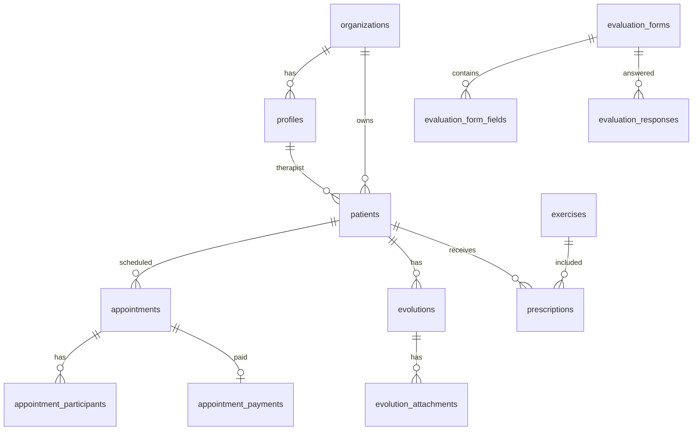

# 05. Banco de Dados

## 🗄️ Visão Geral

O FisioFlow utiliza **Firestore** (Firebase) como banco de dados principal, com **Security Rules** para controle de acesso por organização e role.

## 📊 Schema Principal

### Coleções Principais (Firestore)

```text
-- Usuários e Autenticação
profiles                      -- Perfis de usuários estendidos
organizations                 -- Organizações (multi-tenancy)

-- Pacientes e Clínica
patients                      -- Cadastro de pacientes
patient_contacts             -- Contatos de emergência
patient_objectives           -- Objetivos de tratamento
patient_goals                -- Metas dos pacientes

-- Agenda
appointments                 -- Agendamentos
appointment_participants     -- Participantes de eventos
appointment_payments         -- Pagamentos de consultas
agenda_rooms                 -- Salas de atendimento
agenda_slots                 -- Slots de horário

-- Clínico
evolutions                   -- Evoluções SOAP
evolution_attachments        -- Anexos de evoluções
evaluation_forms             -- Fichas de avaliação
evaluation_form_fields       -- Campos das fichas
evaluation_responses         -- Respostas de avaliações

-- Exercícios
exercises                    -- Biblioteca de exercícios
exercise_categories          -- Categorias de exercícios
prescriptions                -- Prescrições de exercícios
prescription_logs            -- Logs de execução

-- Financeiro
financial_transactions       -- Transações financeiras
financial_accounts           -- Contas bancárias
payment_methods              -- Formas de pagamento
invoices                     -- Faturas/Recibos

-- Sistema
notifications                -- Notificações de usuários
audit_logs                  -- Log de auditoria
system_settings             -- Configurações do sistema
```

## 🔗 Relacionamentos



## 📋 Estrutura das Coleções Principais (Firestore)

Os documentos do Firestore seguem um modelo equivalente às entidades abaixo. Campos em camelCase ou snake_case conforme o código da aplicação.

### profiles (coleção; vínculo com Firebase Auth uid)

Campos: `id` (uid do Auth), `email`, `full_name`, `avatar_url`, `role` (admin, fisioterapeuta, estagiario, recepcionista, paciente, parceiro, pending), `organization_id`, `created_at`, `updated_at`.

### patients

Campos: `organization_id`, `full_name`, `email`, `phone`, `date_of_birth`, `gender`, `address` (map), `insurance_info` (map), `medical_history`, `allergies` (array), `blood_type`, `emergency_contact` (map), `active`, `created_at`, `updated_at`.

### appointments

Campos: `organization_id`, `patient_id`, `therapist_id`, `room_id`, `title`, `description`, `start_time`, `end_time`, `status`, `type`, `notes`, `created_at`, `updated_at`. Para consultas eficientes use índices compostos no Firestore (organization_id + start_time, etc.).

### sessions / evolutions (SOAP)

Campos: `organization_id`, `patient_id`, `therapist_id`, `appointment_id`, `subjective`, `objective`, `assessment`, `plan`, `pain_level`, `pain_location`, `status`, `signature_data`, `signed_at`, `created_at`, `updated_at`.

### evaluation_forms

Campos: `organization_id`, `created_by`, `nome`, `descricao`, `referencias`, `tipo`, `ativo`, `created_at`, `updated_at`. Subcoleção ou coleção separada para `evaluation_form_fields` (form_id, tipo_campo, label, opcoes, ordem, obrigatorio, grupo, etc.).

## 🔒 Firestore Security Rules

As regras de segurança garantem que cada usuário acesse apenas dados da própria organização e conforme o role. Exemplo conceitual:

```javascript
// patients: leitura/escrita só da própria organização
match /patients/{patientId} {
  allow read, write if request.auth != null
    && resource.data.organization_id == request.auth.token.organization_id;
}
// appointments, sessions, etc.: mesma lógica com organization_id e, quando aplicável, therapist_id
```

Consulte o arquivo `firestore.rules` do projeto e a documentação [Firestore Security Rules](https://firebase.google.com/docs/firestore/security/get-started).

## 🔄 Estrutura e Seeds

- Coleções e subcoleções são criadas ao inserir o primeiro documento.
- Dados iniciais (templates de avaliação, categorias, etc.) podem ser inseridos via scripts ou Cloud Functions.
- Push notifications e integrações usam Cloud Functions e, se aplicável, Pub/Sub ou Firestore.

### 4. Agenda Pagamentos

```sql
-- 20250109000011_agenda_payments_schema.sql
-- Pagamentos de consultas
-- Integração com gateways
```

## 🚀 Performance

### Índices (Firestore)

No Firestore, crie **índices compostos** no console ou via `firestore.indexes.json` para consultas comuns, por exemplo: `patients` (organization_id, active), `appointments` (organization_id, start_time), `sessions` (patient_id, created_at). Para busca por texto (nome, email), use Algolia, Typesense ou filtros client-side conforme a escala.

### Métricas de dashboard

Métricas agregadas (total de pacientes, consultas realizadas, receita) podem ser calculadas em **Cloud Functions** (agendadas ou on-demand) e armazenadas em um documento `organization_metrics/{orgId}` ou obtidas em tempo real com consultas e agregação no cliente.

## 💾 Backups e Restauração

- **Firestore:** exportação via `gcloud firestore export`; restauração via import. Backups automáticos conforme plano do Google Cloud.
- **Storage:** cópias periódicas dos buckets conforme política da organização.
- Consulte a documentação do Firebase/Google Cloud para retenção e point-in-time recovery.

## 🔗 Recursos Relacionados

- [Autenticação e Segurança](./06-autenticacao-seguranca.md) - Regras e RBAC
- [APIs e Integrações](./07-api-integracoes.md) - Cloud Functions
- [Configuração Firebase](./guias/configuracao-firebase.md) - Setup completo
