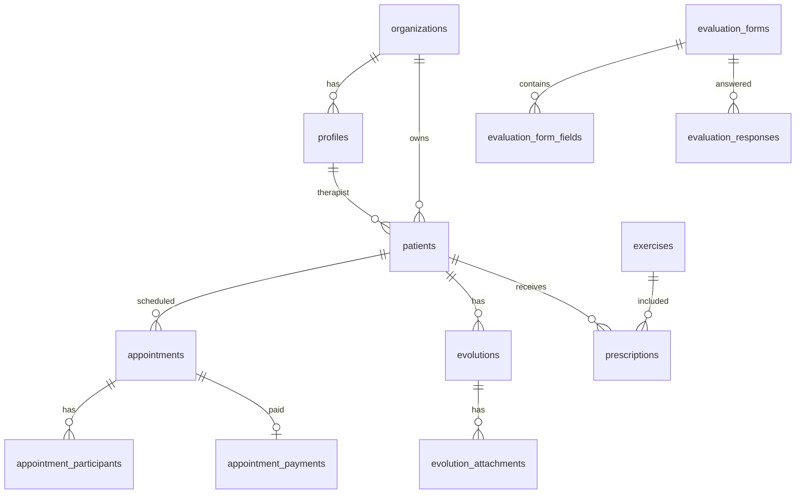

# 05. Banco de Dados

## 🗄️ Visão Geral

O FisioFlow utiliza **PostgreSQL 15+** através do Supabase, com **Row Level Security (RLS)** para controle de acesso granular.

## 📊 Schema Principal

### Tabelas Principais

```sql
-- Usuários e Autenticação
profiles                      -- Perfis de usuários estendidos
organizations                 -- Organizações (multi-tenancy)

-- Pacientes e Clínica
patients                      -- Cadastro de pacientes
patient_contacts             -- Contatos de emergência
patient_objectives           -- Objetivos de tratamento
patient_goals                -- Metas dos pacientes

-- Agenda
appointments                 -- Agendamentos
appointment_participants     -- Participantes de eventos
appointment_payments         -- Pagamentos de consultas
agenda_rooms                 -- Salas de atendimento
agenda_slots                 -- Slots de horário

-- Clínico
evolutions                   -- Evoluções SOAP
evolution_attachments        -- Anexos de evoluções
evaluation_forms             -- Fichas de avaliação
evaluation_form_fields       -- Campos das fichas
evaluation_responses         -- Respostas de avaliações

-- Exercícios
exercises                    -- Biblioteca de exercícios
exercise_categories          -- Categorias de exercícios
prescriptions                -- Prescrições de exercícios
prescription_logs            -- Logs de execução

-- Financeiro
financial_transactions       -- Transações financeiras
financial_accounts           -- Contas bancárias
payment_methods              -- Formas de pagamento
invoices                     -- Faturas/Recibos

-- Sistema
notifications                -- Notificações de usuários
audit_logs                  -- Log de auditoria
system_settings             -- Configurações do sistema
```

## 🔗 Relacionamentos



## 📋 Estrutura das Tabelas Principais

### profiles (Extensão de auth.users)

```sql
create table public.profiles (
  id uuid references auth.users on delete cascade primary key,
  email text,
  full_name text,
  avatar_url text,
  role text check (role in ('admin', 'physiotherapist', 'intern', 'patient')),
  organization_id uuid references organizations(id),
  created_at timestamp with time zone default timezone('utc'::text, now()) not null,
  updated_at timestamp with time zone default timezone('utc'::text, now()) not null
);
```

### patients

```sql
create table public.patients (
  id uuid default gen_random_uuid() primary key,
  organization_id uuid references organizations(id),
  full_name text not null,
  email text,
  phone text,
  date_of_birth date,
  gender text check (gender in ('male', 'female', 'other')),
  address jsonb,
  insurance_info jsonb,
  medical_history jsonb,
  allergies text[],
  blood_type text,
  emergency_contact jsonb,
  active boolean default true,
  created_at timestamp with time zone default timezone('utc'::text, now()) not null,
  updated_at timestamp with time zone default timezone('utc'::text, now()) not null
);
```

### appointments

```sql
create table public.appointments (
  id uuid default gen_random_uuid() primary key,
  organization_id uuid references organizations(id),
  patient_id uuid references patients(id),
  therapist_id uuid references profiles(id),
  room_id uuid references agenda_rooms(id),
  title text not null,
  description text,
  start_time timestamp with time zone not null,
  end_time timestamp with time zone not null,
  status text check (status in ('scheduled', 'confirmed', 'in_progress', 'completed', 'cancelled', 'no_show')),
  type text check (type in ('initial', 'follow_up', 'evaluation', 'therapy', 'telemedicine')),
  notes text,
  created_at timestamp with time zone default timezone('utc'::text, now()) not null,
  updated_at timestamp with time zone default timezone('utc'::text, now()) not null
);

-- Índices para performance
create index idx_appointments_org on appointments(organization_id);
create index idx_appointments_patient on appointments(patient_id);
create index idx_appointments_therapist on appointments(therapist_id);
create index idx_appointments_start on appointments(start_time);
create index idx_appointments_status on appointments(status);
```

### evolutions (SOAP)

```sql
create table public.evolutions (
  id uuid default gen_random_uuid() primary key,
  organization_id uuid references organizations(id),
  patient_id uuid references patients(id),
  therapist_id uuid references profiles(id),
  appointment_id uuid references appointments(id),

  -- SOAP Notes
  subjective text,
  objective text,
  assessment text,
  plan text,

  pain_level integer check (pain_level >= 0 and pain_level <= 10),
  pain_location jsonb,

  status text check (status in ('draft', 'final', 'signed')),
  signature_data jsonb,
  signed_at timestamp with time zone,

  created_at timestamp with time zone default timezone('utc'::text, now()) not null,
  updated_at timestamp with time zone default timezone('utc'::text, now()) not null
);
```

### evaluation_forms

```sql
create table public.evaluation_forms (
  id uuid default gen_random_uuid() primary key,
  organization_id uuid references organizations(id),
  created_by uuid references profiles(id),
  nome text not null,
  descricao text,
  referencias text,              -- Referências científicas
  tipo text,                     -- 'esportiva', 'ortopédica', etc
  ativo boolean default true,
  created_at timestamp with time zone default timezone('utc'::text, now()) not null,
  updated_at timestamp with time zone default timezone('utc'::text, now()) not null
);

-- Campos das fichas
create table public.evaluation_form_fields (
  id uuid default gen_random_uuid() primary key,
  form_id uuid references evaluation_forms(id) on delete cascade,
  tipo_campo text check (tipo_campo in ('texto_curto', 'texto_longo', 'opcao_unica', 'selecao', 'lista', 'escala', 'data', 'hora', 'info', 'numero')),
  label text not null,
  placeholder text,
  opcoes jsonb,                  -- Array de opções para selects
  ordem integer not null,
  obrigatorio boolean default false,
  grupo text,                    -- Seção do formulário
  descricao text,                -- Texto de ajuda
  minimo integer,                -- Para escalas/numeros
  maximo integer,
  created_at timestamp with time zone default timezone('utc'::text, now()) not null
);
```

## 🔒 Row Level Security (RLS)

### Ativar RLS

```sql
alter table patients enable row level security;
alter table appointments enable row level security;
alter table evolutions enable row level security;
-- ... etc
```

### Exemplos de Policies

```sql
-- Pacientes: ver só da própria organização
create policy "patients_select_org" on patients
  for select
  using (organization_id = auth.jwt()->>'organization_id');

-- Pacientes: admin vê tudo
create policy "patients_select_admin" on patients
  for select
  using (auth.jwt()->>'role' = 'admin');

-- Evoluções: terapeuta só vê suas
create policy "evolutions_select_own" on evolutions
  for select
  using (
    organization_id = auth.jwt()->>'organization_id'
    and therapist_id = auth.uid()
  );

-- Evoluções: atualizar só se for o terapeuta
create policy "evolutions_update_own" on evolutions
  for update
  using (
    therapist_id = auth.uid()
    and status = 'draft'  -- Só pode editar draft
  );
```

## 🔄 Migrations Importantes

### 1. Schema Inicial

```sql
-- 20240101000001_initial_schema.sql
-- Cria todas as tabelas principais
-- Configura RLS policies
```

### 2. Avaliações Templates

```sql
-- 20260113220000_seed_evaluation_templates.sql
-- Insere 21 templates de avaliação
-- Avaliações esportivas (10)
-- Avaliações ortopédicas (10)
-- Avaliação padrão (1)
```

### 3. Notificações Push

```sql
-- 20250109000001_push_notifications_schema.sql
-- Tabelas para push notifications
-- Integração com Vercel KV
```

### 4. Agenda Pagamentos

```sql
-- 20250109000011_agenda_payments_schema.sql
-- Pagamentos de consultas
-- Integração com gateways
```

## 🚀 Performance

### Índices

```sql
-- Buscas comuns
create index idx_patients_org_active on patients(organization_id, active);
create index idx_appointments_date_range on appointments(start_time, end_time);
create index idx_evolutions_patient_date on evolutions(patient_id, created_at desc);

-- Full text search
create index idx_patients_search on patients using gin(to_tsvector('portuguese', full_name || ' ' || coalesce(email, '')));
```

### Views Materializadas

```sql
-- Dashboard metrics
create materialized view organization_metrics as
select
  o.id as organization_id,
  count(distinct p.id) as total_patients,
  count(distinct a.id) filter (where a.status = 'completed') as completed_appointments,
  sum(ft.amount) filter (where ft.type = 'income') as total_revenue
from organizations o
left join patients p on p.organization_id = o.id
left join appointments a on a.organization_id = o.id
left join financial_transactions ft on ft.organization_id = o.id
group by o.id;

-- Refresh a cada hora
create unique index on organization_metrics(organization_id);
```

## 💾 Backups e Restauração

### Backup Automático (Supabase Pro)

```yaml
# Configurado no Supabase Dashboard
Backup Schedule: Daily
Retention: 30 days
Point-in-time Recovery: 7 days
```

### Backup Manual via SQL

```sql
-- Exportar schema
pg_dump --schema-only --no-owner --no-acl > schema.sql

-- Exportar dados
pg_dump --data-only --no-owner --no-acl > data.sql
```

### Restauração

```sql
-- Via Supabase Dashboard
# Project Settings → Database → Restore
```

## 🔗 Recursos Relacionados

- [Autenticação e Segurança](./06-autenticacao-seguranca.md) - RLS policies detalhadas
- [APIs e Integrações](./07-api-integracoes.md) - Edge Functions
- [Configuração Supabase](./guias/configuracao-supabase.md) - Setup completo
