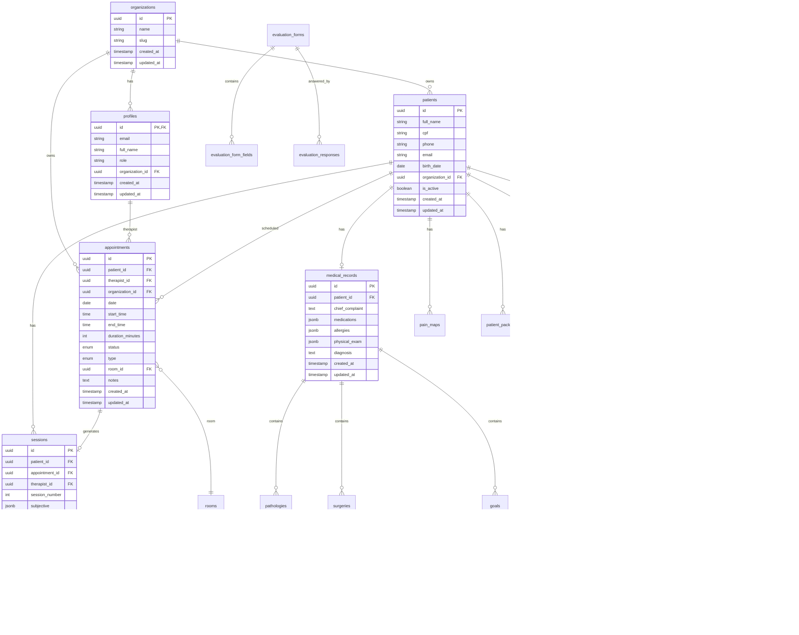

# FisioFlow — Entidades e Relacionamentos

Documento de referência rápida: **entidades** (tabelas), **atributos principais** e **relacionamentos** do banco de dados e tipos da aplicação.

---

## 1. Diagrama ER (Mermaid)

---

## 2. Tabelas e Atributos Principais

### 2.1 Autenticação e Organização

| Tabela | Descrição | Atributos principais |
|--------|------------|------------------------|
| **organizations** | Organizações (clínicas) | id, name, slug, created_at, updated_at |
| **profiles** | Perfis de usuário (extensão auth.users) | id (FK auth.users), email, full_name, avatar_url, **role**, **organization_id**, created_at, updated_at |

### 2.2 Pacientes e Clínica

| Tabela | Descrição | Atributos principais |
|--------|------------|------------------------|
| **patients** | Cadastro de pacientes | id, full_name, cpf, rg, birth_date, gender, phone, email, address (jsonb), emergency_contact (jsonb), insurance (jsonb), organization_id, is_active, created_at, updated_at |
| **patient_contacts** | Contatos de emergência | patient_id, name, phone, relationship |
| **patient_goals** | Objetivos do paciente | id, patient_id, goal_title, goal_description, target_date, current_progress, priority, status |
| **patient_packages** | Pacotes de sessões | id, patient_id, name, total_sessions, used_sessions, remaining_sessions, status, expires_at |

### 2.3 Agenda

| Tabela | Descrição | Atributos principais |
|--------|------------|------------------------|
| **appointments** | Agendamentos | id, patient_id, therapist_id, organization_id, date, start_time, end_time, duration_minutes, **status**, **type**, room_id, payment_status, notes, is_recurring, created_at, updated_at |
| **blocked_slots** | Bloqueios de horário | id, therapist_id, room_id, date, start_time, end_time, reason |
| **rooms** | Salas de atendimento | id, organization_id, name, capacity, is_active |
| **agenda_rooms** / **agenda_slots** | Configurações de agenda (conforme schema) | — |

### 2.4 Prontuário e Sessões

| Tabela | Descrição | Atributos principais |
|--------|------------|------------------------|
| **medical_records** | Prontuário médico (1:1 paciente) | id, patient_id, chief_complaint, current_history, medications (jsonb), allergies (jsonb), physical_exam (jsonb), diagnosis, icd10_codes (jsonb) |
| **sessions** | Sessões/evoluções SOAP | id, patient_id, appointment_id, therapist_id, session_number, **subjective**, **objective**, **assessment**, **plan** (jsonb), status, finalized_at, created_at, updated_at |
| **session_attachments** | Anexos de sessão | id, session_id, patient_id, file_name, file_url, file_type, category |
| **session_templates** | Templates de evolução | id, name, subjective, objective, assessment, plan (jsonb) |
| **evolutions** | Evoluções (quando existir) | id, patient_id, appointment_id, session_number, subjective, objective, assessment, plan, created_by |
| **pain_maps** / **body_pain_maps** | Mapas de dor | id, patient_id, session_id, created_at |
| **pain_map_points** | Pontos do mapa de dor | id, pain_map_id, position (jsonb), intensity |

### 2.5 Objetivos, Patologias e Cirurgias

| Tabela | Descrição | Atributos principais |
|--------|------------|------------------------|
| **goals** | Objetivos de tratamento | id, medical_record_id, description, target_date, priority, status |
| **pathologies** | Patologias/CID | id, medical_record_id, name, icd_code, status, diagnosed_at |
| **surgeries** | Cirurgias | id, medical_record_id, name, surgery_date, surgeon, hospital, notes |
| **treatment_goals** / **treatment_procedures** | Objetivos e procedimentos (conforme schema) | — |

### 2.6 Avaliações

| Tabela | Descrição | Atributos principais |
|--------|------------|------------------------|
| **evaluation_forms** | Fichas de avaliação | id, title, description, category, content (jsonb), is_global |
| **evaluation_form_fields** | Campos das fichas | id, form_id, name, type, required, options |
| **evaluation_responses** | Respostas de avaliações | id, patient_id, form_id, session_id, responses (jsonb) |
| **evaluation_templates** | Templates de avaliação | id, title, description, category, content (jsonb) |

### 2.7 Exercícios e Prescrições

| Tabela | Descrição | Atributos principais |
|--------|------------|------------------------|
| **exercises** | Biblioteca de exercícios | id, name, category, difficulty, description, video_url, image_url, target_muscles, equipment |
| **exercise_categories** | Categorias de exercícios | id, organization_id, name |
| **prescriptions** | Prescrições de exercícios | id, patient_id, therapist_id, status, created_at |
| **prescription_items** | Itens da prescrição | id, prescription_id, exercise_id, sets, reps, rest_seconds, notes |
| **prescription_logs** | Logs de execução | id, prescription_id, session_id, completed_at |

### 2.8 Testes e Conduta

| Tabela | Descrição | Atributos principais |
|--------|------------|------------------------|
| **assessment_test_configs** | Configurações de testes | id, pathology_name, test_name, test_type, frequency_sessions, is_mandatory |
| **test_results** | Resultados de testes | id, session_id, patient_id, test_name, value, unit, measured_by, measured_at |
| **conduct_templates** | Templates de conduta | id, patient_id, template_name, conduct_data (jsonb) |

### 2.9 Financeiro

| Tabela | Descrição | Atributos principais |
|--------|------------|------------------------|
| **financial_transactions** | Transações | id, organization_id, type (income/expense), amount, date, account_id, category |
| **financial_accounts** | Contas financeiras | id, organization_id, name, type, balance |
| **payments** | Pagamentos de consultas | id, appointment_id, amount, status, paid_at |
| **invoices** | Faturas/recibos | id, patient_id, amount, status, issued_at |

### 2.10 Sistema e Auditoria

| Tabela | Descrição | Atributos principais |
|--------|------------|------------------------|
| **notifications** | Notificações | id, user_id, type, title, message, status, read_at |
| **audit_logs** | Log de auditoria | id, user_id, action, entity_type, entity_id, changes (jsonb), created_at |
| **analytics_events** | Eventos de analytics | id, user_id, event_name, properties (jsonb), created_at |

### 2.11 Marketing e CRM

| Tabela | Descrição | Atributos principais |
|--------|------------|------------------------|
| **leads** | Leads | id, organization_id, name, email, phone, source, status |
| **landing_pages** | Páginas de landing | id, slug, title, content |
| **marketing_campaigns** | Campanhas | id, organization_id, name, status, start_date, end_date |

### 2.12 Outros

| Tabela | Descrição |
|--------|------------|
| **waitlist** / **waiting_list** | Lista de espera |
| **package_usage** | Uso de pacotes por atendimento |
| **session_packages** | Definição de pacotes de sessões |
| **message_templates** | Templates de mensagens |
| **whatsapp_connections** / **whatsapp_messages** | Integração WhatsApp |
| **knowledge_documents** / **knowledge_search_history** | Base de conhecimento |
| **backups** | Metadados de backup |

---

## 3. Enums e Valores Comuns

### Status de Agendamento (appointment_status)

- scheduled, confirmed, in_progress, completed, cancelled, no_show, rescheduled

### Tipo de Agendamento (appointment_type)

- evaluation, session, reassessment, group, return  
- (Na aplicação também: Consulta Inicial, Fisioterapia, Reavaliação, Consulta de Retorno, Pilates Clínico, RPG, etc.)

### Status de Pagamento (payment_status)

- pending, paid, partial, refunded

### Status de Sessão (session_status)

- draft, finalized, cancelled

### Roles (profiles.role)

- admin, fisioterapeuta, estagiario, recepcionista, paciente, parceiro, pending

### Status de Pacote (package_status)

- active, expired, used, cancelled

### Status de Patologia (pathology_status)

- active, treated, monitoring

---

## 4. Relacionamentos em Texto (FK)

| Entidade filha | FK | Entidade pai | Comportamento |
|----------------|-----|--------------|----------------|
| profiles | organization_id | organizations | — |
| patients | organization_id | organizations | — |
| appointments | organization_id | organizations | — |
| appointments | patient_id | patients | ON DELETE CASCADE |
| appointments | therapist_id | profiles | — |
| appointments | room_id | rooms | — |
| sessions | patient_id | patients | ON DELETE CASCADE |
| sessions | appointment_id | appointments | ON DELETE SET NULL |
| sessions | therapist_id | profiles | — |
| medical_records | patient_id | patients | ON DELETE CASCADE |
| goals | medical_record_id | medical_records | ON DELETE CASCADE |
| pathologies | medical_record_id | medical_records | ON DELETE CASCADE |
| surgeries | medical_record_id | medical_records | ON DELETE CASCADE |
| session_attachments | session_id | sessions | ON DELETE CASCADE |
| session_attachments | patient_id | patients | ON DELETE CASCADE |
| patient_packages | patient_id | patients | ON DELETE CASCADE |
| prescription_items | prescription_id | prescriptions | — |
| prescription_items | exercise_id | exercises | — |
| prescriptions | patient_id | patients | — |
| prescriptions | therapist_id | profiles | — |
| evaluation_responses | patient_id | patients | — |
| evaluation_responses | form_id | evaluation_forms | — |

---

## 5. Tipos TypeScript (espelho)

Principais interfaces em `src/types/`:

- **Patient** — `src/types/index.ts`
- **AppointmentBase, EnhancedAppointment, AppointmentFormData** — `src/types/appointment.ts`
- **AppointmentUnified, AppointmentStatus, AppointmentType** — `src/types/index.ts`
- **SOAPRecord, SessionEvolution** — `src/types/index.ts`, `src/types/evolution.ts`
- **Exercise, ExercisePlan, Prescription** — `src/types/index.ts`
- **MedicalRecord, Pathology, Surgery, PatientGoal** — `src/types/index.ts`, `src/types/evolution.ts`
- **UserRole, UserProfile** — documentado em `docs2026/06-autenticacao-seguranca.md`; role em `profiles`

---

*FisioFlow — Entidades e relacionamentos. Fevereiro 2026.*
