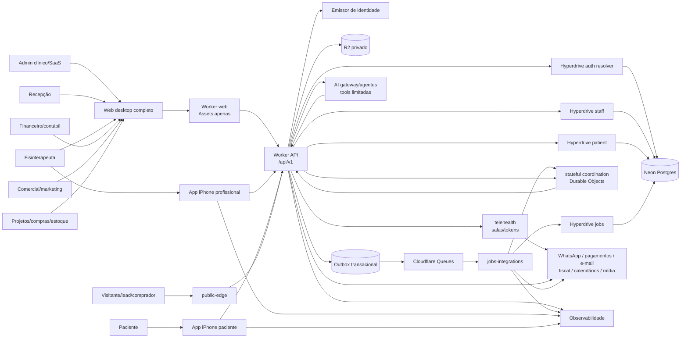

# Contexto do sistema



## Responsabilidades

- O Worker web serve somente shell/assets e nunca recebe credencial de banco, R2 privado ou secret clínico.
- Clientes exibem dados autorizados e validam UX; não decidem autorização final.
- API aplica identidade, permission, tenancy, invariantes e auditoria.
- O monólito modular transacional hospeda os domínios clínicos e empresariais enquanto consistência e simplicidade justificarem; módulos não escrevem tabelas internas uns dos outros.
- Postgres mantém estado transacional e isolamento.
- R2 mantém blobs privados; metadados e autorização ficam no Postgres/API.
- Queue carrega comandos/eventos mínimos e idempotentes.
- Jobs usam identidade e binding de banco próprios; nunca reutilizam credencial de auth resolver, staff ou paciente.
- `public-edge` recebe somente comandos públicos estreitos e nunca lê prontuário diretamente.
- Durable Objects coordenam presença/edição e átomos stateful explícitos, como single-flight por vínculo de calendário; o estado de negócio final permanece canônico no Neon.
- agentes acessam capacidades somente por ferramentas/API autorizadas e approval gates; nunca por credencial ampla de banco.
- `telehealth` encapsula o provedor de mídia; agenda, consentimento e prontuário permanecem em seus módulos canônicos.
- Provedores externos nunca são fonte única do estado de negócio; webhooks são verificados, deduplicados e conciliados.

## Bootstrap de identidade e contexto

O contexto interno nasce em duas etapas; o cliente nunca transforma diretamente um ID recebido no body/header em autoridade:

1. a borda de auth valida assinatura, `issuer`, `audience`, expiração e `subject` do provedor;
2. um resolver interno mínimo localiza a identity e resolve memberships ou patient links permitidos; criação/sincronização ocorre por fluxo privilegiado separado, idempotente e auditado;
3. a sessão interna passa a carregar `identityId` e uma `membershipId` ou patient link previamente verificado;
4. em cada request, a API revalida estado/versão da autorização e abre transação na conexão correta;
5. `org_id`, `identity_id` e, quando aplicável, `patient_id` são definidos localmente nessa mesma transação antes das queries.

Se houver mais de uma membership ativa, `GET /api/v1/auth/contexts` mostra apenas candidatos do próprio subject e `POST /api/v1/auth/context` seleciona um `membershipId` revalidado. Sem membership/link ativo, não existe contexto parcial, organização default nem `viewer`.

## Fronteiras de confiança

1. Internet → Worker web/API: TLS, WAF, rate limits e Turnstile conforme threat model; os dois Workers têm bindings e blast radius distintos.
2. Cliente → API: sessão/JWT, issuer/audience e device posture quando aplicável.
3. API → banco: bindings/login roles distintos para auth resolver, staff e paciente, todos `NOBYPASSRLS`; casos autenticados usam contexto transaction-local na mesma conexão, e commit, rollback ou erro não podem contaminar o próximo request do pool.
4. Queue/jobs → banco: login role e Hyperdrive exclusivos, grants de dispatcher/consumer separados dos requests.
5. API/jobs → integrações: secrets gerenciados, assinatura, timeout e circuit breaker.
6. Operação → dados: least privilege, auditoria e break-glass formal.

## Ameaças HTTP e de cache

- Respostas autenticadas ou com PII/PHI usam `Cache-Control: private, no-store`; a API não depende do cache do edge para dados clínicos.
- Mutações autenticadas por cookie exigem defesa CSRF e validação de Origin/Host; bearer token não elimina controles de replay/idempotência.
- Cursor é opaco, sem PII, vinculado a tenant+filtros+ordenação e possui validade/erro estável.
- Falta de permission conhecida retorna `403`; recurso ausente ou de outro tenant retorna `404` sem confirmar existência.
- Busca por identificador sensível, links públicos, uploads e webhooks ganham threat model/rate limit específicos antes de entrar.

## Fluxos de referência

### Cuidado

```text
recepção agenda
→ profissional atende e registra evolução/medidas
→ profissional prescreve HEP
→ paciente executa e informa resposta
→ Radar sinaliza desvio
→ profissional age
→ Mapa de Resultados demonstra progresso/alta
```

### Operação empresarial

```text
lead consentido → oportunidade → proposta/contrato
→ serviço ou pedido → cobrança/recebimento
→ estoque/compra quando aplicável → lançamento contábil
→ conciliação → relatório/tributação/NFS-e
```

### SaaS

```text
clínica aprovada → tenant provisionado → assinatura/entitlements
→ onboarding → uso medido → suporte/SLO
→ upgrade/downgrade/suspensão auditados
```
