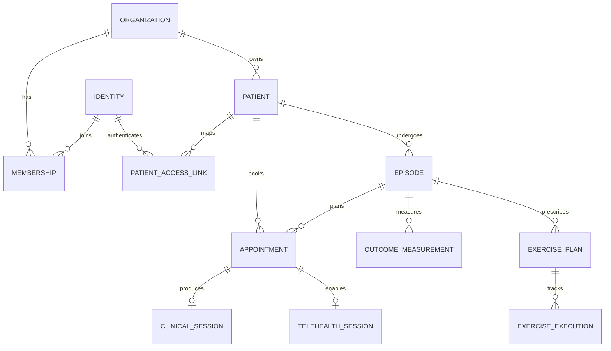
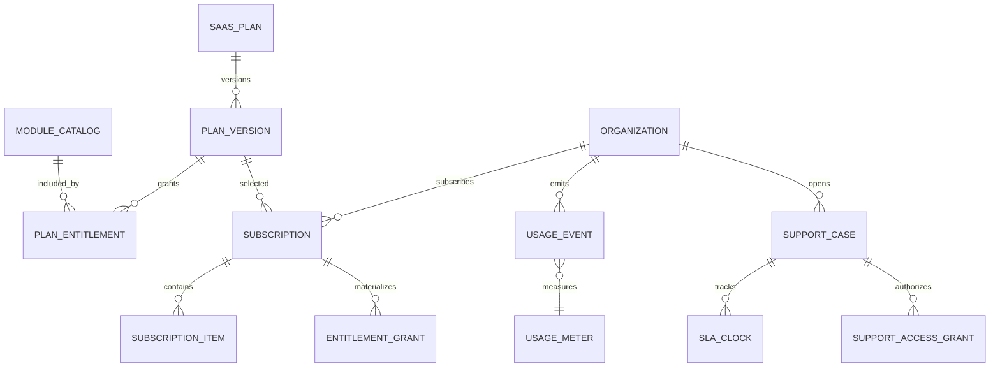
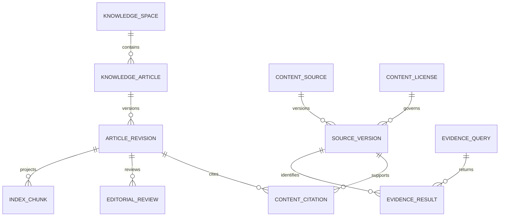

# Modelo alvo por etapas

O modelo nasce **greenfield**: regras e contratos do legado são evidência, mas os registros atuais são sintéticos/descartáveis e não serão migrados. A produção nova começa vazia, com dados de referência e fixtures explicitamente versionados.

Todos os domínios abaixo pertencem ao modelo alvo. Isso não autoriza criar todas as tabelas no primeiro migration: cada módulo recebe schema, regras, permissões e testes quando seu incremento for aprovado.

## Núcleo clínico e operacional

### Organization / Membership

- organization: tenant, branding e configurações tenant-owned versionadas;
- identity: subject externo sem misturar papel de organização;
- membership: status, papéis normalizados, `authorization_version` e validade; permissions derivam de catálogo versionado, não de strings arbitrárias;
- patient access link: identidade autenticada ↔ paciente específico;
- caregiver delegation: escopo, validade, aceitação e revogação auditáveis.

Entitlement pertence ao SaaS Control Plane e é projetado no contexto da organização. Ele habilita o módulo contratado, mas não concede permission a nenhuma identidade.

## SaaS Control Plane

### Catálogo, onboarding e provisioning

- `module_catalog`: módulo comercializável, versão de contrato, dependências, limites e status;
- `saas_plan` + `plan_version`: oferta imutável/versionada, moeda, periodicidade, preço e vigência;
- `plan_entitlement`: capability/limite incluído, unidade e política de excedente;
- `tenant_onboarding`: checklist, owner, estágio, aceite de termos e evidências de conclusão;
- `provisioning_request` + steps: comando idempotente para criar organização, bindings lógicos, defaults e primeiro administrador; retry/compensação são explícitos;
- `tenant_environment`: referência opaca aos recursos provisionados, região, estado e versão, sem secrets em coluna de domínio.

### Subscription, entitlement e metering

- `subscription`: organização, versão do plano, ciclo, estado, trial, cancelamento e referência ao provedor de cobrança;
- `subscription_item`: módulo/add-on, quantidade, preço contratado e vigência;
- `entitlement_grant`: capacidade efetiva, limite, origem, validade e versão; sua projeção é usada no bootstrap, separada de RBAC;
- `usage_meter`: nome, unidade, agregação, janela, deduplicação e política de atraso;
- `usage_event`: tenant, meter, quantidade, occurred/received timestamps e idempotency key, sem PHI/PII no payload;
- `usage_aggregate`: bucket fechado/reprocessável com versão da regra;
- `saas_invoice_reference` e `provider_reconciliation`: referências do billing da plataforma; não compartilham ledger com o ERP da clínica.

### Suporte, SLO e operação

- `support_case`, `support_message`, categoria, severidade, canal, owner, estado e tenant afetado;
- `sla_policy`, `sla_clock`, pause reason, breach e escalation, versionados por plano/severidade;
- `support_access_request` + `support_access_grant`: finalidade, aprovador, scopes, início, TTL, revogação, banner e vínculo obrigatório ao ticket;
- `service`, `service_objective`, `service_indicator`, `incident`, `incident_update` e `tenant_impact` modelam SLO e comunicação de incidente;
- `platform_actor` + `platform_capability_grant` são separados de membership e nunca equivalem a acesso clínico;
- telemetria de suporte é sanitizada; qualquer acesso excepcional a dado tenant-owned gera auditoria reforçada e expira automaticamente.

### Patient / Episode

- patient guarda cadastro e contatos;
- episode representa objetivo/plano de recuperação com início, responsável e estado;
- múltiplos episódios preservam histórico sem transformar o paciente em uma ficha eterna amorfa.

Estados propostos do episódio: `planned`, `active`, `paused`, `completed`, `abandoned`, `cancelled`. `completed` exige alta/desfecho; `abandoned` é explícito e alimenta métricas.

### Scheduling

- appointment individual;
- availability/block/room/resource;
- recurring series;
- canonical status history;
- booking, check-in, no-show e waitlist de **vaga individual**, nunca turma.

### Clinical / Outcomes

- clinical session 1:0..1 appointment;
- note draft + immutable versions;
- finalization/signature metadata;
- structured measurements separate from prose;
- outcome instrument/version, score raw, interpretação autorizada e source;
- clinical goals com baseline/target/date.

### Exercises

- exercise com proveniência/licença/revisão;
- protocol versionado;
- plan e items com dose/instrução;
- execution append-only com resposta curta;
- adherence read model derivado, não campo manual.

### Documents / Telehealth

- document metadata, versão, hash, assinatura, retenção, legal hold e chave opaca de objeto R2;
- telehealth session referencia appointment, registra participantes, consentimento, provedor e lifecycle;
- gravação é opcional, requer consentimento específico e possui retenção independente;
- fotos, vídeos e PDFs clínicos comuns não criam suporte a DICOM/PACS.

## Negócio completo

### Finance & ERP

- chart of accounts, fiscal periods e centros de custo;
- journal entry + journal lines de dupla entrada;
- contas a pagar/receber, caixa, banco, conciliação e competência;
- cobrança, pacote, pagamento, repasse, comissão, contrato e assinatura;
- compras, fornecedores, despesas, ativos e folha somente em incrementos com regra própria;
- configuração fiscal, documento fiscal e NFS-e via adapter versionado por provedor;
- lançamento contabilizado é imutável; correção ocorre por estorno/novo lançamento auditado.

### Projects

- portfolio, project, milestone, board, task, dependency e approval;
- resource allocation, timesheet, timer e política de aprovação;
- vínculo opcional com objetos de outros domínios usa referência opaca/contrato, sem copiar PHI para título, descrição ou evento.

### Commerce & Inventory

- product/service catalog, price book, promotion, cart, order, payment, subscription, refund e fulfillment;
- inventory item, location, lot/expiry, movement ledger, reservation, count, purchase order e supplier;
- saldo de estoque e disponibilidade são projeções do ledger, não campos alteráveis livremente;
- pedido comercial e atendimento clínico são agregados distintos, ligados por contrato quando necessário.

### CRM, Marketing & Site Builder

- lead/contact, source, pipeline, opportunity, segment e attribution;
- campaign, audience snapshot, template, automation, delivery e opt-out;
- site, page, block, theme, domain, form, version, publication e rollback;
- `site_design_draft` registra versão base, briefing, referência ao `ai_run`, layout/theme/content propostos, diff, revisor e decisão; design por LLM nunca publica diretamente;
- publicação gera manifesto imutável/asset para o `public-edge`;
- preferência de marketing nunca é inferida de consentimento para cuidado e não libera leitura clínica.

### Gamification

- ruleset versionado, point ledger, level, achievement, challenge e leaderboard;
- wallet, virtual currency, reward catalog, redemption e virtual inventory;
- identidade exibida, elegibilidade, opt-in e privacidade são configuráveis por contexto;
- recompensas nunca alteram outcome, severidade clínica, prioridade assistencial ou acesso ao cuidado.

## Capacidades avançadas

### Collaboration

- room/document key opaca, actor, operation/update, snapshot, awareness e version vector;
- estado realtime pode viver em Durable Objects; snapshot consolidado tem metadados e retenção;
- finalização de evolução cria versão imutável no Clinical e não depende do estado efêmero de presença.

### AI & Agents

- model/provider policy, prompt/template version, run, input/output reference, tool call, evaluation, approval e cost record;
- payload sensível é minimizado e separado da telemetria operacional;
- toda ferramenta declara capability, escopo tenant, idempotência e classe de risco;
- nota, conduta, pagamento, envio externo ou alteração irreversível exige gate humano apropriado.

### Knowledge, Content & Evidence Gateway

- `knowledge_space`: escopo tenant/global, audiência, política editorial e responsáveis;
- `knowledge_article`: identidade lógica, slug opaco por escopo, tipo, idioma, taxonomia e lifecycle;
- `article_revision`: conteúdo imutável, autor humano/IA, base revision, diff, estado (`draft`, `in_review`, `approved`, `published`, `retired`) e datas;
- `taxonomy_term` + relações versionadas organizam especialidade, região, objetivo, tipo de evidência e audiência sem inferir diagnóstico;
- `content_source`, `source_version` e `content_license` guardam URL/DOI/PMID, autoria, publisher, data, checksum, termos, permissão de uso e expiração;
- `content_citation` liga afirmação/trecho estruturado a uma versão de fonte, com locator e contexto; citação não transfere licença do texto integral;
- `editorial_review` registra revisor, qualificação, checklist, decisão e motivo; conteúdo clínico exige aprovação de revisor qualificado;
- `publication` aponta exatamente uma revisão aprovada, canais, audiência, vigência, correção/retração e manifesto publicado;
- `evidence_query`, `evidence_result`, `evidence_screening` e `evidence_bundle` registram consulta, provider, estratégia, ranking, inclusão/exclusão, citações e limitações;
- `index_chunk`, embedding e índices de busca são projeções reconstruíveis com model/version/dimensão e nunca substituem fonte/revisão;
- geração ou design por LLM referencia `ai_run`, modelo, prompt/template, fontes usadas e diff; permanece draft até revisão/aprovação;
- conteúdo da E-Fisio ou de terceiros só entra com licença/autorização verificável; trocar palavras por IA não cria direito de uso.

### Wearables, Biomechanics & Digital Twin

- device/source, consent grant, observation, sample series, unit, provenance, quality e ingestion receipt;
- capture session, landmark/pose result, derived measurement, algorithm/version e validation status;
- twin model/version, input snapshot, parameter, simulation, result, uncertainty e evidence reference;
- dado bruto, derivado e interpretação nunca são confundidos; capacidades experimentais exibem versão, limitação e aprovação profissional;
- HealthKit/iPhone é uma fonte consentida entre outras, não identidade nem fonte absoluta de verdade.

## Cross-cutting

- idempotency records com TTL;
- transactional outbox e receipts por consumer;
- audit events append-only;
- consent, purpose, retention, legal hold, export e anonymization requests;
- care signals e tasks como projeções/ações;
- module entitlement e feature rollout separados de authorization;
- plano/subscription, billing SaaS e metering separados do ERP tenant-owned;
- support access grant com purpose, ticket, scopes, aprovador, TTL e revogação;
- manifestos publicados e read models reconstruíveis;
- fonte/licença/revisão/publicação separadas de embeddings e saídas de LLM;
- integrações externas registram provider, external ID, tentativa, resposta normalizada e reconciliação.

## Convenções

- `organization_id` obrigatório em entidade tenant-owned.
- FK composta `(organization_id, foreign_id)` quando isso impede ligação cross-tenant no próprio banco.
- `created_at`, `updated_at` e `version` onde mutável; autoria de staff referencia `membership_id` no mesmo tenant, não apenas identity global.
- estado técnico em inglês estável; rótulo localizado no cliente.
- timestamps UTC; timezone da organização somente para exibição/agendamento.
- valor monetário `numeric` + ISO currency; arredondamento e competência são explícitos.
- PII/PHI nunca entra em ID, nome de arquivo, chave de objeto, evento ou log; auditoria bruta não é legível pela runtime comum.
- cada schema/tabela tem owner de módulo, classe de dados, retenção e matriz RLS antes da migration.
- tabelas globais do SaaS Control Plane usam grants de plataforma próprios; `platform_admin` não recebe `BYPASSRLS` nem membership automática de tenant.
- browser e apps nunca conectam diretamente ao Neon.

## Gates antes de dados reais

- produção Neon e buckets R2 novos, sem carga dos registros atuais;
- RLS A/B, permissions, auditoria e threat model aprovados;
- PITR/backup do Neon, lifecycle/versionamento R2 e restore integrado testados;
- dados de seed estritamente sintéticos e reproduzíveis;
- provisioning, entitlement, metering, suporte/SLO e revogação de acesso temporário testados com tenants sintéticos;
- workflow editorial comprova licença, revisão humana e bloqueio de publicação direta por LLM;
- consentimento, retenção e resposta a incidente definidos por classe de dado.

## O que não existe no modelo alvo

- `group_classes`, `group_sessions`, `group_enrollments`, `group_waitlist` ou equivalentes;
- entidades, worklists, studies, series, instances, viewers ou adapters de DICOM/PACS;
- entitlement usado como permission ou `platform_admin` usado como superusuário clínico;
- conteúdo sem proveniência/licença, publicação clínica sem revisão ou design de LLM auto-publicado;
- pares de tabelas PT/EN para a mesma entidade;
- uma tabela genérica de JSON para substituir domínio;
- ligação direta entre app/web e banco;
- tabelas espelho do legado criadas apenas para importar os dados atuais.
