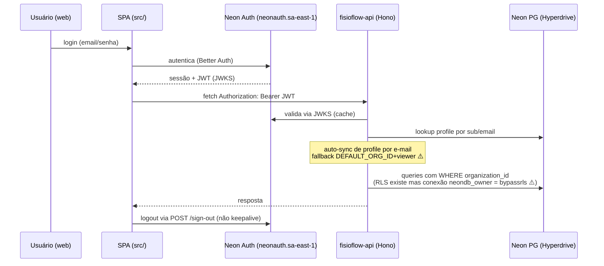

# Diagrama — Autenticação e Autorização (AS-IS)

## Três trilhos de auth divergentes

| Cliente | Mecanismo | Armazenamento |
|---|---|---|
| Web | Neon Auth (Better Auth) + JWT p/ API via GET /__neon-auth/token | cookie/sessão |
| App iOS Pro | `POST /api/auth/login` + JWT + refresh próprio | SecureStore |
| App iOS Paciente | better-auth nativo + trilho `requirePatientAuth` (JWT role=patient); OTP por telefone (stub WhatsApp) | SecureStore |

## Papéis

`admin, fisioterapeuta, recepcionista, estagiario, paciente, parceiro, pending` (+`owner` fantasma via banco, `viewer` fallback implícito). Multi-role em `profiles.roles TEXT[]`. Aprovação de cadastro: role `pending` até admin aprovar. MFA: tabelas/UI existem, login NÃO consulta (decorativo). Detalhe em `03-personas-rbac-e-multitenancy.md` e `10-seguranca-e-lgpd.md`.
