# Máquina de estados — Evolução / Sessão clínica

Fontes: enum `session_status` (`packages/db/src/schema/sessions.ts:35-41`), handlers `apps/api/src/routes/sessions.ts` (autosave 160-268, finalize 379-404). Nota: `under_review` existe no enum (fluxo estagiário→supervisor) mas o handler só mapeia draft/finalized/cancelled — transição não implementada na API.

```mermaid
stateDiagram-v2
    [*] --> draft : abrir evolução (autosave cria sessão)

    draft --> draft : POST /autosave (idempotente; version otimista +1)
    draft --> under_review : (previsto no enum) estagiário finaliza — NÃO implementado na API
    draft --> finalized : POST /:id/finalize (grava finalizedAt/finalizedBy)
    draft --> cancelled : sessão cancelada

    under_review --> finalized : supervisor aprova (previsto)

    finalized --> finalized : edição posterior marca is_edited=true
    finalized --> arquivada : cron mensal >90 dias (R2/Iceberg)

    cancelled --> [*]
    arquivada --> [*]

    note right of draft
        - Idempotency-Key: idem autosave por org
        - version mismatch => update não aplica (conflito)
        - Colaboração Yjs (DO EvolutionCollaborationSql)
        - Ditado: flag dictation_enabled + budget transcrição
    end note
    note right of finalized
        - Refinalizar => 404 "já finalizada"
        - Dispara SessionSummaryWorkflow
        - Alimenta contagem p/ gamificação/dropout
        - Sem evolução => tarefa automática (cron 12h UTC)
    end note
```

