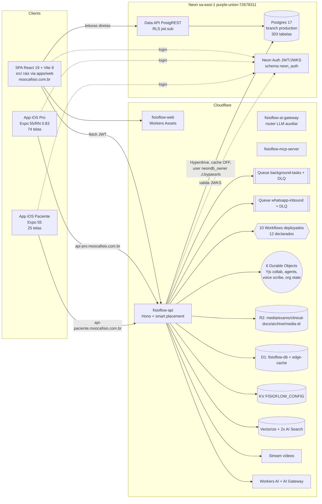

# Diagrama — Containers (C4 nível 2, AS-IS)

Notas: auth divergente entre clientes (web = Neon Auth; app pro = `POST /api/auth/login` + SecureStore; app paciente = better-auth) [ver 12]. Compartilhamento de código web↔mobile ≈ zero.
