# Diagrama — Modelo de Dados (núcleo, AS-IS)

> ERD de alto nível dos agregados centrais (303 tabelas no total — dicionário completo em `inventories/database-objects.csv`). Nomes = tabelas reais de produção.

```mermaid
erDiagram
    organizations ||--o{ patients : "organization_id"
    organizations ||--o{ profiles : ""
    organizations ||--o{ appointments : ""
    profiles }o--o{ organization_members : ""
    patients ||--o{ appointments : "patient_id"
    appointments ||--o{ sessions : "appointment_id (nullable)"
    patients ||--o{ sessions : ""
    sessions ||--o{ evolution_versions : ""
    sessions ||--o{ session_attachments : ""
    patients ||--o{ medical_records : ""
    patients ||--o{ patient_evaluation_responses : "avaliações"
    patients ||--o{ patient_surgeries : ""
    patients ||--o{ patient_medical_returns : "retorno médico"
    patients ||--o{ pain_maps : ""
    recurring_series ||--o{ appointments : "recorrência"
    rooms ||--o{ appointments : "room_id FK"
    exercises ||--o{ exercise_plan_items : ""
    exercise_plans ||--o{ exercise_plan_items : ""
    patients ||--o{ exercise_plans : "HEP"
    patients ||--o{ patient_exercise_logs : "execução"
    session_package_templates ||--o{ patient_packages : ""
    patient_packages ||--o{ package_usage : "débito por sessão"
    patients ||--o{ payments : ""
    payments ||--o{ recibos : ""
    nfse_config ||--o{ nfse_records : "0 emitidas"
    contacts ||--o{ contact_activities : "CRM"
    leads ||--o{ lead_historico : ""
    leads ||--|| patients : "trigger efetivação"
    wa_conversations ||--o{ wa_messages : "inbox"
    whatsapp_contacts ||--o{ whatsapp_messages : "trilho legado"
    boards ||--o{ board_columns : ""
    board_columns ||--o{ tarefas : "kanban"
    patients ||--o{ patient_gamification : ""
    wiki_pages ||--o{ wiki_page_versions : ""
    knowledge_articles ||--o{ clinical_embeddings : "pgvector"
```

Observações estruturais:
- Isolamento por `organization_id` em praticamente todos os agregados (1 org em produção).
- Duplicidades PT/EN convivendo (`salas`×`rooms`, `transacoes`×`transactions`, `pagamentos`×`payments`, dois trilhos WhatsApp `wa_*`×`whatsapp_*`).
- `sessions.observacao` (texto livre TipTap) + `sessions.observacao_ydoc` (snapshot Yjs) — modelo SOAP foi removido.
- 8 tabelas órfãs e enum `appointment_status` com 17 valores mistos EN/PT (detalhe em 08/14).
