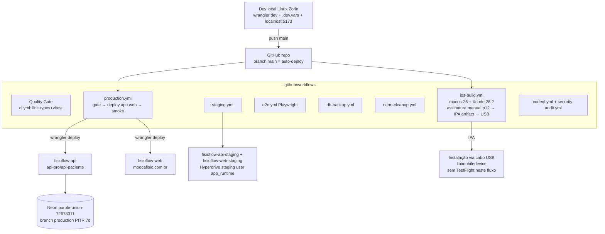

# Diagrama — Deploy e Ambientes (AS-IS)

Regras operacionais conhecidas: nunca misturar deploy manual com o auto-deploy do CI (race de hashes); falha no teste de cron DB-free bloqueia TODOS os deploys silenciosamente; migrations aplicadas manualmente (sem ledger no banco).
