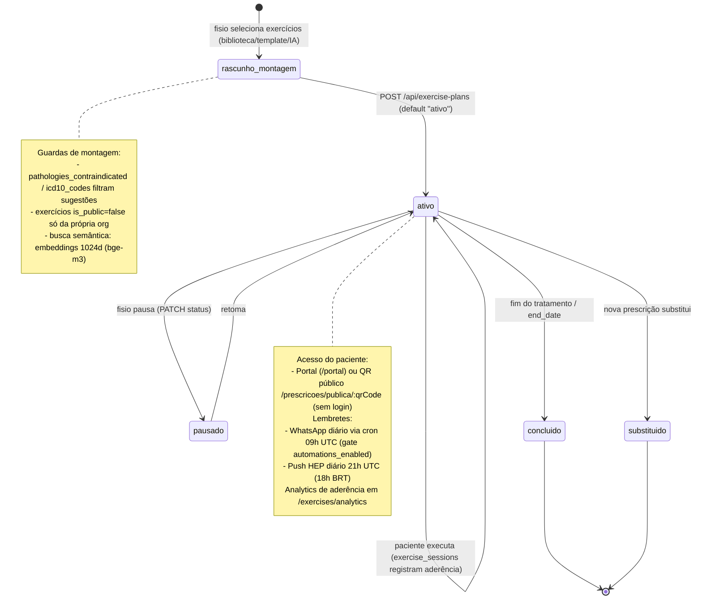

# Máquina de estados — Prescrição de exercícios (HEP)

Fontes: `apps/api/src/routes/exercisePlans.ts:41-48` (status default `"ativo"`; update whitelist inclui `status` como texto livre — estados além de `ativo` inferidos do uso: concluído/pausado). Lembretes: `apps/api/src/cron.ts:101-105` (WhatsApp gated) e `:336-348` (push 18h BRT).

