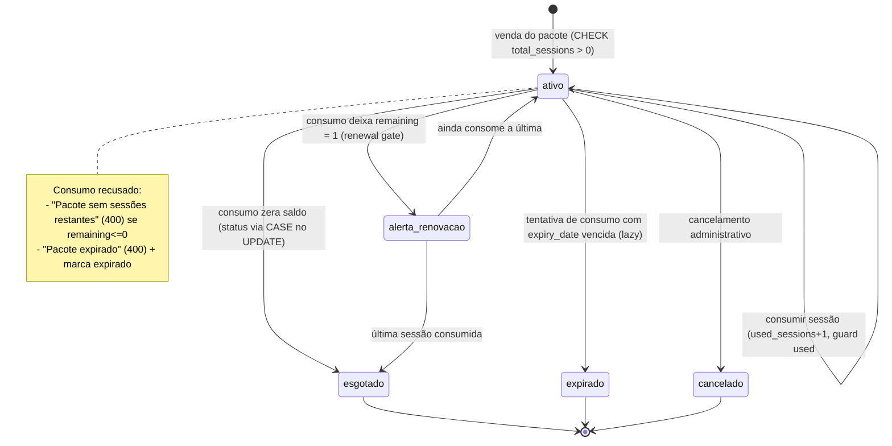
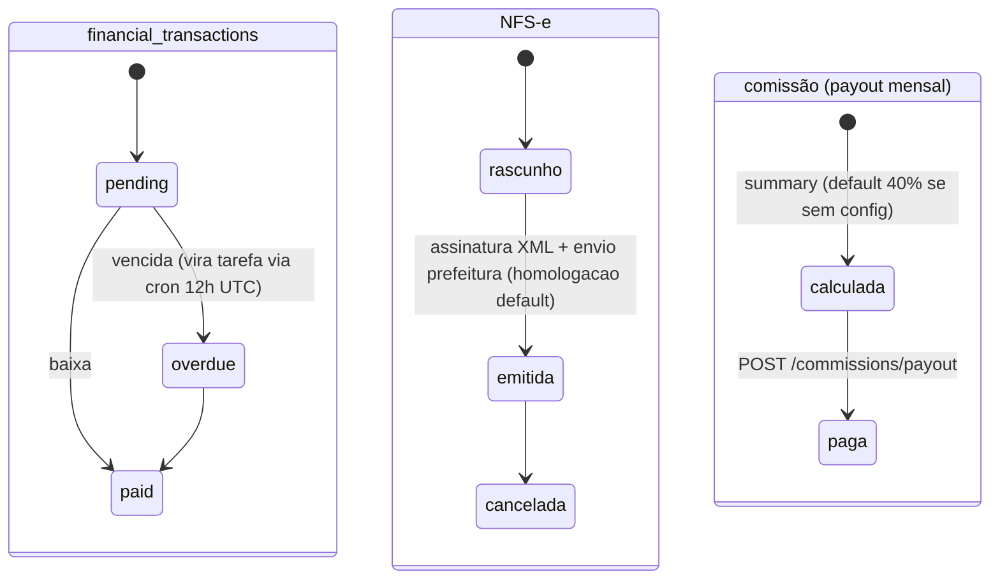

# Máquina de estados — Pacote de sessões / Pagamento

Fontes: CHECK da migration `apps/api/migrations/0039_session_packages.sql:31` (`ativo/esgotado/expirado/cancelado` — valores efetivos usados por `apps/api/src/routes/packages.ts:245-278`). Atenção: o enum Drizzle `package_status` declara EN (`active/expired/used/cancelled`, `packages/db/src/schema/financial.ts:235-240`) — divergência a resolver na reconstrução.

## Transação financeira / recibo / NFS-e

