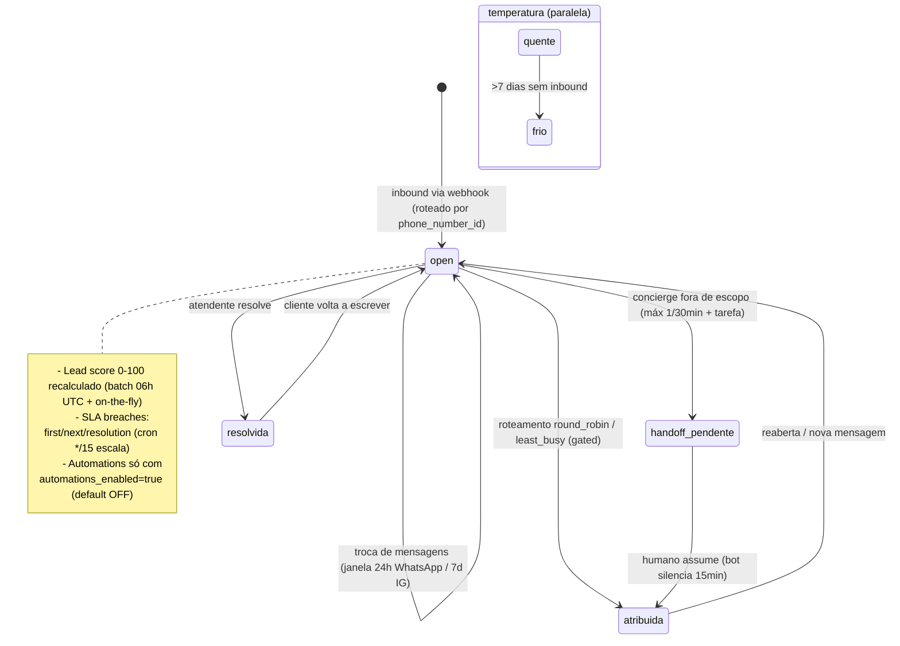
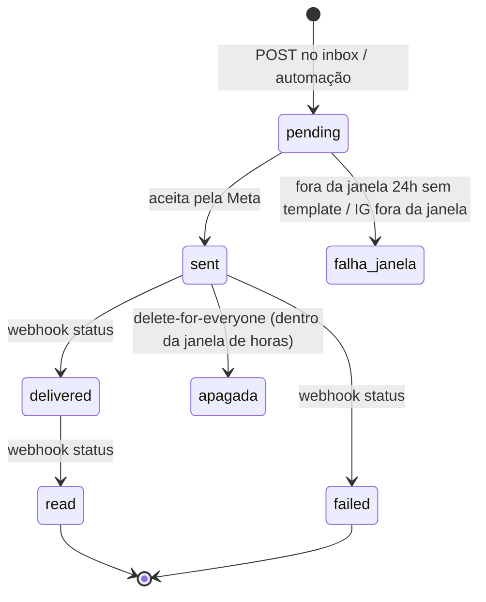
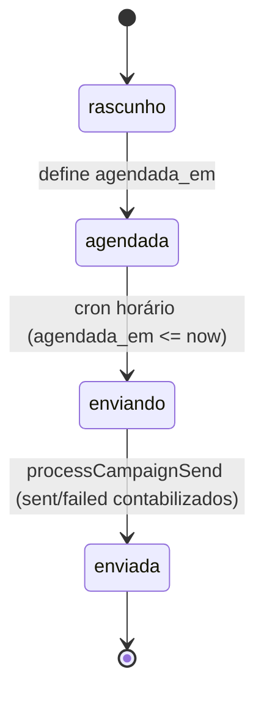
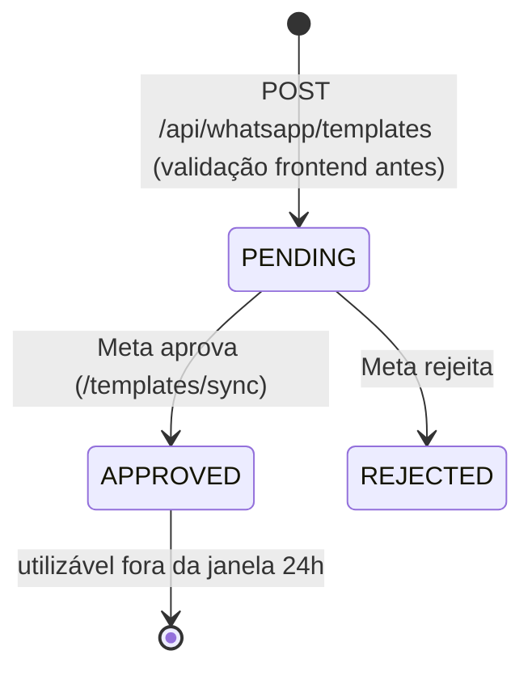

# Máquina de estados — Conversa WhatsApp/IG/Webchat e Mensagem

Fontes: `packages/db/src/schema/whatsapp-inbox.ts:57-59` (conversa: status default `open`, priority `normal`, channel `whatsapp`), `:104` (mensagem: default `pending`), webhook Meta atualiza sent/delivered/read/failed (`apps/api/src/routes/whatsapp-webhook.ts`), campanhas `apps/api/src/cron.ts:311-334`.

## Conversa / lead

## Mensagem outbound

## Campanha

## Template Meta

