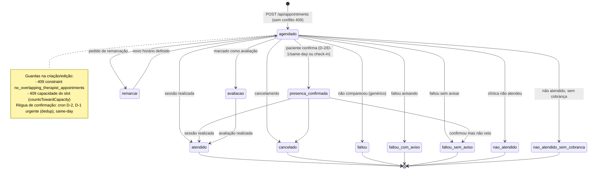
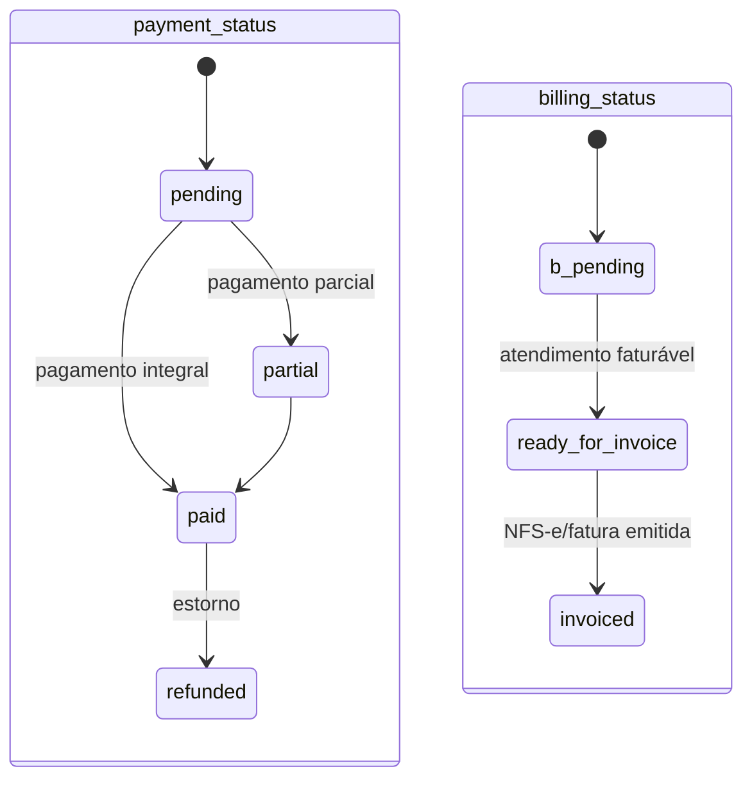

# Máquina de estados — Agendamento

Fontes: enum `appointment_status` (`packages/db/src/schema/appointments.ts:34-46`), status é `varchar` default `"agendado"` (linha 86 — enum não imposto na coluna, e há status customizáveis por org em `appointment_status_settings`). `payment_status` e `billing_status` são eixos paralelos.

## Eixos paralelos

